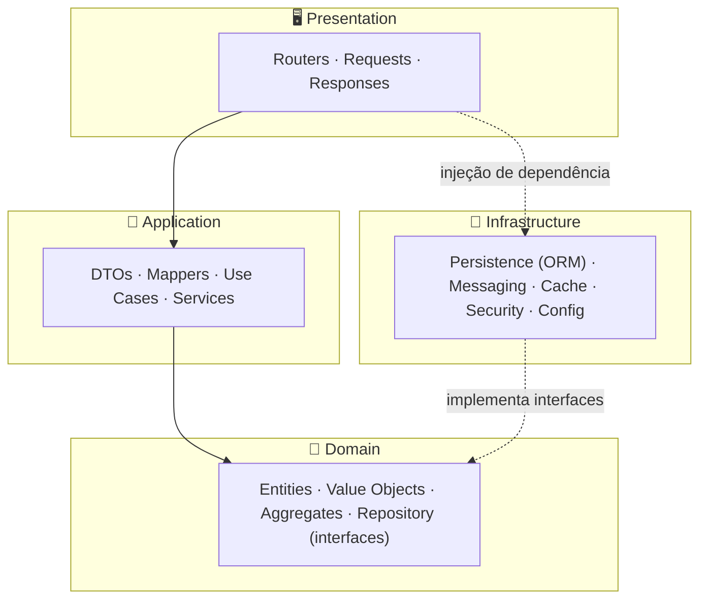

<div align="center">

# ⚡ EnergyHub

**Plataforma de negociação de energia** construída com **FastAPI**, **Clean Architecture** e **Domain-Driven Design**.

[](https://www.python.org/)
[](https://fastapi.tiangolo.com/)
[](https://www.sqlalchemy.org/)
[](https://www.postgresql.org/)
[](LICENSE)
[](docs/ROADMAP.md)

</div>

---

## 📑 Índice

- [Sobre o projeto](#-sobre-o-projeto)
- [Principais funcionalidades](#-principais-funcionalidades)
- [Arquitetura](#-arquitetura)
- [Modelo de domínio](#-modelo-de-domínio)
- [Stack tecnológica](#-stack-tecnológica)
- [Estrutura do projeto](#-estrutura-do-projeto)
- [Começando](#-começando)
- [Documentação da API](#-documentação-da-api)
- [Testes](#-testes)
- [Roadmap](#-roadmap)
- [Fluxo de desenvolvimento (OpenSpec)](#-fluxo-de-desenvolvimento-openspec)
- [Documentação](#-documentação)
- [Licença](#-licença)

---

## 📖 Sobre o projeto

O **EnergyHub** é o _backend_ de uma plataforma de **negociação de energia** — pensada para
gerenciar clientes, contratos, negociações, compra e venda de energia, faturamento, auditoria,
notificações e relatórios.

O projeto é construído de forma **incremental e _spec-driven_**: cada incremento é uma _change_
do [OpenSpec](openspec/changes/), com proposta, design, tarefas e especificações de
capacidades. São **18 fases** que vão do planejamento até uma plataforma de **microsserviços em
Kubernetes com CI/CD automatizado**.

Prioridades de arquitetura definidas no planejamento (Fase 0):

- **Desempenho** — respostas de API abaixo de ~200 ms
- **Escalabilidade** — alvo de ~10.000 usuários simultâneos
- **Disponibilidade** — meta de 99,9% de _uptime_
- **Segurança e auditabilidade** — controle de acesso e trilha de auditoria completa
- **Integridade financeira** — PostgreSQL normalizado (3FN) para dados transacionais

> ⚙️ **Estado atual:** as especificações das 18 fases estão completas; a implementação está no
> início (aplicação FastAPI básica com `/` e `/health`). Consulte o [ROADMAP](docs/ROADMAP.md) e o
> [CHANGELOG](docs/CHANGELOG.md) para acompanhar a evolução.

---

## ✨ Principais funcionalidades

| Domínio | Descrição |
| :------ | :-------- |
| 👥 **Usuários & Acesso** | Cadastro de usuários, papéis e permissões (RBAC) |
| 🏢 **Clientes** | Gestão de clientes e contatos, com validação de **CNPJ** |
| 📄 **Contratos** | Criação e ciclo de vida de contratos (aprovação, ativação, rejeição) |
| 🤝 **Negociações** | Registro de negociações e transações de energia |
| ⚡ **Compra & Venda de Energia** | Operações de compra e venda de energia |
| 💰 **Financeiro** | Emissão de faturas e registro de pagamentos |
| 🔍 **Auditoria** | Trilha de auditoria de todas as operações |
| 🔔 **Notificações** | Envio e acompanhamento de notificações |
| 📊 **Relatórios** | Geração de relatórios do negócio |

**Tipos de usuário:** administradores, operadores, clientes e fornecedores.

---

## 🏛️ Arquitetura

O EnergyHub segue **Clean Architecture** com **DDD**, organizado em **9 módulos** de negócio,
cada um com **4 camadas**. A regra de dependência é estrita: o **domínio não depende de nada**;
a aplicação depende do domínio; a infraestrutura implementa as interfaces do domínio.



**Módulos:** `shared` · `auth` · `clients` · `contracts` · `negotiations` · `financial` · `audit` · `notifications` · `reports`

**Camadas por módulo:**

| Camada | Pacotes | Responsabilidade |
| :----- | :------ | :--------------- |
| **Domain** | `entity`, `valueobject`, `aggregate`, `repository`, `service`, `exception` | Regras de negócio puras |
| **Application** | `dto`, `mapper`, `usecase`, `service`, `exception` | Orquestração de casos de uso |
| **Infrastructure** | `persistence`, `messaging`, `config`, `security` | Detalhes técnicos e I/O |
| **Presentation** | `router`, `request`, `response`, `exception` | Interface HTTP (REST) |

---

## 💎 Modelo de domínio

**Entidades** (por módulo):

| Módulo | Entidades |
| :----- | :-------- |
| `auth` | `User`, `Role`, `Permission` |
| `clients` | `Client`, `Contact` |
| `contracts` | `Contract` |
| `negotiations` | `Negotiation`, `EnergyTransaction` |
| `financial` | `Invoice`, `Payment` |
| `audit` | `AuditLog` |
| `notifications` | `Notification` |
| `reports` | `Report` |

**Value Objects:** `CNPJ` · `Email` · `Money` · `PhoneNumber` · `Address` · `Percentage`
(implementados como _frozen dataclasses_ com validação na construção).

**Enums:** `ContractStatus` · `ContractType` · `NegotiationStatus` · `TransactionType` ·
`InvoiceStatus` · `NotificationStatus` · `AuditAction` · `ContactType`.

**Agregados:** `AuthAggregate` · `ClientAggregate` · `ContractAggregate` ·
`NegotiationAggregate` · `FinancialAggregate`.

**Eventos de negócio** (comunicação assíncrona): `user.created/updated/deleted`,
`client.created/updated`, `contract.created/approved/rejected`,
`negotiation.initiated/completed/cancelled`, `energy.bought/sold`,
`invoice.issued/paid/cancelled`, `notification.sent`, `report.generated`.

---

## 🧰 Stack tecnológica

| Categoria | Tecnologias |
| :-------- | :---------- |
| **Linguagem** | Python 3.12+ |
| **Framework Web** | FastAPI · Uvicorn |
| **ORM & Banco** | SQLAlchemy 2.0 (async) · asyncpg · PostgreSQL 16 |
| **Migrações** | Alembic |
| **Validação & Config** | Pydantic v2 · pydantic-settings |
| **Autenticação** | JWT (python-jose, HS256) · BCrypt (passlib) |
| **Cache** | Redis 7 · fastapi-cache2 |
| **Mensageria** | RabbitMQ (aio-pika) · Apache Kafka (aiokafka) |
| **Busca** | Elasticsearch 8 · elasticsearch-dsl |
| **Observabilidade** | Prometheus · Grafana · Alertmanager · psutil |
| **Testes** | pytest · pytest-asyncio · pytest-cov · Testcontainers |
| **Qualidade de código** | black · ruff · flake8 · mypy |
| **Dependências** | Poetry |
| **Containers** | Docker · Docker Compose |
| **Microsserviços** | Consul (discovery) · httpx · tenacity · Traefik (gateway) |
| **Orquestração** | Kubernetes (Deployments, HPA, Ingress, Metrics Server) |
| **CI/CD** | GitHub Actions |
| **Especificação** | OpenSpec (_spec-driven_) |

> Nem tudo acima já está implementado — a stack é introduzida **fase a fase** (veja o [ROADMAP](docs/ROADMAP.md)).

---

## 📂 Estrutura do projeto

**Estrutura atual (raiz do repositório):**

```
energyhub/
├── docs/                      # 📚 Documentação (README, ROADMAP, CHANGELOG)
├── openspec/                  # 📋 Especificações spec-driven (18 fases)
│   ├── changes/
│   │   ├── implement-fase-0/  #    proposal · design · tasks · specs/
│   │   ├── implement-fase-1/
│   │   └── ...                #    até implement-fase-17
│   └── config.yaml
├── energyhub/                 # 🐍 Projeto Python (Poetry, layout src/)
│   ├── src/energyhub/
│   │   └── main.py            #    app FastAPI (endpoints / e /health)
│   ├── tests/
│   └── pyproject.toml
├── backend/  database/  docker/  scripts/
├── LICENSE                    # MIT
└── README.md                  # 👈 você está aqui
```

**Estrutura-alvo de um módulo (a partir da Fase 2):**

```
src/energyhub/<módulo>/
├── domain/
│   ├── entity/         valueobject/   aggregate/
│   ├── repository/     service/       exception/
├── application/
│   ├── dto/            mapper/        usecase/
│   ├── service/        exception/
├── infrastructure/
│   ├── persistence/    messaging/     config/       security/
└── presentation/
    ├── router/         request/       response/     exception/
```

---

## 🚀 Começando

### Pré-requisitos

- [Python 3.12+](https://www.python.org/)
- [Poetry](https://python-poetry.org/)
- [Docker](https://www.docker.com/) e Docker Compose (para PostgreSQL e demais serviços)

### 1. Clonar o repositório

```bash
git clone https://github.com/Matheus-Siquara/energyhub.git
cd energyhub
```

### 2. Subir a infraestrutura (PostgreSQL)

```bash
docker compose up -d
```

### 3. Instalar dependências e rodar a aplicação

O projeto Python usa _layout src_ e vive na subpasta `energyhub/`:

```bash
cd energyhub
poetry install
poetry run uvicorn energyhub.main:app --reload
```

A API sobe em **http://localhost:8000**:

```bash
curl http://localhost:8000/           # {"message": "EnergyHub API está rodando 🚀"}
curl http://localhost:8000/health     # {"status": "ok"}
```

### 4. Migrações do banco _(a partir da Fase 4)_

```bash
poetry run alembic upgrade head       # aplica todas as migrações
poetry run alembic downgrade base     # reverte
```

### 5. Qualidade de código

```bash
poetry run black .        # formatação
poetry run ruff check .   # lint
poetry run mypy .         # checagem de tipos
```

---

## 📘 Documentação da API

Com a aplicação em execução, a documentação interativa fica disponível em:

- **Swagger UI** — http://localhost:8000/docs
- **ReDoc** — http://localhost:8000/redoc
- **OpenAPI JSON** — http://localhost:8000/openapi.json

A partir da **Fase 8**, a documentação será curada (metadados, exemplos e _security scheme_ JWT),
com um **catálogo de erros** ([`docs/API_ERRORS.md`](docs/API_ERRORS.md)) e
**exemplos de uso** ([`docs/API_EXAMPLES.md`](docs/API_EXAMPLES.md)).

**Autenticação _(a partir da Fase 7)_:** obtenha um token em `POST /api/v1/auth/login` e envie-o
como `Authorization: Bearer <token>` nas rotas protegidas.

---

## 🧪 Testes

_A suíte de testes é estabelecida na Fase 13_, com **cobertura mínima de 80%**:

```bash
cd energyhub
poetry run pytest                 # roda unitários + integração
poetry run pytest --cov           # com relatório de cobertura
```

- **Unitários** — serviços da camada de aplicação com colaboradores _mockados_.
- **Integração** — repositórios contra `PostgresContainer` (Testcontainers) e API via `TestClient` com JWT real.

---

## 🗺️ Roadmap

O projeto evolui em **18 fases**, agrupadas em 7 etapas. Resumo:

| Fase | Marco | Versão |
| :--: | :---- | :----: |
| 0 | Planejamento e Design do Sistema | — |
| 1 | Scaffolding do Projeto e Infraestrutura | `0.1.0` |
| 2 | Estrutura Clean Architecture e Classes Base | `0.2.0` |
| 3 | Modelo de Domínio (DDD) | `0.3.0` |
| 4 | Schema do Banco e Migrações Alembic | `0.4.0` |
| 5 | Persistência: ORM & Repositórios | `0.5.0` |
| 6 | Camadas de Aplicação e Apresentação (REST API) | `0.6.0` |
| 7 | Autenticação e Autorização RBAC | `0.7.0` |
| 8 | Documentação da API e Erros Padronizados | `0.8.0` |
| 9 | Camada de Cache com Redis | `0.9.0` |
| 10 | Mensageria Assíncrona (RabbitMQ & Kafka) | `0.10.0` |
| 11 | Subsistema de Busca com Elasticsearch | `0.11.0` |
| 12 | Observabilidade: Métricas, Dashboards e Alertas | `0.12.0` |
| 13 | Suíte de Testes e _Quality Gate_ de Cobertura | `0.13.0` |
| 14 | Containerização e Orquestração | `0.14.0` |
| 15 | Decomposição em Microsserviços e API Gateway | `0.15.0` |
| 16 | Orquestração com Kubernetes | `0.16.0` |
| 17 | Automação CI/CD com GitHub Actions | `1.0.0` |

👉 Detalhes completos de cada fase em **[docs/ROADMAP.md](docs/ROADMAP.md)** · histórico em **[docs/CHANGELOG.md](docs/CHANGELOG.md)**.

---

## 🔄 Fluxo de desenvolvimento (OpenSpec)

Este projeto adota o fluxo **_spec-driven_** do [OpenSpec](openspec/): antes de implementar,
cada mudança é descrita como uma _change_ em [`openspec/changes/`](openspec/changes/) contendo:

```
implement-fase-N/
├── proposal.md    # Por quê · O que muda · Capacidades · Impacto
├── design.md      # Contexto · Decisões · Riscos · Trade-offs
├── tasks.md       # Checklist de implementação
└── specs/
    └── <capacidade>/spec.md   # Requisitos ADDED por capacidade
```

Isso mantém escopo, design e requisitos versionados e revisáveis **antes** de qualquer código.

---

## 📚 Documentação

| Documento | Descrição |
| :-------- | :-------- |
| [docs/README.md](docs/README.md) | Índice da documentação |
| [docs/ROADMAP.md](docs/ROADMAP.md) | Plano de evolução detalhado das 18 fases |
| [docs/CHANGELOG.md](docs/CHANGELOG.md) | Histórico de versões (Keep a Changelog + SemVer) |
| [openspec/changes/](openspec/changes/) | Especificações _spec-driven_ completas |

---

## 📄 Licença

Distribuído sob a licença **MIT**. Veja [`LICENSE`](LICENSE) para mais informações.

Copyright © 2026 Matheus-Siquara.

---

<div align="center">
<sub>Construído com ⚡ e Clean Architecture · documentação gerada a partir das 18 changes OpenSpec.</sub>
</div>
