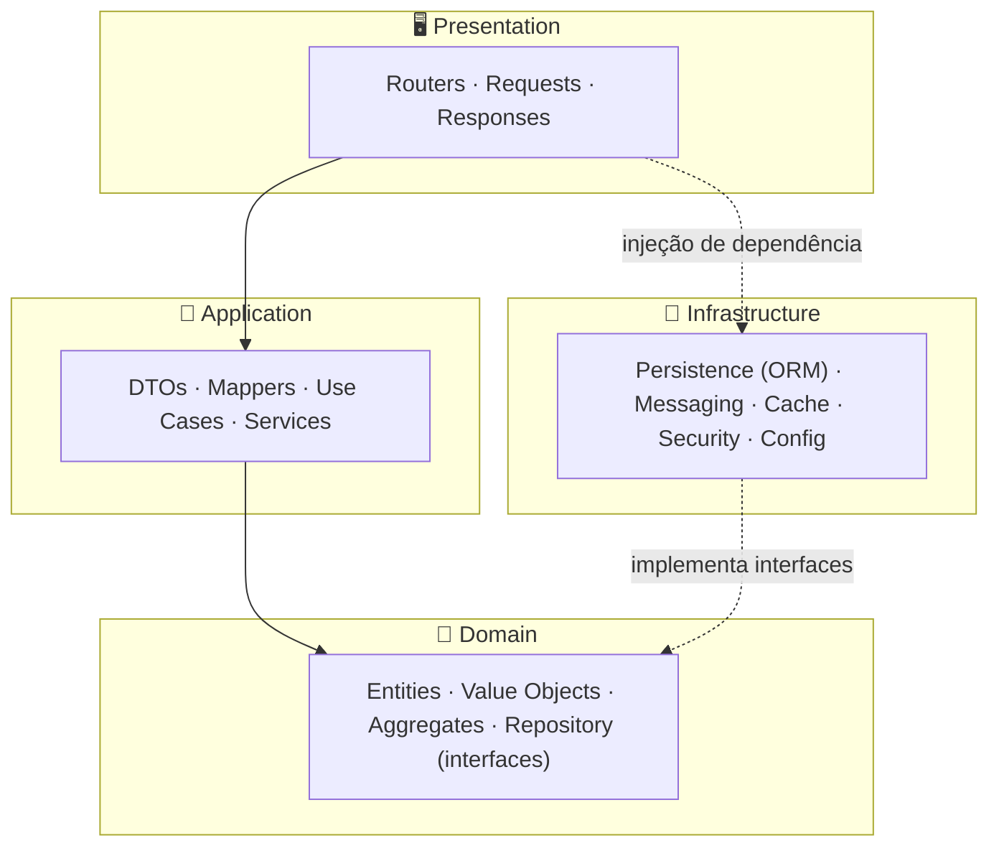

<div align="center">

# ⚡ EnergyHub

**Plataforma de negociação de energia** construída com **FastAPI**, **Clean Architecture** e **Domain-Driven Design**.

[](https://www.python.org/)
[](https://fastapi.tiangolo.com/)
[](https://www.sqlalchemy.org/)
[](https://www.postgresql.org/)
[](LICENSE)
[](docs/ROADMAP.md)

</div>

---

## 📑 Índice

- [Sobre o projeto](#-sobre-o-projeto)
- [Principais funcionalidades](#-principais-funcionalidades)
- [Arquitetura](#-arquitetura)
- [Modelo de domínio](#-modelo-de-domínio)
- [Stack tecnológica](#-stack-tecnológica)
- [Estrutura do projeto](#-estrutura-do-projeto)
- [Começando](#-começando)
- [Documentação da API](#-documentação-da-api)
- [Testes](#-testes)
- [Roadmap](#-roadmap)
- [Fluxo de desenvolvimento (OpenSpec)](#-fluxo-de-desenvolvimento-openspec)
- [Documentação](#-documentação)
- [Licença](#-licença)

---

## 📖 Sobre o projeto

O **EnergyHub** é o _backend_ de uma plataforma de **negociação de energia** — pensada para
gerenciar clientes, contratos, negociações, compra e venda de energia, faturamento, auditoria,
notificações e relatórios.

O projeto é construído de forma **incremental e _spec-driven_**: cada incremento é uma _change_
do [OpenSpec](openspec/changes/), com proposta, design, tarefas e especificações de
capacidades. São **18 fases** que vão do planejamento até uma plataforma de **microsserviços em
Kubernetes com CI/CD automatizado**.

Prioridades de arquitetura definidas no planejamento (Fase 0):

- **Desempenho** — respostas de API abaixo de ~200 ms
- **Escalabilidade** — alvo de ~10.000 usuários simultâneos
- **Disponibilidade** — meta de 99,9% de _uptime_
- **Segurança e auditabilidade** — controle de acesso e trilha de auditoria completa
- **Integridade financeira** — PostgreSQL normalizado (3FN) para dados transacionais

> ⚙️ **Estado atual:** 🎉 **Todas as 18 fases (0 a 17) concluídas — marco `1.0.0`** — o planejamento está completo
> ([`docs/fase-0`](docs/fase-0/)), o **modelo de domínio DDD** existe como **domínio puro**, o
> **schema PostgreSQL** é versionado por **migrações Alembic**, a **camada de persistência**
> (ORM async + 13 repositórios + filtros + paginação) lê e grava as tabelas, a **API REST** está
> no ar (**10 routers / 25 endpoints** `/api/v1/...`, CRUD + listagem paginada + sub-recursos), a
> **segurança** protege a API (**login JWT**, `get_current_user`, **RBAC por permissão** — **401**/**403**),
> a API é **auto-descritiva** (**OpenAPI curado**, DTOs com exemplos, **erros padronizados** +
> `error_code`, guias [`docs/API_ERRORS.md`](docs/API_ERRORS.md)/[`docs/API_EXAMPLES.md`](docs/API_EXAMPLES.md)),
> há um **cache Redis** de leitura (`fastapi-cache2`) com invalidação na escrita e um router
> `/api/v1/cache` protegido por `CACHE_MANAGE`, uma **camada de mensageria assíncrona**
> (**RabbitMQ** para workflows + **Kafka** para streams) publica eventos de domínio pós-commit e os
> consome fora do caminho da requisição (`NotificationConsumer`, `AuditConsumer`), um **subsistema
> de busca** (**Elasticsearch**) oferece full-text com relevância/fuzziness e filtros compostos em
> `/api/v1/search/clients`, e uma **camada de observabilidade** expõe métricas Prometheus em
> `/metrics` (HTTP + negócio + recursos) com **Prometheus/Grafana/Alertmanager** (dashboards e alertas),
> e uma **suíte de testes automatizados** (pytest) com **_quality gate_ de 80% de cobertura** guarda o
> comportamento — unitários dos serviços, testes de componente dos routers e integração (repositórios
> via Testcontainers + API via `TestClient`). Por fim, a **própria aplicação está containerizada**
> (`Dockerfile` multi-stage, não-root) e **toda a stack sobe com um comando** (`docker compose up -d`):
> API + Postgres/Redis/RabbitMQ/Kafka/Elasticsearch/Prometheus/Grafana numa rede compartilhada, com
> health checks, ordem de inicialização e volumes nomeados. E, por fim, o monólito foi **decomposto em
> microsserviços** (⚠️ _breaking_): **auth/client/contract/financial/audit** como serviços FastAPI
> independentes (banco por serviço), com **service discovery** (Consul), **comunicação HTTP resiliente**
> entre serviços (`httpx` + `tenacity`) e um **API gateway** (Traefik) roteando por prefixo de caminho.
> E, por fim, toda a plataforma está declarada como **manifestos Kubernetes** ([`k8s/`](k8s/)): um
> `Deployment`/`Service`/`HPA` por serviço (réplicas, _probes_ `/health`, autoscaling 2–5 por CPU/memória),
> `ConfigMap`s/`Secret`, `LoadBalancer` (Traefik) + `Ingress` (NGINX) na borda e backends stateful
> in-cluster — validada em **minikube** (login→cliente→contrato pelo gateway, HPA escalando 2↔5).
> E, por fim, uma esteira de **CI/CD com GitHub Actions** ([`.github/workflows/`](.github/workflows/))
> fecha o ciclo: a cada push, **build + testes** (com Postgres/Redis), **5 imagens publicadas no GHCR**
> (`latest`+SHA) e **deploy em Kubernetes** com verificação de _rollout_ e **rollback** automático — a
> esteira `build→push→deploy` valida o deploy num **kind efêmero** (grátis), com deploy real atrás do
> secret `KUBE_CONFIG`. 🎉 **Todas as 18 fases (0–17) concluídas — marco `1.0.0`.** Consulte o
> [ROADMAP](docs/ROADMAP.md) e o [CHANGELOG](docs/CHANGELOG.md) para o histórico completo.

---

## ✨ Principais funcionalidades

| Domínio | Descrição |
| :------ | :-------- |
| 👥 **Usuários & Acesso** | Cadastro de usuários, papéis e permissões (RBAC) |
| 🏢 **Clientes** | Gestão de clientes e contatos, com validação de **CNPJ** |
| 📄 **Contratos** | Criação e ciclo de vida de contratos (aprovação, ativação, rejeição) |
| 🤝 **Negociações** | Registro de negociações e transações de energia |
| ⚡ **Compra & Venda de Energia** | Operações de compra e venda de energia |
| 💰 **Financeiro** | Emissão de faturas e registro de pagamentos |
| 🔍 **Auditoria** | Trilha de auditoria de todas as operações |
| 🔔 **Notificações** | Envio e acompanhamento de notificações |
| 📊 **Relatórios** | Geração de relatórios do negócio |

**Tipos de usuário:** administradores, operadores, clientes e fornecedores.

---

## 🏛️ Arquitetura

O EnergyHub segue **Clean Architecture** com **DDD**, organizado em **9 módulos** de negócio,
cada um com **4 camadas**. A regra de dependência é estrita: o **domínio não depende de nada**;
a aplicação depende do domínio; a infraestrutura implementa as interfaces do domínio.



**Módulos:** `shared` · `auth` · `clients` · `contracts` · `negotiations` · `financial` · `audit` · `notifications` · `reports`

**Camadas por módulo:**

| Camada | Pacotes | Responsabilidade |
| :----- | :------ | :--------------- |
| **Domain** | `entity`, `valueobject`, `repository`, `service`, `exception` (+ `aggregate` na Fase 3) | Regras de negócio puras |
| **Application** | `dto`, `mapper`, `usecase`, `service`, `exception` | Orquestração de casos de uso |
| **Infrastructure** | `persistence`, `messaging`, `config`, `security` | Detalhes técnicos e I/O |
| **Presentation** | `router`, `request`, `response`, `exception` | Interface HTTP (REST) |

As **classes-base** que sustentam essas camadas (`BaseEntity`, `Repository`, `UseCase`,
`SQLAlchemyRepository`, `BaseRouter`, entre outras) vivem no módulo `shared` e estão documentadas
no guia **[docs/ARCHITECTURE.md](docs/ARCHITECTURE.md)**.

---

## 💎 Modelo de domínio

> ✅ **Implementado na Fase 3.** Entidades, _value objects_, enums e agregados já existem como
> **domínio puro** — _dataclasses_ sem imports de framework, com validação no `__post_init__`. O
> **mapeamento ORM** (SQLAlchemy) foi implementado na **Fase 5** via **mapeamento imperativo**, que
> persiste essas mesmas entidades **sem** acoplar o domínio ao framework.

**Entidades** (por módulo):

| Módulo | Entidades |
| :----- | :-------- |
| `auth` | `User`, `Role`, `Permission` |
| `clients` | `Client`, `Contact` |
| `contracts` | `Contract` |
| `negotiations` | `Negotiation`, `EnergyTransaction` |
| `financial` | `Invoice`, `Payment` |
| `audit` | `AuditLog` |
| `notifications` | `Notification` |
| `reports` | `Report` |

**Value Objects:** `CNPJ` · `Email` · `Money` · `PhoneNumber` · `Address` · `Percentage`
(implementados como _frozen dataclasses_ com validação na construção).

**Enums:** `ContractStatus` · `ContractType` · `NegotiationStatus` · `TransactionType` ·
`InvoiceStatus` · `NotificationStatus` · `AuditAction` · `ContactType`.

**Agregados:** `AuthAggregate` · `ClientAggregate` · `ContractAggregate` ·
`NegotiationAggregate` · `FinancialAggregate`.

**Eventos de negócio** (comunicação assíncrona): `user.created/updated/deleted`,
`client.created/updated`, `contract.created/approved/rejected`,
`negotiation.initiated/completed/cancelled`, `energy.bought/sold`,
`invoice.issued/paid/cancelled`, `notification.sent`, `report.generated`.

---

## 🧰 Stack tecnológica

| Categoria | Tecnologias |
| :-------- | :---------- |
| **Linguagem** | Python 3.12+ |
| **Framework Web** | FastAPI · Uvicorn |
| **ORM & Banco** | SQLAlchemy 2.0 (async) · asyncpg · PostgreSQL 16 |
| **Migrações** | Alembic |
| **Validação & Config** | Pydantic v2 · pydantic-settings |
| **Autenticação** | JWT (python-jose, HS256) · BCrypt (lib `bcrypt`) · RBAC por permissão |
| **Cache** | Redis 7 · fastapi-cache2 |
| **Mensageria** | RabbitMQ (aio-pika) · Apache Kafka (aiokafka) |
| **Busca** | Elasticsearch 8 · elasticsearch-dsl |
| **Observabilidade** | Prometheus · Grafana · Alertmanager · psutil |
| **Testes** | pytest · pytest-asyncio · pytest-cov · Testcontainers |
| **Qualidade de código** | black · ruff · flake8 · mypy |
| **Dependências** | Poetry |
| **Containers** | Docker · Docker Compose |
| **Microsserviços** | Consul (discovery) · httpx · tenacity · Traefik (gateway) |
| **Orquestração** | Kubernetes (Deployments, HPA, Ingress, Metrics Server) |
| **CI/CD** | GitHub Actions |
| **Especificação** | OpenSpec (_spec-driven_) |

> Nem tudo acima já está implementado — a stack é introduzida **fase a fase** (veja o [ROADMAP](docs/ROADMAP.md)).

---

## 📂 Estrutura do projeto

**Estrutura do repositório:**

```
energyhub/
├── docs/                      # 📚 Documentação (README, ROADMAP, CHANGELOG, ARCHITECTURE, fase-0/)
├── openspec/                  # 📋 Especificações spec-driven (18 fases)
│   ├── changes/
│   │   ├── implement-fase-0/  #    proposal · design · tasks · specs/
│   │   ├── implement-fase-1/
│   │   └── ...                #    até implement-fase-17
│   ├── specs/                 #    baseline de capacidades
│   └── config.yaml
├── energyhub/                 # 🐍 Projeto Python (Poetry, layout src/)
│   ├── src/energyhub/
│   │   ├── main.py            #    app FastAPI (/ , /health, CORS, auth JWT + 10 routers)
│   │   ├── config/            #    settings.py · dependencies/  (pacote)
│   │   ├── shared/            #    classes-base + util/ constant/ enums/
│   │   ├── auth/  clients/  contracts/  negotiations/
│   │   └── financial/  audit/  notifications/  reports/
│   ├── tests/                 #    conftest.py · test_base_entity.py
│   └── pyproject.toml  poetry.lock
├── backend/  database/  docker/  scripts/
├── docker-compose.yml         # PostgreSQL 16
├── LICENSE                    # MIT
└── README.md                  # 👈 você está aqui
```

**Módulo `shared` (base reutilizável):**

```
src/energyhub/shared/
├── domain/          entity/ (BaseEntity) · repository/ (Repository) · exception/ (DomainException)
├── application/     dto/ (BaseDTO) · usecase/ (UseCase) · exception/ (ApplicationException)
├── infrastructure/  persistence/ (SQLAlchemyRepository) · messaging/ · config/ · security/
├── presentation/    router/ (BaseRouter) · exception/ (global_exception_handler) · response/ (ErrorResponse)
└── util/            constant/            enums/
```

**Estrutura de um módulo de negócio (4 camadas):**

Cada um dos **8 módulos de negócio** (`auth`, `clients`, `contracts`, `negotiations`, `financial`,
`audit`, `notifications`, `reports`) segue as **4 camadas** com os mesmos sub-pacotes:

```
src/energyhub/<módulo>/
├── domain/
│   ├── entity/         valueobject/   repository/
│   ├── service/        exception/
├── application/
│   ├── dto/            mapper/        usecase/
│   ├── service/        exception/
├── infrastructure/
│   ├── persistence/    messaging/     config/       security/
└── presentation/
    ├── router/         request/       response/     exception/
```

---

## 🚀 Começando

### Pré-requisitos

- [Python 3.12+](https://www.python.org/)
- [Poetry](https://python-poetry.org/)
- [Docker](https://www.docker.com/) e Docker Compose (para PostgreSQL e demais serviços)

### 1. Clonar o repositório

```bash
git clone https://github.com/Matheus-Siquara/energyhub.git
cd energyhub
```

### 2. Subir a stack completa com um comando (Fase 14)

`docker compose up -d` constrói a imagem da API (pelo `Dockerfile`) e sobe **tudo** — API +
PostgreSQL, Redis, RabbitMQ, Kafka+Zookeeper, Elasticsearch, Prometheus, Grafana e Alertmanager —
numa rede compartilhada, com health checks e ordem de inicialização (a API só inicia depois das
dependências saudáveis):

```bash
docker compose up -d                                    # constrói a API + sobe a stack toda
docker compose ps                                       # todos "Up (healthy)"
curl -s http://localhost:8000/health                    # {"status":"healthy"}
```

No **primeiro boot** com o banco vazio, aplique as migrações (o admin é semeado por elas):

```bash
docker compose exec energyhub-api alembic upgrade head
```

Portas: API **:8000** · Postgres **:5432** · Redis **:6379** · RabbitMQ **:5672** (UI **:15672**) ·
Kafka **:9092** · Elasticsearch **:9200** · Prometheus **:9090** · Grafana **:3000** (`admin`/`admin`
— _placeholder_) · Alertmanager **:9093**. O Prometheus scrapeia a API por nome de serviço
(`energyhub-api:8000`).

> ⚠️ As credenciais e o `SECRET_KEY` no `docker-compose.yml` são **placeholders de desenvolvimento**
> — rotacionar e externalizar (`.env` / secrets manager) antes de produção.

### 3. Desenvolvimento local (alternativa, sem containerizar a API)

Para iterar na aplicação com _hot reload_, rode só a infra pelo compose e a API no host (o projeto
Python usa _layout src_ e vive na subpasta `energyhub/`):

```bash
cd energyhub
poetry install
poetry run uvicorn energyhub.main:app --reload          # http://localhost:8000
```

```bash
curl http://localhost:8000/           # {"message": "EnergyHub API"}
curl http://localhost:8000/health     # {"status": "healthy"}
```

### 4. Migrações do banco _(Fases 4, 7 e 9 ✅)_

```bash
cd energyhub
poetry run alembic upgrade head       # aplica as 10 migrações (15 tabelas + índices + constraints + seed + permissões)
poetry run alembic current            # revisão atual (head = 0010)
poetry run alembic downgrade base     # reverte tudo
```

O _seed_ cria um usuário **`admin`** (papel `ADMIN`, com **todas** as permissões) com senha de
_bootstrap_ **`ChangeMe123!`** — **rotacione antes de qualquer uso real** (junto com o `SECRET_KEY`).
No Windows + Docker Desktop, se o driver não conectar do host, aplique o SQL dentro do container:
`poetry run alembic upgrade head --sql | docker compose exec -T postgres psql -U energyhub -d energyhub`.

### 5. Qualidade de código

```bash
poetry run black .        # formatação
poetry run ruff check .   # lint
poetry run mypy .         # checagem de tipos
```

---

## 📘 Documentação da API

Com a aplicação em execução, a documentação interativa fica disponível em:

- **Swagger UI** — http://localhost:8000/docs
- **ReDoc** — http://localhost:8000/redoc
- **OpenAPI JSON** — http://localhost:8000/openapi.json

Desde a **Fase 8 ✅**, a documentação é **curada**: metadados (contato/licença), _security scheme_
`bearerAuth` (JWT), agrupamento por **tags**, endpoints com `summary`/`description`/`responses` e
DTOs com descrições e exemplos. Os erros são **padronizados** (`ErrorResponse` /
`ValidationErrorResponse` com `error_code`), catalogados em
**[`docs/API_ERRORS.md`](docs/API_ERRORS.md)**, e há exemplos `curl` em
**[`docs/API_EXAMPLES.md`](docs/API_EXAMPLES.md)**.

**Autenticação _(Fase 7 ✅)_:** faça login em `POST /api/v1/auth/login` (ex.: `admin` /
`ChangeMe123!`) e envie o token retornado como `Authorization: Bearer <token>` nas rotas protegidas.
Sem token → **401**; token válido sem a permissão exigida pelo endpoint → **403**. O botão
**Authorize** do Swagger (`/docs`) usa o esquema `bearerAuth`.

---

## 🧪 Testes

A **suíte de testes automatizados** (Fase 13) roda com um único comando e aplica um **_quality gate_
de 80% de cobertura** embutido no `addopts` (todo `pytest` — local ou CI — enforça o mesmo piso):

```bash
cd energyhub
poetry run pytest                 # unitários + componente + integração, com o gate de 80%
poetry run pytest --no-cov        # para iterar sem o gate de cobertura
```

- **Unitários** — serviços da camada de aplicação com colaboradores _mockados_ (`AsyncMock`), cobrindo
  caminhos felizes e de exceção de domínio; mais value objects, validadores, handlers e métricas.
- **Componente** — routers via `TestClient` com serviços mockados e `get_current_user` sobrescrito
  (exercita roteamento, status HTTP, serialização e os _guards_ RBAC sem infraestrutura).
- **Integração** — repositórios contra `PostgresContainer` (Testcontainers) e API via `TestClient`
  com login JWT real. Exigem Docker; os unitários/componente rodam sem ele.

> **Windows:** o Postgres não é acessível host→container (peculiaridade do Docker Desktop), então a
> camada de integração roda **dentro de um container** na rede do compose (os testes marcados
> `integration` são pulados automaticamente no host). Os testes unitários/componente rodam no host.

---

## 🗺️ Roadmap

O projeto evolui em **18 fases**, agrupadas em 7 etapas. Resumo:

| Fase | Marco | Versão |
| :--: | :---- | :----: |
| 0 | Planejamento e Design do Sistema | — |
| 1 | Scaffolding do Projeto e Infraestrutura | `0.1.0` |
| 2 | Estrutura Clean Architecture e Classes Base | `0.2.0` |
| 3 | Modelo de Domínio (DDD) | `0.3.0` |
| 4 | Schema do Banco e Migrações Alembic | `0.4.0` |
| 5 | Persistência: ORM & Repositórios | `0.5.0` |
| 6 | Camadas de Aplicação e Apresentação (REST API) | `0.6.0` |
| 7 | Autenticação e Autorização RBAC | `0.7.0` |
| 8 | Documentação da API e Erros Padronizados | `0.8.0` |
| 9 | Camada de Cache com Redis | `0.9.0` |
| 10 | Mensageria Assíncrona (RabbitMQ & Kafka) | `0.10.0` |
| 11 | Subsistema de Busca com Elasticsearch | `0.11.0` |
| 12 | Observabilidade: Métricas, Dashboards e Alertas | `0.12.0` |
| 13 | Suíte de Testes e _Quality Gate_ de Cobertura | `0.13.0` |
| 14 | Containerização e Orquestração | `0.14.0` |
| 15 | Decomposição em Microsserviços e API Gateway | `0.15.0` |
| 16 | Orquestração com Kubernetes | `0.16.0` |
| 17 | Automação CI/CD com GitHub Actions | `1.0.0` |

👉 Detalhes completos de cada fase em **[docs/ROADMAP.md](docs/ROADMAP.md)** · histórico em **[docs/CHANGELOG.md](docs/CHANGELOG.md)**.

---

## 🔄 Fluxo de desenvolvimento (OpenSpec)

Este projeto adota o fluxo **_spec-driven_** do [OpenSpec](openspec/): antes de implementar,
cada mudança é descrita como uma _change_ em [`openspec/changes/`](openspec/changes/) contendo:

```
implement-fase-N/
├── proposal.md    # Por quê · O que muda · Capacidades · Impacto
├── design.md      # Contexto · Decisões · Riscos · Trade-offs
├── tasks.md       # Checklist de implementação
└── specs/
    └── <capacidade>/spec.md   # Requisitos ADDED por capacidade
```

Isso mantém escopo, design e requisitos versionados e revisáveis **antes** de qualquer código.

---

## 📚 Documentação

| Documento | Descrição |
| :-------- | :-------- |
| [docs/README.md](docs/README.md) | Índice da documentação |
| [docs/ARCHITECTURE.md](docs/ARCHITECTURE.md) | Guia da arquitetura base: classes-base do `shared` e regra de dependência |
| [docs/ROADMAP.md](docs/ROADMAP.md) | Plano de evolução detalhado das 18 fases |
| [docs/CHANGELOG.md](docs/CHANGELOG.md) | Histórico de versões (Keep a Changelog + SemVer) |
| [openspec/changes/](openspec/changes/) | Especificações _spec-driven_ completas |

---

## 📄 Licença

Distribuído sob a licença **MIT**. Veja [`LICENSE`](LICENSE) para mais informações.

Copyright © 2026 Matheus-Siquara.

---

<div align="center">
<sub>Construído com ⚡ e Clean Architecture · documentação gerada a partir das 18 changes OpenSpec.</sub>
</div>
