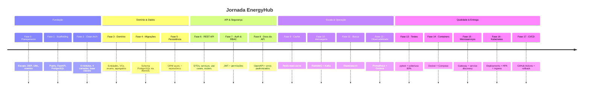

# 🗺️ Roadmap — EnergyHub

> Plano de evolução da plataforma **EnergyHub**, uma plataforma de negociação de energia
> construída com **FastAPI**, **Clean Architecture** e **Domain-Driven Design** em **Python 3.12+**.

Este roadmap consolida as **18 fases** especificadas em [`openspec/changes/`](../openspec/changes/).
Cada fase é uma _change_ do [OpenSpec](https://github.com/openspec) (fluxo _spec-driven_) com
`proposal.md`, `design.md`, `tasks.md` e um conjunto de _specs_ de capacidades.

O caminho vai do **planejamento** (Fase 0) até uma plataforma de microsserviços
**pronta para produção com CI/CD** (Fase 17), evoluindo de forma incremental e sempre
mantendo o sistema funcional a cada etapa.

---

## 📌 Legenda de status

| Status | Significado |
| :----: | :---------- |
| ✅ Concluído | Fase implementada e validada |
| 🚧 Em andamento | Implementação iniciada |
| 📋 Planejado | Especificação (OpenSpec) pronta; implementação ainda não iniciada |

> **Estado atual:** as especificações OpenSpec das **18 fases estão completas**. As **Fases 0 a 4
> estão CONCLUÍDAS e arquivadas** (versões `0.1.0` a `0.4.0`); a implementação seguiu o
> **layout `src`** (`src/energyhub/`). A **próxima é a Fase 5 — Persistência: ORM & Repositórios**.
> As **Fases 5–17 permanecem 📋 Planejadas**. Consulte o [CHANGELOG](./CHANGELOG.md)
> para o mapeamento fase → versão.

---

## 🧭 Visão geral por etapas

As 18 fases estão agrupadas em **7 etapas** que representam grandes marcos do produto:

| Etapa | Fases | Foco | Versões |
| :---- | :---- | :--- | :------ |
| **0 · Planejamento** | 0 | Escopo, requisitos, modelagem e arquitetura | — |
| **1 · Fundação** | 1–2 | Ambiente, tooling e esqueleto Clean Architecture | `0.1.0` – `0.2.0` |
| **2 · Domínio & Dados** | 3–5 | Modelo de domínio, schema do banco e persistência | `0.3.0` – `0.5.0` |
| **3 · API & Segurança** | 6–8 | REST API, autenticação/RBAC e documentação | `0.6.0` – `0.8.0` |
| **4 · Escala & Operação** | 9–12 | Cache, mensageria, busca e observabilidade | `0.9.0` – `0.12.0` |
| **5 · Qualidade & Empacotamento** | 13–14 | Testes automatizados e containerização | `0.13.0` – `0.14.0` |
| **6 · Distribuição & Entrega** | 15–17 | Microsserviços, Kubernetes e CI/CD | `0.15.0` – `1.0.0` |

---

## 🚩 Etapa 0 — Planejamento

### ✅ Fase 0 — Planejamento e Design do Sistema _(concluída)_
**Objetivo:** estabelecer toda a documentação de planejamento (escopo, requisitos, modelo de
domínio e arquitetura) **antes de escrever código**, evitando retrabalho e alinhando os
_stakeholders_ — crítico dados os requisitos financeiros e regulatórios.

**Entregáveis (capacidades):**
- `system-scope` — funcionalidades, tipos de usuário, módulos e regras de negócio
- `requirements-specification` — requisitos funcionais e não-funcionais (< 200 ms, 10k usuários, 99,9% de _uptime_, segurança, auditabilidade, i18n)
- `use-case-modeling` — casos de uso **UC-01 a UC-11** e diagrama de casos de uso
- `database-design` — diagrama Entidade-Relacionamento (DER) completo
- `uml-modeling` — diagramas UML (Classe, Sequência, Componentes)
- `business-events` — catálogo de eventos de negócio (payload, gatilho, consumidores)
- `architecture-planning` — arquitetura técnica em Clean Architecture (módulos e dependências)

**Decisões-chave:** Mermaid + Draw.io para diagramas versionáveis · PostgreSQL em 3FN (NoSQL descartado) · Clean Architecture com 4 camadas · regra de dependência _domain → application → infrastructure_.

---

## 🏗️ Etapa 1 — Fundação

### ✅ Fase 1 — Scaffolding do Projeto e Infraestrutura · `0.1.0` _(concluída)_
**Objetivo:** montar o ambiente de desenvolvimento, controle de versão, gerência de
dependências e conectividade com o banco.

**Entregáveis:**
- `git-repository-setup` · `poetry-project-setup` · `docker-postgresql-setup`
- `fastapi-application-init` — app FastAPI com endpoints raiz e `/health`
- `development-tools-config` — pytest, black, flake8, mypy, ruff

**Tecnologias introduzidas:** Poetry, FastAPI, Uvicorn, SQLAlchemy 2.0, asyncpg, Pydantic, pydantic-settings, Alembic, Docker Compose, PostgreSQL 16.

_Como implementado:_ código no **layout `src`** (`src/energyhub/`); app em `main.py` (`/`, `/health`); `config` inicial via pydantic-settings; verificado com **ruff / mypy / black / pytest** limpos.

### ✅ Fase 2 — Estrutura Clean Architecture e Classes Base · `0.2.0` _(concluída)_
**Objetivo:** criar o esqueleto de módulos e as classes/interfaces base compartilhadas por
todas as camadas, evitando duplicação e garantindo consistência.

**Entregáveis:**
- `clean-architecture-structure` — **9 módulos** (`shared`, `auth`, `clients`, `contracts`, `negotiations`, `financial`, `audit`, `notifications`, `reports`) × **4 camadas**
- `domain-layer-base` (`BaseEntity`, `Repository`, hierarquia `DomainException`)
- `application-layer-base` (`BaseDTO`, `UseCase`, `ApplicationException`)
- `infrastructure-layer-base` (`SQLAlchemyRepository`)
- `presentation-layer-base` (`BaseRouter`, _exception handlers_, `ErrorResponse`)
- `shared-module-organization` · `config-module-enhancement` (CORS + injeção de dependências)

_Como implementado:_ **layout `src`**; **`config` como pacote** (`settings.py` + reexport + `config/dependencies/`); `BaseEntity` como `@dataclass(kw_only=True)`; **211 `__init__.py`** nos 9 módulos × 4 camadas; verificado com **ruff / mypy / black / pytest** limpos.

---

## 🧩 Etapa 2 — Domínio & Dados

### ✅ Fase 3 — Modelo de Domínio (DDD) · `0.3.0` _(concluída)_
**Objetivo:** implementar a camada de domínio completa (entidades, _value objects_, enums e
agregados) de forma pura, sem acoplamento a infraestrutura.

**Entregáveis:**
- Entidades: `User`/`Role`/`Permission`, `Client`/`Contact`, `Contract`, `Negotiation`/`EnergyTransaction`, `Invoice`/`Payment`, `AuditLog`, `Notification`, `Report`
- `domain-value-objects` — `CNPJ`, `Email`, `Money`, `PhoneNumber`, `Address`, `Percentage` (_frozen dataclasses_ com validação)
- `domain-enums` — `ContractStatus`, `NegotiationStatus`, `InvoiceStatus`, `TransactionType`, etc. (`str, Enum`)
- `domain-aggregates` — `AuthAggregate`, `ClientAggregate`, `ContractAggregate`, `NegotiationAggregate`, `FinancialAggregate`
- `domain-validations` — validações no `__post_init__` (`ValidationException`) e métodos de transição de estado nas entidades

_Como implementado:_ **domínio puro** (sem imports de framework): entidades `@dataclass(kw_only=True)` com validação no **`__post_init__`** (`ValidationException`); relacionamentos por **referências Python** + **agregados**; VOs como _frozen dataclasses_; verificado com **ruff / mypy / black** + _smoke test_ comportamental.

### ✅ Fase 4 — Schema do Banco e Migrações Alembic · `0.4.0` _(concluída)_
**Objetivo:** materializar o schema PostgreSQL de forma versionada, reproduzível e reversível.

**Entregáveis:**
- `alembic-configuration` — Alembic ligado às _settings_ e ao `Base.metadata`
- `database-schema-migrations` — todas as tabelas (chaves UUID via `gen_random_uuid()`, FKs, _joins_)
- `database-indexes` — índices simples e compostos para _hot paths_
- `database-constraints` — `CHECK` (e-mail/CNPJ, valores positivos, ordenação de datas) + _trigger_ `updated_at`
- `database-seed-data` — _seed_ idempotente (papéis `ADMIN`/`OPERATOR`/`CLIENT`, permissões e usuário admin padrão)

_Como implementado:_ **8 migrações encadeadas** (`0001`→`0008`) criando **15 tabelas** de domínio, **42 índices**, **4 CHECK constraints**, **função + 13 triggers** `updated_at` e o _seed_ (3 papéis, 4 permissões, grants do ADMIN e usuário `admin` com hash bcrypt); `Base` declarativa em `shared/infrastructure/persistence/database.py` e `env.py` (async/`NullPool`, online+offline). Validado contra o **PostgreSQL do Docker** (16 tabelas, `alembic_version=0008`, cenários de CHECK/FK/trigger e _round-trip_ `downgrade base`→`upgrade head`). O domínio `Contract` foi **endurecido** (valores estritamente positivos, `end_date > start_date`) para alinhar com os CHECKs do banco.

### 📋 Fase 5 — Persistência: ORM & Repositórios · `0.5.0`
**Objetivo:** conectar domínio e banco com uma camada de persistência async, tipada e testável.

**Entregáveis:**
- `sqlalchemy-database-configuration` — engine async, `async_sessionmaker`, dependência `get_session()`
- `orm-entity-mapping` — cada entidade mapeada à sua tabela (`Mapped[...]`)
- `generic-repository` — `SQLAlchemyRepository[T, ID]` com CRUD (`save` faz _flush_, não _commit_)
- `entity-repositories` — um repositório por entidade com _finders_ específicos
- `query-filtering` · `pagination` (`PageRequest`/`PageResponse`) · `persistence-integration-tests`

---

## 🌐 Etapa 3 — API & Segurança

### 📋 Fase 6 — Camadas de Aplicação e Apresentação (REST API) · `0.6.0`
**Objetivo:** transformar as entidades persistidas em uma API REST documentada e chamável.

**Entregáveis:**
- `request-response-dtos` · `input-validation` (ex.: `CnpjValidator`) · `entity-dto-mappers`
- `domain-exceptions` — hierarquia (não-encontrado / já-existe / estado-inválido) mapeada para HTTP (404/409/422)
- `application-services` · `use-case-orchestration` (contrato `UseCase[Input, Output]`)
- `rest-api-endpoints` — routers CRUD + listagem paginada, auto-documentados (Swagger/ReDoc)

### 📋 Fase 7 — Autenticação e Autorização RBAC · `0.7.0`
**Objetivo:** proteger a API com login por JWT e controle de acesso por papéis/permissões.

**Entregáveis:**
- `password-hashing` (BCrypt) · `jwt-tokens` (`JwtService`, HS256) · `authentication` (`POST /api/v1/auth/login`)
- `current-user-resolution` (`get_current_user` + `UserDetails`) — 401 em token inválido
- `rbac-authorization` — `require_permission` / `require_role` (403 em grant insuficiente)
- `role-permission-services` · `endpoint-security` (rotas públicas × protegidas)

### 📋 Fase 8 — Documentação da API e Erros Padronizados · `0.8.0`
**Objetivo:** tornar a API auto-descritiva com contrato OpenAPI curado e respostas de erro consistentes.

**Entregáveis:**
- `openapi-configuration` — `custom_openapi()` com metadados e _security scheme_ `bearerAuth`
- `endpoint-documentation` · `schema-documentation` (descrições, exemplos e _tags_)
- `error-response-schemas` — `ErrorResponse` / `ValidationErrorResponse`
- `error-catalog` — [`docs/API_ERRORS.md`](./API_ERRORS.md) + `error_code` nas exceções
- `api-usage-examples` — [`docs/API_EXAMPLES.md`](./API_EXAMPLES.md) com exemplos `curl`

---

## ⚙️ Etapa 4 — Escala & Operação

### 📋 Fase 9 — Camada de Cache com Redis · `0.9.0`
**Objetivo:** reduzir carga no banco e latência com um _read-cache_ Redis e invalidação explícita na escrita.

**Entregáveis:**
- `redis-cache-infrastructure` (serviço `redis:7-alpine` + _settings_) · `cache-backend-configuration` (`fastapi-cache2`)
- `query-result-caching` — `@cache` com _namespaces_ por domínio e TTLs escalonados
- `cache-invalidation` — evicção em create/update/delete · `cache-administration` (rota `/api/v1/cache`, permissão `CACHE_MANAGE`)

### 📋 Fase 10 — Camada de Mensageria Assíncrona (RabbitMQ & Kafka) · `0.10.0`
**Objetivo:** desacoplar módulos com comunicação orientada a eventos — RabbitMQ para _workflows_ confiáveis por entidade e Kafka para _streams_ de alto volume.

**Entregáveis:**
- `rabbitmq-messaging-infrastructure` (aio-pika) · `domain-event-producers` · `async-event-consumers` (`NotificationConsumer`, `AuditConsumer`)
- `kafka-streaming-infrastructure` (aiokafka + Zookeeper) · `kafka-event-streaming`
- `message-delivery-reliability` — entrega _at-least-once_, mensagens duráveis, `MessagePublishingException`

### 📋 Fase 11 — Subsistema de Busca com Elasticsearch · `0.11.0`
**Objetivo:** oferecer busca _full-text_ com ranqueamento por relevância, tolerância a erros e filtros compostos sobre clientes e contratos.

**Entregáveis:**
- `elasticsearch-configuration` (serviço single-node + client factory) · `search-document-mapping` (analisador Português)
- `entity-indexing` · `full-text-search` (`multi_match` com _boosting_ + `fuzziness='AUTO'`)
- `advanced-search-filters` (`SearchFilter`/`FilterCondition`) · `search-api-endpoints` · `search-performance-tests`

> Elasticsearch é um _read store_ secundário e reconstruível; **PostgreSQL permanece a fonte da verdade**.

### 📋 Fase 12 — Observabilidade: Métricas, Dashboards e Alertas · `0.12.0`
**Objetivo:** dar visibilidade em tempo real (throughput, latência, taxa de erro, volumes de negócio e recursos de host).

**Entregáveis:**
- `metrics-instrumentation` (endpoint `/metrics` via `prometheus-fastapi-instrumentator`) · `custom-application-metrics` (`BusinessMetrics`)
- `system-resource-metrics` (psutil) · `prometheus-scraping` · `grafana-dashboards`
- `alerting` — regras Prometheus + Alertmanager (latência alta, taxa de erro, recursos baixos)

---

## 🧪 Etapa 5 — Qualidade & Empacotamento

### 📋 Fase 13 — Suíte de Testes Automatizados e _Quality Gate_ de Cobertura · `0.13.0`
**Objetivo:** estabelecer uma suíte determinística (unitários + integração) com **cobertura mínima de 80%** antes da containerização.

**Entregáveis:**
- `test-tooling-configuration` · `unit-testing` (serviços com _mocks_) · `test-doubles-and-fixtures` (`conftest.py`)
- `integration-testing` (Testcontainers + `TestClient`) · `test-environment` (`docker-compose.test.yml`)
- `coverage-quality-gate` (`--cov-fail-under=80`) · `test-stabilization`

### 📋 Fase 14 — Containerização e Orquestração Completa · `0.14.0`
**Objetivo:** empacotar a aplicação em imagem Docker _slim_ e _non-root_ e orquestrar toda a stack com Docker Compose (boot com um comando).

**Entregáveis:**
- `application-container-image` (Dockerfile _multi-stage_ + `.dockerignore`) · `service-orchestration` (rede + `depends_on`/_healthchecks_)
- `container-configuration` (12-factor, variáveis de ambiente) · `data-persistence-volumes`
- `messaging-and-streaming-containers` · `observability-stack-containers` · `environment-validation`

---

## 🚀 Etapa 6 — Distribuição & Entrega

### 📋 Fase 15 — Decomposição em Microsserviços e API Gateway · `0.15.0` ⚠️ _breaking_
**Objetivo:** dividir o monólito modular em serviços FastAPI independentemente implantáveis, comunicando-se pela rede.

**Entregáveis:**
- `bounded-context-decomposition` · `service-extraction` (Auth, Clients, Contracts, Financial, Audit)
- `service-discovery` (Consul) · `inter-service-communication` (httpx) · `service-resilience` (tenacity: timeout + retries + fallback)
- `api-gateway-routing` (Traefik por prefixo de path)

> ⚠️ **Mudança _breaking_:** o ponto de entrada único é substituído por serviços independentes atrás do _gateway_; chamadas entre módulos viram chamadas de rede e **cada serviço passa a ter seu próprio banco**.

### 📋 Fase 16 — Orquestração com Kubernetes · `0.16.0`
**Objetivo:** declarar toda a topologia como manifestos Kubernetes — serviços distribuídos, auto-recuperáveis, com autoscaling e um único ponto de entrada externo.

**Entregáveis:**
- `service-deployments` (réplicas, _requests/limits_, _probes_ em `/health`) · `configuration-and-secrets` (namespace `energyhub`, ConfigMaps + Secrets)
- `service-networking` (ClusterIP + LoadBalancer) · `ingress-routing` · `horizontal-autoscaling` (HPA v2, CPU ~70% / mem ~80%)
- `cluster-deployment-validation`

### 📋 Fase 17 — Automação CI/CD com GitHub Actions · `1.0.0` 🎉
**Objetivo:** automatizar build, testes, publicação de imagens e _deploy_ em Kubernetes com _rollback_ — tornando a plataforma **continuamente entregue e pronta para produção**.

**Entregáveis:**
- `build-automation-workflow` · `test-automation-workflow` (serviços Postgres/Redis) · `docker-image-build` (Buildx _matrix_ + cache)
- `container-registry-publishing` (tags `:latest` e `:SHA`) · `kubernetes-deploy-automation`
- `deployment-rollback-and-notifications` (`kubectl rollout undo` + alerta Slack) · `cicd-pipeline-orchestration` (`ci-cd.yml`)

---

## 🔗 Mapa de dependências entre fases

| Fase | Depende de |
| :--- | :--------- |
| 0 · Planejamento | — |
| 1 · Scaffolding | — |
| 2 · Clean Architecture | 1 |
| 3 · Domínio | 2 |
| 4 · Migrações | 1, 3 |
| 5 · Persistência | 3, 4 |
| 6 · REST API | 2, 5 |
| 7 · Auth & RBAC | 3, 4, 5, 6 |
| 8 · Docs da API | 6, 7 |
| 9 · Cache Redis | 5, 6, 7, 8 |
| 10 · Mensageria | 3, 4, 5, 6, 7, 8, 9 |
| 11 · Busca | 3, 4, 5, 6, 10 |
| 12 · Observabilidade | 11 |
| 13 · Testes | 4, 5, 6, 7, 8 |
| 14 · Containerização | — |
| 15 · Microsserviços | 12, 14 |
| 16 · Kubernetes | 14, 15 |
| 17 · CI/CD | 1, 13, 15, 16 |

---

## 📚 Referências

- Especificações completas: [`openspec/changes/`](../openspec/changes/)
- Histórico de versões planejadas: [`CHANGELOG.md`](./CHANGELOG.md)
- Visão geral do projeto: [`README.md`](./README.md)

---

Documento gerado a partir das 18 changes OpenSpec do EnergyHub · fluxo _spec-driven_.
