# 🗺️ Roadmap — EnergyHub

> Plano de evolução da plataforma **EnergyHub**, uma plataforma de negociação de energia
> construída com **FastAPI**, **Clean Architecture** e **Domain-Driven Design** em **Python 3.12+**.

Este roadmap consolida as **18 fases** ([`openspec/changes/archive/`](../openspec/changes/archive/))
e as **5 propostas de endurecimento pós-`1.0.0`** ([`openspec/changes/`](../openspec/changes/)).
Cada _change_ é do [OpenSpec](https://github.com/openspec) (fluxo _spec-driven_) com
`proposal.md`, `design.md`, `tasks.md` e um conjunto de _specs_ de capacidades.

O caminho vai do **planejamento** (Fase 0) até uma plataforma de microsserviços
**pronta para produção com CI/CD** (Fase 17), evoluindo de forma incremental e sempre
mantendo o sistema funcional a cada etapa — seguido de um ciclo de **endurecimento
pós-`1.0.0`** (segurança, supply-chain, correções de microsserviços, robustez do Kubernetes
e validação da esteira ao vivo) antes de qualquer uso não-local.

---

## 📌 Legenda de status

| Status | Significado |
| :----: | :---------- |
| ✅ Concluído | Fase implementada e validada |
| 🚧 Em andamento | Implementação iniciada |
| 📋 Planejado | Especificação (OpenSpec) pronta; implementação ainda não iniciada |

> **Estado atual:** 🎉 **Todas as 18 fases (0–17) estão CONCLUÍDAS e arquivadas** (versões `0.1.0`
> a `1.0.0`) — roadmap das fases completo, marco `1.0.0`; a implementação seguiu o **layout `src`**
> (`src/energyhub/`). Em seguida, um ciclo de **endurecimento pós-`1.0.0`** adicionou **5 novas
> propostas OpenSpec** (📋 _Planejadas_ — _specs_ prontas e validadas com `openspec validate --strict`,
> implementação a iniciar em ordem) cobrindo **segurança**, **supply-chain do CI/CD**, **correções dos
> microsserviços**, **robustez do Kubernetes** e **validação da esteira ao vivo**. Consulte o
> [CHANGELOG](./CHANGELOG.md) para o mapeamento fase → versão.

---

## 🧭 Visão geral por etapas

As 18 fases estão agrupadas em **7 etapas** (0–6) que representam grandes marcos do produto; um
**oitavo grupo** reúne as propostas de endurecimento **pós-`1.0.0`**:

| Etapa | Fases | Foco | Versões |
| :---- | :---- | :--- | :------ |
| **0 · Planejamento** | 0 | Escopo, requisitos, modelagem e arquitetura | — |
| **1 · Fundação** | 1–2 | Ambiente, tooling e esqueleto Clean Architecture | `0.1.0` – `0.2.0` |
| **2 · Domínio & Dados** | 3–5 | Modelo de domínio, schema do banco e persistência | `0.3.0` – `0.5.0` |
| **3 · API & Segurança** | 6–8 | REST API, autenticação/RBAC e documentação | `0.6.0` – `0.8.0` |
| **4 · Escala & Operação** | 9–12 | Cache, mensageria, busca e observabilidade | `0.9.0` – `0.12.0` |
| **5 · Qualidade & Empacotamento** | 13–14 | Testes automatizados e containerização | `0.13.0` – `0.14.0` |
| **6 · Distribuição & Entrega** | 15–17 | Microsserviços, Kubernetes e CI/CD | `0.15.0` – `1.0.0` |
| **7 · Endurecimento (pós-`1.0.0`)** | — | Segurança, supply-chain, correções de microsserviços, robustez k8s e validação da esteira | pós-`1.0.0` (📋) |

```mermaid
timeline
    title Jornada EnergyHub
    section Fundação
        Fase 0 · Planejamento : Escopo, DER, UML, eventos
        Fase 1 · Scaffolding  : Poetry, FastAPI, PostgreSQL
        Fase 2 · Clean Arch   : 9 módulos, 4 camadas, base classes
    section Domínio & Dados
        Fase 3 · Domínio      : Entidades, VOs, enums, agregados
        Fase 4 · Migrações    : Schema PostgreSQL via Alembic
        Fase 5 · Persistência : ORM async + repositórios
    section API & Segurança
        Fase 6 · REST API     : DTOs, serviços, use cases, routers
        Fase 7 · Auth & RBAC  : JWT + permissões
        Fase 8 · Docs da API  : OpenAPI + erros padronizados
    section Escala & Operação
        Fase 9 · Cache        : Redis read-cache
        Fase 10 · Mensageria  : RabbitMQ + Kafka
        Fase 11 · Busca       : Elasticsearch
        Fase 12 · Observabilidade : Prometheus + Grafana
    section Qualidade & Entrega
        Fase 13 · Testes      : pytest + cobertura 80%
        Fase 14 · Containers  : Docker + Compose
        Fase 15 · Microsserviços : Gateway + service discovery
        Fase 16 · Kubernetes  : Deployments + HPA + Ingress
        Fase 17 · CI/CD       : GitHub Actions + rollback
    section Endurecimento (pós-1.0.0)
        Segurança         : Credenciais + secret manager + TLS
        Supply-chain      : Actions por SHA + branch protection
        Microsserviços    : Consul service_id + produtor audit
        Robustez k8s      : Kustomize + Kafka KRaft + PVCs
        Esteira ao vivo   : Pipeline verde no GitHub + evidências
```

---

## 🚩 Etapa 0 — Planejamento

### ✅ Fase 0 — Planejamento e Design do Sistema _(concluída)_
**Objetivo:** estabelecer toda a documentação de planejamento (escopo, requisitos, modelo de
domínio e arquitetura) **antes de escrever código**, evitando retrabalho e alinhando os
_stakeholders_ — crítico dados os requisitos financeiros e regulatórios.

**Entregáveis (capacidades):**
- `system-scope` — funcionalidades, tipos de usuário, módulos e regras de negócio
- `requirements-specification` — requisitos funcionais e não-funcionais (< 200 ms, 10k usuários, 99,9% de _uptime_, segurança, auditabilidade, i18n)
- `use-case-modeling` — casos de uso **UC-01 a UC-11** e diagrama de casos de uso
- `database-design` — diagrama Entidade-Relacionamento (DER) completo
- `uml-modeling` — diagramas UML (Classe, Sequência, Componentes)
- `business-events` — catálogo de eventos de negócio (payload, gatilho, consumidores)
- `architecture-planning` — arquitetura técnica em Clean Architecture (módulos e dependências)

**Decisões-chave:** Mermaid + Draw.io para diagramas versionáveis · PostgreSQL em 3FN (NoSQL descartado) · Clean Architecture com 4 camadas · regra de dependência _domain → application → infrastructure_.

---

## 🏗️ Etapa 1 — Fundação

### ✅ Fase 1 — Scaffolding do Projeto e Infraestrutura · `0.1.0` _(concluída)_
**Objetivo:** montar o ambiente de desenvolvimento, controle de versão, gerência de
dependências e conectividade com o banco.

**Entregáveis:**
- `git-repository-setup` · `poetry-project-setup` · `docker-postgresql-setup`
- `fastapi-application-init` — app FastAPI com endpoints raiz e `/health`
- `development-tools-config` — pytest, black, flake8, mypy, ruff

**Tecnologias introduzidas:** Poetry, FastAPI, Uvicorn, SQLAlchemy 2.0, asyncpg, Pydantic, pydantic-settings, Alembic, Docker Compose, PostgreSQL 16.

_Como implementado:_ código no **layout `src`** (`src/energyhub/`); app em `main.py` (`/`, `/health`); `config` inicial via pydantic-settings; verificado com **ruff / mypy / black / pytest** limpos.

### ✅ Fase 2 — Estrutura Clean Architecture e Classes Base · `0.2.0` _(concluída)_
**Objetivo:** criar o esqueleto de módulos e as classes/interfaces base compartilhadas por
todas as camadas, evitando duplicação e garantindo consistência.

**Entregáveis:**
- `clean-architecture-structure` — **9 módulos** (`shared`, `auth`, `clients`, `contracts`, `negotiations`, `financial`, `audit`, `notifications`, `reports`) × **4 camadas**
- `domain-layer-base` (`BaseEntity`, `Repository`, hierarquia `DomainException`)
- `application-layer-base` (`BaseDTO`, `UseCase`, `ApplicationException`)
- `infrastructure-layer-base` (`SQLAlchemyRepository`)
- `presentation-layer-base` (`BaseRouter`, _exception handlers_, `ErrorResponse`)
- `shared-module-organization` · `config-module-enhancement` (CORS + injeção de dependências)

_Como implementado:_ **layout `src`**; **`config` como pacote** (`settings.py` + reexport + `config/dependencies/`); `BaseEntity` como `@dataclass(kw_only=True)`; **211 `__init__.py`** nos 9 módulos × 4 camadas; verificado com **ruff / mypy / black / pytest** limpos.

---

## 🧩 Etapa 2 — Domínio & Dados

### ✅ Fase 3 — Modelo de Domínio (DDD) · `0.3.0` _(concluída)_
**Objetivo:** implementar a camada de domínio completa (entidades, _value objects_, enums e
agregados) de forma pura, sem acoplamento a infraestrutura.

**Entregáveis:**
- Entidades: `User`/`Role`/`Permission`, `Client`/`Contact`, `Contract`, `Negotiation`/`EnergyTransaction`, `Invoice`/`Payment`, `AuditLog`, `Notification`, `Report`
- `domain-value-objects` — `CNPJ`, `Email`, `Money`, `PhoneNumber`, `Address`, `Percentage` (_frozen dataclasses_ com validação)
- `domain-enums` — `ContractStatus`, `NegotiationStatus`, `InvoiceStatus`, `TransactionType`, etc. (`str, Enum`)
- `domain-aggregates` — `AuthAggregate`, `ClientAggregate`, `ContractAggregate`, `NegotiationAggregate`, `FinancialAggregate`
- `domain-validations` — validações no `__post_init__` (`ValidationException`) e métodos de transição de estado nas entidades

_Como implementado:_ **domínio puro** (sem imports de framework): entidades `@dataclass(kw_only=True)` com validação no **`__post_init__`** (`ValidationException`); relacionamentos por **referências Python** + **agregados**; VOs como _frozen dataclasses_; verificado com **ruff / mypy / black** + _smoke test_ comportamental.

### ✅ Fase 4 — Schema do Banco e Migrações Alembic · `0.4.0` _(concluída)_
**Objetivo:** materializar o schema PostgreSQL de forma versionada, reproduzível e reversível.

**Entregáveis:**
- `alembic-configuration` — Alembic ligado às _settings_ e ao `Base.metadata`
- `database-schema-migrations` — todas as tabelas (chaves UUID via `gen_random_uuid()`, FKs, _joins_)
- `database-indexes` — índices simples e compostos para _hot paths_
- `database-constraints` — `CHECK` (e-mail/CNPJ, valores positivos, ordenação de datas) + _trigger_ `updated_at`
- `database-seed-data` — _seed_ idempotente (papéis `ADMIN`/`OPERATOR`/`CLIENT`, permissões e usuário admin padrão)

_Como implementado:_ **8 migrações encadeadas** (`0001`→`0008`) criando **15 tabelas** de domínio, **42 índices**, **4 CHECK constraints**, **função + 13 triggers** `updated_at` e o _seed_ (3 papéis, 4 permissões, grants do ADMIN e usuário `admin` com hash bcrypt); `Base` declarativa em `shared/infrastructure/persistence/database.py` e `env.py` (async/`NullPool`, online+offline). Validado contra o **PostgreSQL do Docker** (16 tabelas, `alembic_version=0008`, cenários de CHECK/FK/trigger e _round-trip_ `downgrade base`→`upgrade head`). O domínio `Contract` foi **endurecido** (valores estritamente positivos, `end_date > start_date`) para alinhar com os CHECKs do banco.

### ✅ Fase 5 — Persistência: ORM & Repositórios · `0.5.0` _(concluída)_
**Objetivo:** conectar domínio e banco com uma camada de persistência async, tipada e testável.

**Entregáveis:**
- `sqlalchemy-database-configuration` — engine async, `async_sessionmaker`, dependência `get_session()`
- `orm-entity-mapping` — cada entidade mapeada à sua tabela via **mapeamento imperativo** (domínio puro)
- `generic-repository` — `SQLAlchemyRepository[T, ID]` com CRUD (`save` faz _flush_, não _commit_)
- `entity-repositories` — um repositório por entidade com _finders_ específicos
- `query-filtering` · `pagination` (`PageRequest`/`PageResponse`) · `persistence-integration-tests`

_Como implementado:_ **mapeamento imperativo** (`registry.map_imperatively`) em `shared/infrastructure/persistence/mapping.py` — as entidades continuam _dataclasses_ **puras** (sem import de framework), e `BaseEntity` ganhou igualdade por identidade (`id`). `Base` + engine async + `get_session()`; **13 repositórios** sobre o `SQLAlchemyRepository[T, ID]` (`save` faz _flush_); filtros componíveis + DTOs Pydantic; paginação `PageRequest`/`PageResponse`. Verificado: app sobe sem erros de mapper, **8 testes de integração** passam contra o Postgres do Docker; ruff/black/mypy limpos (com _override_ de mypy escopado à camada de persistência, pelo mapeamento imperativo).

---

## 🌐 Etapa 3 — API & Segurança

### ✅ Fase 6 — Camadas de Aplicação e Apresentação (REST API) · `0.6.0` _(concluída)_
**Objetivo:** transformar as entidades persistidas em uma API REST documentada e chamável.

**Entregáveis:**
- `request-response-dtos` · `input-validation` (validadores reutilizáveis de CNPJ/e-mail/não-vazio) · `entity-dto-mappers`
- `domain-exceptions` — hierarquia (não-encontrado / já-existe / estado-inválido) mapeada para HTTP (404/409/422)
- `application-services` · `use-case-orchestration` (contrato `UseCase[Input, Output]`)
- `rest-api-endpoints` — routers CRUD + listagem paginada, auto-documentados (Swagger/ReDoc)

_Como implementado:_ **10 routers / 25 endpoints** (`/api/v1/...`) sobre a cadeia **DTO→mapper→service→use-case**; DTOs Pydantic (resposta estende `BaseDTO`, `from_attributes`), validadores compartilhados aplicados via `@field_validator`, e **handler central** que traduz exceções de domínio em HTTP (404/409/422). `auth` com **M2M** (papéis/permissões aninhados via `selectin`; senha **bcrypt**, nunca exposta); sub-recursos (contatos, pagamentos, transações) com a FK vinda do path. Ajustes de fundação: `BaseDTO`/`PageResponse` migrados para **Pydantic**, relações de navegação do ORM como **`viewonly`** e `get_session` passa a **commitar na borda** da requisição. Verificado com **ruff / black / mypy (384) limpos** + **2 E2E HTTP** cobrindo os 8 módulos e os erros 404/409/422 contra o Postgres do Docker.

### ✅ Fase 7 — Autenticação e Autorização RBAC · `0.7.0` _(concluída)_
**Objetivo:** proteger a API com login por JWT e controle de acesso por papéis/permissões.

**Entregáveis:**
- `password-hashing` (BCrypt) · `jwt-tokens` (`JwtService`, HS256) · `authentication` (`POST /api/v1/auth/login`)
- `current-user-resolution` (`get_current_user` + `UserDetails`) — 401 em token inválido
- `rbac-authorization` — `require_permission` / `require_role` (403 em grant insuficiente)
- `role-permission-services` · `endpoint-security` (rotas públicas × protegidas)

_Como implementado:_ hashing **bcrypt direto** (`get_password_hash`/`verify_password`; o `passlib`
1.7.4 é incompatível com o `bcrypt 5.x` — desvio da spec documentado no módulo). `JwtService`
(python-jose, HS256) com `create_token`/`decode_token`/`extract_username`/`is_token_valid`; login
(`AuthenticationService` + `AuthRouter`) que rejeita usuário inexistente/senha errada/inativo com **401**
e emite o token + perfil. `get_current_user` usa `HTTPBearer(auto_error=False)` (token ausente → **401**,
não 403) e resolve o `sub`→`UserDetails` (papéis + permissões achatadas via `selectin`).
`require_permission`/`require_role` (em `shared`, encadeados após `get_current_user`) barram com **403**.
**10 routers protegidos** (nível de grupo `get_current_user` + **54 guards** `require_permission` por
endpoint), catálogo canônico em `shared/constant/permissions.py`; login/`/`/`/health` públicos. Nova
**migração `0009`** semeia o catálogo completo (**38 permissões**) e concede **todas** ao `ADMIN` via
`INSERT…SELECT` idempotente. Verificado: **ruff/black/mypy (394) limpos**, **26 paths OpenAPI** (54
operações com `security`), e **E2E** contra o Postgres do Docker (login **200**, sem token **401**, sem
permissão **403**, com permissão **200**).

### ✅ Fase 8 — Documentação da API e Erros Padronizados · `0.8.0` _(concluída)_
**Objetivo:** tornar a API auto-descritiva com contrato OpenAPI curado e respostas de erro consistentes.

**Entregáveis:**
- `openapi-configuration` — `custom_openapi()` com metadados e _security scheme_ `bearerAuth`
- `endpoint-documentation` · `schema-documentation` (descrições, exemplos e _tags_)
- `error-response-schemas` — `ErrorResponse` / `ValidationErrorResponse`
- `error-catalog` — [`docs/API_ERRORS.md`](./API_ERRORS.md) + `error_code` nas exceções
- `api-usage-examples` — [`docs/API_EXAMPLES.md`](./API_EXAMPLES.md) com exemplos `curl`

_Como implementado:_ `custom_openapi()` (cacheado) injeta contato/licença e o esquema **`bearerAuth`**
(HTTP/bearer/JWT) com requisito de segurança global — rotas públicas (`login`, `/`, `/health`)
neutralizadas; **12 tags** com descrições. Os **11 routers** ganharam `summary`/`description`/
`responses` por status (compostos de blocos reutilizáveis em `shared/presentation/response/openapi_responses.py`),
e os **30 DTOs**, descrições + exemplos sintéticos + constraints leves (sem `EmailStr` — `email-validator`
ausente). Erros padronizados: `ErrorResponse` (Pydantic, com `error_code`) e `ValidationErrorResponse`/
`FieldError`; handlers alinhados — `RequestValidationError`→**400**, domínio→404/409/422, credenciais→401,
não-tratado→**500**. **23 exceções** ganharam `error_code`, catalogado em `docs/API_ERRORS.md`; guia
`curl` em `docs/API_EXAMPLES.md`. A versão da API é **`0.8.0`** (SemVer do projeto, não o `1.0.0` literal
do plano). Verificado: **ruff/black/mypy (397) limpos** + **E2E** (404 `ErrorResponse`, 400
`ValidationErrorResponse`, 409 `CLIENT_ALREADY_EXISTS`, esquema `bearerAuth`) contra o Postgres do Docker.

---

## ⚙️ Etapa 4 — Escala & Operação

### ✅ Fase 9 — Camada de Cache com Redis · `0.9.0` _(concluída)_
**Objetivo:** reduzir carga no banco e latência com um _read-cache_ Redis e invalidação explícita na escrita.

**Entregáveis:**
- `redis-cache-infrastructure` (serviço `redis:7-alpine` + _settings_) · `cache-backend-configuration` (`fastapi-cache2`)
- `query-result-caching` — `@cache` com _namespaces_ por domínio e TTLs escalonados
- `cache-invalidation` — evicção em create/update/delete · `cache-administration` (rota `/api/v1/cache`, permissão `CACHE_MANAGE`)

_Como implementado:_ serviço **`redis:7-alpine`** (append-only + volume + healthcheck) no compose; deps
`redis ^4.6` (o `fastapi-cache2` fixa `redis<5`) + `jinja2`. `CacheConfig.init_cache()` (RedisBackend +
prefixo `energyhub` + **PickleCoder** p/ round-trip de DTOs Pydantic) no **lifespan** da app; `CacheConstants`
(namespaces + TTLs SHORT/DEFAULT/LONG). **`@cache`** nos reads de **5 serviços** (Role/Permission/Client/
Contract/User) com _key builders_ que ignoram o `self`; `invalidate_cache`/`invalidate_all_cache` em todo
create/update/delete. Router `/api/v1/cache` (`/stats`, `/clear`) protegido por **`CACHE_MANAGE`** (migração
**0010** concede ao ADMIN). Verificado: **ruff/black/mypy (401) limpos** + **E2E** (miss→popula, hit→serve do
cache, create→invalida namespace, 403/401 no gating) contra Postgres+Redis do Docker. Nota Windows: o Redis
**conecta do host** (ao contrário do Postgres).

### ✅ Fase 10 — Camada de Mensageria Assíncrona (RabbitMQ & Kafka) · `0.10.0` _(concluída)_
**Objetivo:** desacoplar módulos com comunicação orientada a eventos — RabbitMQ para _workflows_ confiáveis por entidade e Kafka para _streams_ de alto volume.

**Entregáveis:**
- `rabbitmq-messaging-infrastructure` (aio-pika) · `domain-event-producers` · `async-event-consumers` (`NotificationConsumer`, `AuditConsumer`)
- `kafka-streaming-infrastructure` (aiokafka + Zookeeper) · `kafka-event-streaming`
- `message-delivery-reliability` — entrega _at-least-once_, mensagens duráveis, `MessagePublishingException`

_Como implementado:_ brokers **RabbitMQ** (`3-management-alpine`, healthcheck + volume) e **Kafka + Zookeeper**
(`cp-*:7.6.1`, dois _listeners_ — `localhost:9092` host / `kafka:29092` rede — e `auto-create` off) no compose;
deps `aio-pika ^9.4` + `aiokafka ^0.11` e settings `rabbitmq_url`/`kafka_bootstrap_servers`/`kafka_group_id`.
`RabbitMQConfig` (**11 filas** duráveis) + `setup_queues()` idempotente; `EventProducer` base (conexão robusta,
`DeliveryMode.PERSISTENT`) + `UserEventProducer`/`ClientEventProducer`; consumidores `NotificationConsumer` e
`AuditConsumer` (**`prefetch_count=1`**, ack pós-processo) + contrato `AuditEvent`. `KafkaConfig` (**4 tópicos**,
financeiro com 6 partições, `create_topics` idempotente) + `KafkaEventProducer` (keyed `send_and_wait`) /
`KafkaEventConsumer` (`stop` no `finally`). Publicação **pós-commit** não-bloqueante nos serviços (User/Client →
RabbitMQ, Contract/Invoice → Kafka) via `publish_safely`; topologia preparada no **lifespan**. Verificado:
**ruff/black/mypy (413) limpos** + **E2E** contra os brokers reais — create real → fila, `AuditConsumer` grava
`AuditLog` (Postgres), Kafka mesma-chave→mesma-partição+ordem, **durabilidade** no restart, **redelivery** em
handler falho, e falha de publicação → `MessagePublishingException` sem desfazer a escrita. Nota Windows:
**RabbitMQ e Kafka conectam do host** (só o E2E que grava no banco roda no container da rede do compose).

### ✅ Fase 11 — Subsistema de Busca com Elasticsearch · `0.11.0` _(concluída)_
**Objetivo:** oferecer busca _full-text_ com ranqueamento por relevância, tolerância a erros e filtros compostos sobre clientes e contratos.

**Entregáveis:**
- `elasticsearch-configuration` (serviço single-node + client factory) · `search-document-mapping` (analisador Português)
- `entity-indexing` · `full-text-search` (`multi_match` com _boosting_ + `fuzziness='AUTO'`)
- `advanced-search-filters` (`SearchFilter`/`FilterCondition`) · `search-api-endpoints` · `search-performance-tests`

> Elasticsearch é um _read store_ secundário e reconstruível; **PostgreSQL permanece a fonte da verdade**.

_Como implementado:_ serviço **`elasticsearch:8.13.4`** (single-node, segurança off, heap 512m, healthcheck
`_cluster/health`, volume) no compose; deps `elasticsearch`/`elasticsearch-dsl ^8.0` e settings
`elasticsearch_url`/`elasticsearch_timeout`. `ElasticsearchConfig` (cliente **síncrono** singleton +
`create_indices(documents)` idempotente — recebe as classes do chamador, `shared` não importa módulos de
negócio). Analisador **português** customizado + `ClientDocument`/`ContractDocument` (keyword/text/date/`Double`,
`from_entity` achatando enums/`Decimal`/id). Repositórios de busca (`save`/`delete` + _finders_) e
`ClientSearchService` (**`multi_match`** com boosting `corporate_name^2`/`trade_name^1.5`/`cnpj` +
`fuzziness='AUTO'`, `filter_by_location`, `advanced_search` com `SearchFilter`/`FilterCondition` +
`min_score`), paginado via `PageRequest`/`PageResponse` (`hits.total.value`). Router
**`/api/v1/search/clients`** (full-text/location/advanced, endpoints síncronos → threadpool), índices criados no
**lifespan**. Verificado: **ruff/black/mypy (425) limpos** + **6 testes** (`pytest -k search`) contra o ES real —
full-text < 1s, fuzziness, location, paginação, term+range e `min_score`. Nota Windows: o ES **conecta do host**
(como Redis/RabbitMQ/Kafka; só o Postgres falha).

### ✅ Fase 12 — Observabilidade: Métricas, Dashboards e Alertas · `0.12.0` _(concluída)_
**Objetivo:** dar visibilidade em tempo real (throughput, latência, taxa de erro, volumes de negócio e recursos de host).

**Entregáveis:**
- `metrics-instrumentation` (endpoint `/metrics` via `prometheus-fastapi-instrumentator`) · `custom-application-metrics` (`BusinessMetrics`)
- `system-resource-metrics` (psutil) · `prometheus-scraping` · `grafana-dashboards`
- `alerting` — regras Prometheus + Alertmanager (latência alta, taxa de erro, recursos baixos)

_Como implementado:_ instrumentação via `prometheus-fastapi-instrumentator` (métricas HTTP `fastapi_*` +
`application_info`, `/metrics` excluído da própria coleta). `MetricsConfig` (coletores registrados uma vez) +
`BusinessMetrics` (singleton) + `record_safely` (registro livre de falhas); séries de negócio
(`client_created_total`, `contract_created_total{status}`, `invoice_paid_total`, `clients_active`,
`operation_duration_seconds`) zero-inicializadas no lifespan e instrumentadas em Client/Contract/Invoice.
`SystemMetricsCollector` (psutil) refresca memória/CPU/disco no scrape. Stack `prom/prometheus` +
`grafana/grafana` (data source + 3 dashboards provisionados) + `prom/alertmanager` no compose; o Prometheus
scrapeia o app no host via `host.docker.internal:8000`. Regras `HighRequestLatency`/`HighErrorRate`/`LowMemory`.
Verificado: **ruff/black/mypy (429) limpos** + E2E — `/metrics` (11 famílias), target UP, PromQL, 3 regras
carregadas e roteadas ao Alertmanager, data source + dashboards do Grafana renderizando. Placeholders
(`admin`/`admin`, receiver, `/metrics` aberto) a trocar antes de produção.

---

## 🧪 Etapa 5 — Qualidade & Empacotamento

### ✅ Fase 13 — Suíte de Testes Automatizados e _Quality Gate_ de Cobertura · `0.13.0` _(concluída)_
**Objetivo:** estabelecer uma suíte determinística (unitários + integração) com **cobertura mínima de 80%** antes da containerização.

**Entregáveis:**
- `test-tooling-configuration` · `unit-testing` (serviços com _mocks_) · `test-doubles-and-fixtures` (`conftest.py`)
- `integration-testing` (Testcontainers + `TestClient`) · `test-environment` (`docker-compose.test.yml`)
- `coverage-quality-gate` (`--cov-fail-under=80`) · `test-stabilization`

_Como implementado:_ toolchain `pytest` + `pytest-asyncio` (modo `auto`) + `pytest-mock` + `pytest-cov` +
`testcontainers` no grupo `dev`; `[tool.pytest.ini_options]` com `addopts` que embute o gate (`--cov=energyhub
--cov-fail-under=80`) e o marcador `integration`. **Unitários** dos 15 serviços de aplicação com colaboradores
`AsyncMock` (caminhos felizes + exceções de domínio, convenção `test_should_..._when_...`); um `conftest.py`
inicializa um cache **em memória** por teste (para os métodos `@cache`/`invalidate_cache` rodarem sem Redis) e
expõe doubles compartilhados. **Componente** dos 13 routers via `TestClient` + `dependency_overrides`
(sobrescrevendo `get_current_user`) — cobrindo apresentação e _guards_ RBAC sem infraestrutura. **Integração**:
`test_client_repository` contra um `PostgresContainer` (com _fallback_ para `EH_TEST_DATABASE_URL`) e
`test_client_router` via `TestClient` com login JWT real; ambos marcados `integration` e pulados sem Docker.
`docker-compose.test.yml` isola PG/Redis/RabbitMQ em `5433/6380/5673`. Verificado: **ruff/black (476) + mypy
(429) limpos**; no host **273 passam** (integração pulada) com **cobertura 85%**; **in-container** (onde o
Postgres é acessível) **279 passam** com **cobertura 87%**, gate satisfeito. Estabilização não revelou defeito
de aplicação — apenas ajustes de _harness_ (isolamento de cache; `raise_server_exceptions=False` no TestClient).

### ✅ Fase 14 — Containerização e Orquestração Completa · `0.14.0` _(concluída)_
**Objetivo:** empacotar a aplicação em imagem Docker _slim_ e _non-root_ e orquestrar toda a stack com Docker Compose (boot com um comando).

**Entregáveis:**
- `application-container-image` (Dockerfile _multi-stage_ + `.dockerignore`) · `service-orchestration` (rede + `depends_on`/_healthchecks_)
- `container-configuration` (12-factor, variáveis de ambiente) · `data-persistence-volumes`
- `messaging-and-streaming-containers` · `observability-stack-containers` · `environment-validation`

_Como implementado:_ **Dockerfile multi-stage** — estágio `builder` resolve só as deps de produção
(`poetry install --only main --no-root`) num venv em `/app/.venv`; o `runtime` (`python:3.12-slim`)
copia apenas o venv + o código, roda como **`appuser`** (não-root), `EXPOSE 8000` e `CMD uvicorn`. Um
`.dockerignore` enxuga o contexto. O `docker-compose.yml` foi estendido para incluir o serviço
**`energyhub-api`** (construído pelo Dockerfile) ao lado de toda a infra, numa **rede bridge
`energyhub-network`**, com `restart: unless-stopped` e **startup health-gated** (`depends_on:
condition: service_healthy` em Postgres/Redis/RabbitMQ/Elasticsearch/Kafka; `start_period` no ES/Kafka
tornou a convergência determinística). Config **12-factor**: todas as URLs endereçam as dependências
por **nome de serviço** (não `localhost`), sem segredo embutido na imagem. Volumes nomeados para todos
os serviços com estado + **AOF do Redis**; o Prometheus passou a **scrapear `energyhub-api:8000`**.
Verificado na stack real: imagem builda e roda standalone (`/health` 200, processo como `appuser`);
`docker compose up -d` sobe **10 serviços** (health-checked saudáveis); **smoke E2E** (login admin →
usuário → cliente → contrato + cache + busca ES + mensageria) passou; `application_info{environment=
"production"}` confirma a injeção de ambiente; **persistência** validada num ciclo `down`/`up`
(dados PG + chave Redis sobreviveram); RabbitMQ UI (3.13.7), tópicos Kafka (`client/contract/financial/
user-events`), Prometheus com o target `energyhub` **UP** e Grafana **:3000** saudável. Reconciliação:
mantidas as versões já validadas nas Fases 10–12 (ES `8.13.4`, Kafka/ZK `7.6.1`, Prometheus `v2.54.1`,
Grafana `11.2.0`) em vez das do plano (`8.11.0`/`7.5.0`) — baixar o ES quebraria o volume de dados
existente. Credenciais/`SECRET_KEY` são placeholders de desenvolvimento a rotacionar antes de produção.

---

## 🚀 Etapa 6 — Distribuição & Entrega

### ✅ Fase 15 — Decomposição em Microsserviços e API Gateway · `0.15.0` ⚠️ _breaking_ _(concluída)_
**Objetivo:** dividir o monólito modular em serviços FastAPI independentemente implantáveis, comunicando-se pela rede.

**Entregáveis:**
- `bounded-context-decomposition` · `service-extraction` (Auth, Clients, Contracts, Financial, Audit)
- `service-discovery` (Consul) · `inter-service-communication` (httpx) · `service-resilience` (tenacity: timeout + retries + fallback)
- `api-gateway-routing` (Traefik por prefixo de path)

> ⚠️ **Mudança _breaking_:** o ponto de entrada único é substituído por serviços independentes atrás do _gateway_; chamadas entre módulos viram chamadas de rede e **cada serviço passa a ter seu próprio banco**.

_Como implementado:_ decomposição documentada em [`docs/bounded-contexts.md`](./bounded-contexts.md)
(inventário módulo→contexto→serviço + DAG de dependências + ordem de extração). **5 serviços FastAPI
independentes** em `services/<nome>-service/` (auth `:8001`, client `:8002`, contract `:8003`, financial
`:8004`, audit `:8005`), cada um com `pyproject.toml`/`Dockerfile`/`config.py`/`main.py` próprios, um
`mapping.py` **enxuto** (só as tabelas do serviço; referências cross-context viram UUID sem FK) e o seu
**banco dedicado** (`authdb`/`clientdb`/...). **Consul** (service discovery): cada serviço se registra no
startup com health check HTTP (`register_with_consul`, via API HTTP do Consul) e é resolvido por nome.
**Comunicação HTTP** (`httpx`): `AuthClient`/`ClientClient`/`ContractClient` substituem as chamadas
in-process — notadamente o `get_current_user` dos serviços downstream, que valida o JWT e resolve o
usuário via `auth-service` (endpoints internos `/internal/users/...`). **Resiliência** (`ServiceClient`
base): timeout explícito + retry com backoff exponencial (`tenacity`) + **fallback** `None` + `close`
dos pools no shutdown. **Traefik** (gateway): provider **Consul-catalog** monta as rotas a partir das
tags de cada serviço, roteando por prefixo de caminho, com middlewares de borda (**rate limit**,
**access log** e **forwardAuth** → `auth-service`). Verificado na stack real (16 containers): os **5
serviços registram no Consul com health passing**; chamadas cross-service (cliente/contrato/fatura)
retornam **201** validando o token via `AuthClient`; com o auth-service **derrubado**, uma chamada
dependente degrada para **401 contido** (retries + fallback, sem cascata); e o **gateway** (`:80`) roteia
login→auth, `/clients`→client, `/contracts`→contract, bloqueando na borda requisições sem token (**401**).
Reconciliações: registro no Consul via **API HTTP** (`httpx`) em vez de `python-consul`; roteamento via
**Consul-catalog** (o provider Docker do Traefik não alcança o daemon no Windows). Placeholders de
credenciais/`SECRET_KEY` a rotacionar antes de produção.

### ✅ Fase 16 — Orquestração com Kubernetes · `0.16.0` _(concluída)_
**Objetivo:** declarar toda a topologia como manifestos Kubernetes — serviços distribuídos, auto-recuperáveis, com autoscaling e um único ponto de entrada externo.

**Entregáveis:**
- `service-deployments` (réplicas, _requests/limits_, _probes_ em `/health`) · `configuration-and-secrets` (namespace `energyhub`, ConfigMaps + Secrets)
- `service-networking` (ClusterIP + LoadBalancer) · `ingress-routing` · `horizontal-autoscaling` (HPA v2, CPU ~70% / mem ~80%)
- `cluster-deployment-validation`

> **Entregue:** árvore `k8s/` (40 manifestos) + backends stateful in-cluster, validada em **minikube** (Kubernetes v1.35): pods `Running`/ready, DNS inter-serviço, HPA escalando `2↔5`, e login→cliente→contrato pelo gateway (`ingress → Traefik → serviço`). Guia em [`k8s/README.md`](../k8s/README.md); arquitetura em [ARCHITECTURE §21](./ARCHITECTURE.md). **Próxima: Fase 17 — CI/CD.**

### ✅ Fase 17 — Automação CI/CD com GitHub Actions · `1.0.0` 🎉 _(concluída)_
**Objetivo:** automatizar build, testes, publicação de imagens e _deploy_ em Kubernetes com _rollback_ — tornando a plataforma **continuamente entregue e pronta para produção**.

**Entregáveis:**
- `build-automation-workflow` · `test-automation-workflow` (serviços Postgres/Redis) · `docker-image-build` (Buildx _matrix_ + cache)
- `container-registry-publishing` (tags `:latest` e `:SHA`) · `kubernetes-deploy-automation`
- `deployment-rollback-and-notifications` (`kubectl rollout undo` + alerta Slack) · `cicd-pipeline-orchestration` (`ci-cd.yml`)

> **Entregue:** 5 workflows em `.github/workflows/` publicando as 5 imagens no **GHCR** e deployando em k8s com **rollback**; esteira `build→push→deploy` com validação de deploy grátis em **kind efêmero**. Validado localmente (`actionlint` limpo, `pytest` 83.9%, revisão adversarial); guia em [`docs/ci-cd.md`](./ci-cd.md). **🎉 Roadmap completo — `1.0.0`.**

---

## 🛡️ Etapa 7 — Endurecimento & Pós-`1.0.0`

> Com o marco `1.0.0` atingido, estas **5 propostas OpenSpec** (📋 _Planejadas_) endurecem a
> plataforma para uso **não-local**. Cada uma tem `proposal.md`/`design.md`/`tasks.md`/`specs/`
> prontos e **validados com `openspec validate --strict`**; a implementação ainda **não começou**
> e por isso não recebem número de versão. **Ordem recomendada — segurança primeiro:**
> `harden-security-credentials` → `harden-cicd-supply-chain` → `fix-microservices-gaps` →
> `k8s-production-robustness` → `validate-pipeline-live`.

### 📋 `harden-security-credentials` — Endurecimento de Segurança _(planejada · 38 tarefas)_
**Objetivo:** fechar os riscos de segurança que hoje bloqueiam qualquer _deploy_ não-local —
credenciais placeholder versionadas e superfícies de _dev_ abertas — **antes** de qualquer uso real.

**Entregáveis (capacidades):**
- `credential-rotation` — rotação de `SECRET_KEY`, admin, Grafana, Postgres e RabbitMQ (sem defaults versionados)
- `production-credential-validation` — o perfil `production` falha rápido diante de credencial placeholder/vazia
- `internal-admin-surface-hardening` — `/internal/*`, dashboard do Traefik e UI do Consul exigem auth/restrição
- `edge-tls-termination` — cert-manager + TLS no Ingress + redirect HTTP→HTTPS
- `network-policy-segmentation` — NetworkPolicies _default-deny_ + _allow_ de menor privilégio
- _(modificadas)_ `configuration-and-secrets` (sem segredo em texto puro; secret manager) · `database-seed-data` (senha do admin via secret, não o hash `ChangeMe123!`)

### 📋 `harden-cicd-supply-chain` — Endurecimento da Supply-Chain do CI/CD _(planejada · 27 tarefas)_
**Objetivo:** endurecer a cadeia de suprimentos da esteira da Fase 17 — _actions_ em _tags_ móveis,
`master` sem _checks_ obrigatórios e imagens GHCR privadas que o cluster não consegue puxar.

**Entregáveis (capacidades):**
- `github-actions-sha-pinning` — todas as `uses:` fixadas por _commit SHA_ (+ comentário de versão, Dependabot)
- `branch-protection-rules` — `master`/`main` protegidos: _checks_ `build`/`test` + _review_ obrigatórios, sem _push_ direto
- `cluster-image-pull-authentication` — `imagePullSecret` (`dockerconfigjson`) do GHCR (ou pacotes públicos)
- `workflow-supply-chain-hardening` — `permissions` de menor privilégio, `concurrency` e _provenance_/SBOM

### 📋 `fix-microservices-gaps` — Correção das Lacunas dos Microsserviços _(planejada · 20 tarefas)_
**Objetivo:** fechar as duas lacunas herdadas da Fase 15 e expostas pelo _multi-replica_/HPA da Fase 16.

**Entregáveis (capacidades):**
- `audit-event-production` _(nova)_ — `AuditEventProducer` publicando na fila `audit` (payload compatível com o consumidor)
- _(modificada)_ `service-discovery` — `service_id` único por instância (pod `HOSTNAME`/UUID) + _deregister_ próprio no shutdown
- _(modificada)_ `domain-event-producers` — todo create/update/delete emite evento de auditoria (efeito colateral não-bloqueante)

### 📋 `k8s-production-robustness` — Robustez de Produção no Kubernetes _(planejada · 25 tarefas)_
**Objetivo:** tornar o _deploy_ da Fase 16 robusto para produção — _pin_ de imagem imperativo,
Kafka com Zookeeper e backends em `emptyDir`.

**Entregáveis (capacidades):**
- `kustomize-image-pinning` _(nova)_ — transformer `images:` declarativo fixa cada imagem no _commit SHA_ (aposenta o `kubectl set image`)
- `kustomize-environment-overlays` _(nova)_ — _base_ Kustomize + _overlays_ `dev`/`prod`
- _(modificadas)_ `data-persistence-volumes` (emptyDir→PVC p/ Postgres+Kafka) · `messaging-and-streaming-containers` (Kafka `StatefulSet` em **KRaft**, sem Zookeeper) · `kubernetes-deploy-automation` (apply via _overlay_ Kustomize)

### 📋 `validate-pipeline-live` — Validação da Esteira ao Vivo _(planejada · 40 tarefas)_
**Objetivo:** provar a esteira da Fase 17 **verde de verdade** nos _runners_ do GitHub (até aqui só
validada localmente), fechando a lacuna entre "sintaxe validada" e "entregue continuamente".

**Entregáveis (capacidades):**
- `live-pipeline-execution` — 1º _run_ verde de Build/Test/Docker/CI-CD nos _runners_ hospedados
- `ghcr-publication-verification` — 5 imagens em `ghcr.io/siquaradev/energyhub-<serviço>` com tags `:latest` + `:SHA`
- `ephemeral-deploy-drill-validation` — _deploy_ em kind-in-CI + _dry-run_ + prontidão do core + _drill_ de rollback
- `repository-secret-configuration` — configurar (ou confirmar degradação graciosa) de `CODECOV_TOKEN`/`KUBE_CONFIG`/`SLACK_WEBHOOK_URL`
- `pipeline-validation-record` — captura de evidências (URLs/logs), _fix-forward_ do 1º _run_ e registro datado

---

## 🔗 Mapa de dependências entre fases

| Fase | Depende de |
| :--- | :--------- |
| 0 · Planejamento | — |
| 1 · Scaffolding | — |
| 2 · Clean Architecture | 1 |
| 3 · Domínio | 2 |
| 4 · Migrações | 1, 3 |
| 5 · Persistência | 3, 4 |
| 6 · REST API | 2, 5 |
| 7 · Auth & RBAC | 3, 4, 5, 6 |
| 8 · Docs da API | 6, 7 |
| 9 · Cache Redis | 5, 6, 7, 8 |
| 10 · Mensageria | 3, 4, 5, 6, 7, 8, 9 |
| 11 · Busca | 3, 4, 5, 6, 10 |
| 12 · Observabilidade | 11 |
| 13 · Testes | 4, 5, 6, 7, 8 |
| 14 · Containerização | — |
| 15 · Microsserviços | 12, 14 |
| 16 · Kubernetes | 14, 15 |
| 17 · CI/CD | 1, 13, 15, 16 |
| 🛡️ harden-security-credentials _(pós-1.0.0)_ | 7, 12, 15, 16 |
| 🔗 harden-cicd-supply-chain _(pós-1.0.0)_ | 16, 17 |
| 🧩 fix-microservices-gaps _(pós-1.0.0)_ | 10, 15, 16 |
| ☸️ k8s-production-robustness _(pós-1.0.0)_ | 16, 17 |
| 🚀 validate-pipeline-live _(pós-1.0.0)_ | 16, 17 |

---

## 📚 Referências

- Especificações completas: [`openspec/changes/`](../openspec/changes/)
- Histórico de versões planejadas: [`CHANGELOG.md`](./CHANGELOG.md)
- Visão geral do projeto: [`README.md`](./README.md)

---

Documento gerado a partir das 18 fases + 5 propostas de endurecimento pós-`1.0.0` (23 changes OpenSpec) do EnergyHub · fluxo _spec-driven_.
