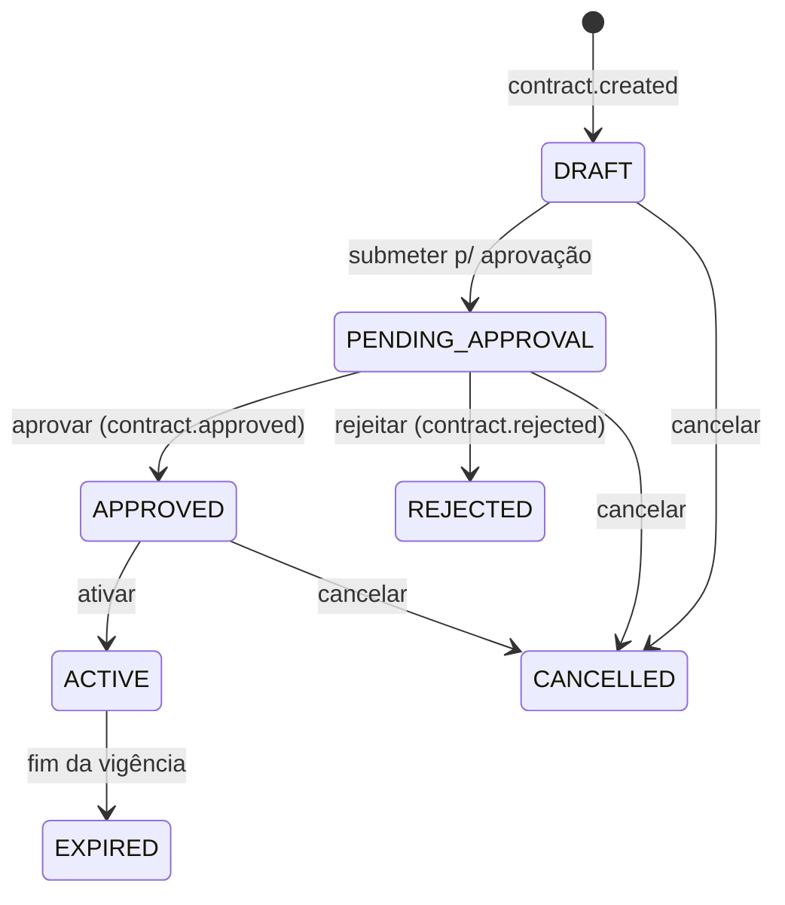
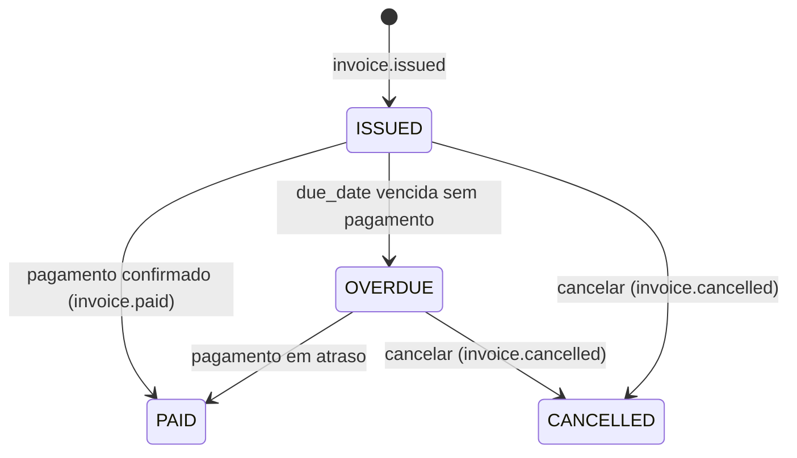

# ⚡ EnergyHub — Escopo do Sistema (Fase 0)

Este documento define o **escopo do sistema** do EnergyHub, o _backend_ de uma plataforma de
**negociação de energia** construída com **Python 3.12 · FastAPI · SQLAlchemy 2.0 async ·
Clean Architecture + DDD** sobre **PostgreSQL 16**. Ele estabelece _o que_ a plataforma faz —
suas funcionalidades principais, os tipos de usuário envolvidos, os módulos de negócio, as regras
de negócio centrais e, sobretudo, as **fronteiras do produto** (o que está dentro e o que está
fora do escopo). É a base sobre a qual se apoiam os demais artefatos da Fase 0 (requisitos, casos
de uso, modelo de dados, UML, eventos de negócio e arquitetura) e serve como referência para
validação com as partes interessadas antes de qualquer implementação.

> 📌 Este documento é derivado do **modelo canônico da Fase 0** e usa exatamente os mesmos nomes
> de entidades, módulos, enums e eventos. Em caso de divergência, o modelo canônico prevalece.

---

## 🎯 1. Funcionalidades principais

O EnergyHub cobre o ciclo completo da operação comercial de energia — do cadastro de partes
envolvidas à liquidação financeira e à geração de relatórios —, sempre com **rastreabilidade** e
**controle de acesso**. As nove funcionalidades principais são:

| # | Funcionalidade | Módulo | Descrição |
| :-: | :------------- | :----- | :-------- |
| 1 | **Gestão de usuários** | `auth` | Cadastro e ciclo de vida de usuários (`User`), com papéis (`Role`) e permissões (`Permission`) via **RBAC**. Autenticação por senha (BCrypt) e sessão via **JWT**. |
| 2 | **Gestão de clientes** | `clients` | Cadastro de clientes e fornecedores (entidade `Client`, diferenciados por `ClientType`) e seus contatos (`Contact`), com validação de **CNPJ**. |
| 3 | **Gestão de contratos** | `contracts` | Criação e ciclo de vida de contratos (`Contract`) de compra e venda, incluindo fluxo de aprovação, ativação, rejeição e expiração. |
| 4 | **Gestão de negociações** | `negotiations` | Registro de negociações (`Negotiation`) atreladas a contratos, com preço proposto por MWh e volume negociado. |
| 5 | **Compra e venda de energia** | `negotiations` | Execução de transações de energia (`EnergyTransaction`) de compra (`BUY`) e venda (`SELL`), calculando o valor total a partir de volume × preço unitário. |
| 6 | **Faturamento** | `financial` | Emissão de faturas (`Invoice`), controle de vencimento e status, e registro de pagamentos (`Payment`). |
| 7 | **Auditoria** | `audit` | Trilha de auditoria _append-only_ (`AuditLog`) de toda operação relevante do sistema. |
| 8 | **Notificações** | `notifications` | Envio e acompanhamento de notificações (`Notification`) por múltiplos canais (e-mail, SMS, in-app). |
| 9 | **Relatórios** | `reports` | Geração assíncrona de relatórios (`Report`) de vendas, compras, financeiro, auditoria e contratos, em PDF/CSV/XLSX. |

---

## 👤 2. Tipos de usuário (atores)

O sistema reconhece **quatro atores humanos** e **um ator secundário** (o próprio sistema, que
dispara jobs e integrações automáticas). Os papéis efetivos são atribuídos via RBAC (`Role` +
`Permission`), mas conceitualmente os atores e suas responsabilidades são:

| Ator | Natureza | Responsabilidades principais |
| :--- | :------- | :--------------------------- |
| 🛡️ **Administrador** | Interno | Configura o sistema, gerencia usuários, papéis e permissões (`User`/`Role`/`Permission`); consulta a trilha de auditoria; tem acesso administrativo pleno. |
| 🧑‍💼 **Operador** | Interno | Executa a operação do dia a dia: cadastra clientes, cria e submete contratos, registra negociações, executa compra/venda de energia, emite faturas e gera relatórios. |
| 🏢 **Cliente** | Externo | Parte **compradora/consumidora** de energia — pessoa jurídica com CNPJ (`Client` com `type = CONSUMER`). É objeto de cadastro e contraparte de contratos e faturas. |
| 🏭 **Fornecedor** | Externo | Parte **vendedora/geradora** de energia — pessoa jurídica com CNPJ (`Client` com `type = SUPPLIER`). Contraparte de contratos de compra. |
| 🤖 **Sistema** | Secundário | Ator automático: dispara eventos de negócio, gera faturas em lote, envia notificações e produz relatórios agendados. |

> ℹ️ **Cliente** e **Fornecedor** compartilham a mesma entidade `Client`, distinguidos pelo enum
> `ClientType` (`CONSUMER` | `SUPPLIER`). Não são usuários autenticáveis do sistema nesta fase —
> são **entidades de negócio** cadastradas e operadas por administradores e operadores.

---

## 🧩 3. Módulos do sistema

A plataforma é organizada em **9 módulos** de negócio, cada um com as quatro camadas da Clean
Architecture (domain · application · infrastructure · presentation). A tabela abaixo resume a
responsabilidade de cada módulo:

| Módulo | Entidades | Responsabilidade |
| :----- | :-------- | :--------------- |
| `shared` | — (base classes, VOs, eventos, exceptions) | Blocos reutilizáveis por todos os módulos (Value Objects, classes-base, envelope de eventos, exceções comuns). |
| `auth` | `User`, `Role`, `Permission` | Autenticação e autorização (RBAC): login, gestão de usuários, papéis e permissões. |
| `clients` | `Client`, `Contact` | Cadastro de clientes/fornecedores e seus contatos, com validação de CNPJ. |
| `contracts` | `Contract` | Ciclo de vida de contratos de compra e venda de energia. |
| `negotiations` | `Negotiation`, `EnergyTransaction` | Negociações comerciais e transações de compra/venda de energia. |
| `financial` | `Invoice`, `Payment` | Faturamento, vencimentos e registro de pagamentos. |
| `audit` | `AuditLog` | Trilha de auditoria _append-only_ de operações relevantes. |
| `notifications` | `Notification` | Envio e acompanhamento de notificações multicanal. |
| `reports` | `Report` | Geração de relatórios de negócio em múltiplos formatos. |

> As **11 entidades de núcleo** da Fase 0 são `User`, `Role`, `Permission`, `Client`, `Contract`,
> `Negotiation`, `EnergyTransaction`, `Invoice`, `AuditLog`, `Notification` e `Report`. `Contact`
> e `Payment` são entidades de apoio, internas aos agregados `ClientAggregate` e
> `FinancialAggregate`.

---

## 📐 4. Regras de negócio principais

Esta seção documenta as regras de negócio centrais que governam o comportamento da plataforma.
Elas são a fonte para os requisitos funcionais (02) e os casos de uso (03).

### 4.1 📄 Aprovação de contratos

Todo contrato (`Contract`) percorre uma máquina de estados controlada pelo enum `ContractStatus`.
O fluxo de aprovação é:

| Regra | Descrição |
| :---- | :-------- |
| **Criação** | O contrato nasce em `DRAFT`, criado por um **Operador**. Gera o evento `contract.created`. |
| **Submissão** | Um contrato em `DRAFT` pode ser submetido, passando a `PENDING_APPROVAL`. |
| **Quem aprova** | Somente um usuário com a permissão adequada (perfil **Administrador**, ou operador com `contracts:approve`) pode aprovar/rejeitar. A aprovação **não pode** ser feita pelo mesmo operador que criou o contrato (segregação de funções). |
| **Aprovação** | Ao aprovar, o status vai para `APPROVED`, registram-se `approved_by` (FK→`User`) e `approved_at`, e emite-se `contract.approved` (consumido por `financial`, `notifications`, `audit`). |
| **Rejeição** | Ao rejeitar, o status vai para `REJECTED` e emite-se `contract.rejected`. |
| **Ativação/Expiração** | Um contrato `APPROVED` pode tornar-se `ACTIVE`; ao término da vigência (`end_date`), torna-se `EXPIRED`. |
| **Vigência** | `end_date` deve ser maior ou igual a `start_date` (constraint no banco). |

### 4.2 💵 Cálculo de preço

Os valores monetários usam o Value Object `Money` (`Decimal` + moeda ISO-4217), com **moeda
padrão `BRL`**. A energia é medida em **MWh** (`NUMERIC(18,4)`).

| Regra | Fórmula / Descrição |
| :---- | :------------------ |
| **Preço da negociação** | A `Negotiation` registra o `proposed_price` **por MWh** e o `volume_mwh` negociado. |
| **Valor da transação** | Em `EnergyTransaction`, `total_amount = volume_mwh × unit_price`, onde `unit_price` é o preço por MWh (VO `Money`). |
| **Valor do contrato** | O `Contract` armazena `total_amount` (VO `Money`) e `energy_volume_mwh`, coerentes com as transações associadas. |
| **Moeda** | Todos os campos monetários carregam uma coluna `*_currency CHAR(3)`, com `BRL` como padrão. Operações entre valores só são válidas na mesma moeda. |
| **Sentido da operação** | `TransactionType` (`BUY`/`SELL`) e `ContractType` (`PURCHASE`/`SALE`) determinam se a operação é compra ou venda, refletindo nos eventos `energy.bought` / `energy.sold`. |

### 4.3 🧾 Faturamento

O faturamento é responsabilidade do módulo `financial` e gira em torno da entidade `Invoice` e do
enum `InvoiceStatus`.

| Regra | Descrição |
| :---- | :-------- |
| **Emissão** | Uma fatura é emitida (`ISSUED`) por um Operador ou pelo Sistema, vinculada a um `Client` (obrigatório) e opcionalmente a um `Contract`. Possui `issue_date`, `due_date` e `amount` (VO `Money`). Emite `invoice.issued`. |
| **Unicidade** | Cada fatura tem um `number` único. |
| **Pagamento** | Ao ser paga, o status vai para `PAID`, registra-se `paid_at` e cria-se um `Payment` (método `BANK_SLIP`/`PIX`/`TRANSFER`). Emite `invoice.paid`. |
| **Vencimento** | Uma fatura `ISSUED` cuja `due_date` expirou sem pagamento passa a `OVERDUE` (transição típica disparada pelo Sistema). |
| **Cancelamento** | Faturas `ISSUED` ou `OVERDUE` podem ser canceladas (`CANCELLED`), emitindo `invoice.cancelled`. |

### 4.4 🔍 Auditoria

| Regra | Descrição |
| :---- | :-------- |
| **Cobertura** | **Toda operação relevante** (criação, alteração, exclusão, login, aprovação, rejeição, etc.) gera um registro `AuditLog`. |
| **Imutabilidade** | `AuditLog` é **_append-only_**: registros nunca são alterados nem excluídos. Possuem `created_at` imutável. |
| **Conteúdo** | Cada registro guarda `action` (enum `AuditAction`: `CREATE`/`UPDATE`/`DELETE`/`LOGIN`/`APPROVE`/`REJECT`/…), `entity_type`, `entity_id`, `payload` (JSONB com diff/estado), `ip_address` e o `user_id` responsável. |
| **Ações do sistema** | Quando a ação é automática (ator Sistema), `user_id` é `NULL`. |
| **Consulta** | A trilha é consultável por Administradores/Auditores (UC-09), servindo a fins de conformidade regulatória (ex.: CCEE/ANEEL). |

---

## 🚧 5. Escopo — Dentro vs. Fora

A tabela a seguir delimita as fronteiras da plataforma nesta fase de planejamento, permitindo que
as partes interessadas validem o que **está** e o que **não está** contemplado. O foco do
EnergyHub é o **backend** da operação comercial de energia; camadas de interface, integrações
externas reais e obrigações fiscais/legais ficam explicitamente fora do escopo.

| Área | ✅ Dentro do escopo (In Scope) | ❌ Fora do escopo (Out of Scope) |
| :--- | :---------------------------- | :------------------------------ |
| **Interface** | API REST (FastAPI) documentada via OpenAPI/Swagger. | UI / _front-end_ web ou mobile (telas, portais, apps). |
| **Usuários & Acesso** | Autenticação (JWT), autorização RBAC, gestão de usuários/papéis/permissões. | SSO/OAuth externo, federação de identidade, MFA. |
| **Clientes** | Cadastro de clientes e fornecedores, contatos, validação de CNPJ. | Consulta automática a bases externas (Receita Federal, _bureaus_ de crédito). |
| **Contratos** | Ciclo de vida completo com aprovação, ativação, rejeição e expiração. | Assinatura digital/eletrônica com validade jurídica; gestão documental (anexos legais). |
| **Negociações & Energia** | Registro de negociações e transações de compra/venda; cálculo de valores (preço × volume). | **Medição física** de energia; integração com SCADA/telemetria; despacho físico de carga. |
| **Financeiro** | Emissão de faturas, controle de vencimento/status, registro de pagamentos. | **Faturamento fiscal** (emissão de NF-e legal); **integração de pagamento real** (gateways, bancos, PIX real, boleto registrado); conciliação bancária. |
| **Auditoria** | Trilha _append-only_ de operações relevantes. | SIEM/monitoramento de segurança externo; retenção legal de longo prazo em cofre imutável. |
| **Notificações** | Registro e acompanhamento de notificações multicanal (modelo de domínio). | Integração real com provedores de e-mail/SMS/push (introduzida em fases posteriores). |
| **Relatórios** | Modelo de geração de relatórios (tipos, formatos, status). | _Business Intelligence_, dashboards analíticos e _data warehouse_. |
| **Conformidade** | Estrutura preparada para auditabilidade e regulações do setor (CCEE/ANEEL). | Certificação/homologação regulatória formal; integração oficial com câmaras de liquidação. |
| **Infraestrutura** | Backend Python/FastAPI, PostgreSQL 16, Clean Architecture + DDD. | Provisionamento de nuvem, contratos com terceiros e custos operacionais de produção. |

> 🧭 O escopo acima reflete a **Fase 0** (planejamento). Capacidades marcadas como "fora do
> escopo" que envolvem tecnologia (cache, mensageria, busca, containers, microsserviços) são
> introduzidas **fase a fase** ao longo do roadmap — não fazem parte do produto mínimo desta fase,
> mas estão previstas no plano de evolução.

---

## 📚 Referências

Documentos irmãos da Fase 0 (planejamento e design do sistema):

- [02 — Requisitos](02-requisitos.md)
- [03 — Casos de Uso](03-casos-de-uso.md)
- [04 — Modelo de Dados](04-modelo-de-dados.md)
- [05 — Diagramas UML](05-diagramas-uml.md)
- [06 — Eventos de Negócio](06-eventos-de-negocio.md)
- [07 — Arquitetura](07-arquitetura.md)
