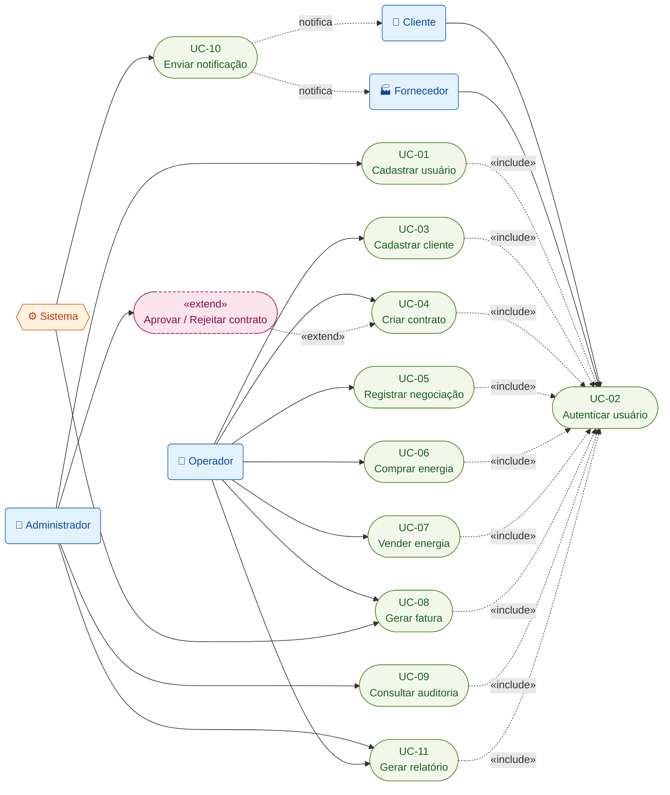

# ⚡ EnergyHub — Fase 0 · Modelagem de Casos de Uso

Este documento descreve os **casos de uso (UC)** do EnergyHub — a plataforma de negociação de
energia construída com **FastAPI**, **Clean Architecture** e **DDD**. Ele detalha _quem_ interage
com o sistema (atores), _o que_ cada interação realiza (fluxos) e _quais efeitos_ ela produz
(pós-condições e **eventos de negócio**).

O documento é derivado e **totalmente consistente com o modelo canônico da Fase 0** (entidades,
enums, eventos e módulos). Sempre que um fluxo cria ou altera estado, os nomes de entidades
(`User`, `Client`, `Contract`, `Negotiation`, `EnergyTransaction`, `Invoice`, `AuditLog`,
`Notification`, `Report`), de enums (`ContractStatus`, `TransactionType`, `InvoiceStatus`, …) e de
eventos (`user.created`, `contract.created`, `energy.bought`, …) seguem exatamente a fonte de
verdade.

São **11 casos de uso** e **5 atores**. Cada operação relevante gera uma entrada em `AuditLog`
(auditabilidade) e, quando aplicável, emite um dos **18 eventos de negócio** que alimentam os
módulos consumidores (`financial`, `notifications`, `reports`, `audit`).

## Convenções de notação

- **Fluxo principal:** passos numerados (`1`, `2`, `3`, …) descrevendo o caminho de sucesso.
- **Fluxos alternativos / exceções:** identificados por `A1`, `A2`, … (variações e falhas), com
  referência ao passo do fluxo principal em que ocorrem.
- **Eventos de negócio:** grafados no padrão `dominio.acao` (ex.: `contract.created`), conforme o
  catálogo de 18 eventos do modelo canônico.
- **Permissões (RBAC):** citadas no padrão `recurso:acao` (ex.: `contracts:create`) de forma
  **ilustrativa** — o mapa completo de `Role`/`Permission` é detalhado na Fase 7.
- **Autenticação:** as operações iniciadas por humanos pressupõem sessão válida obtida em **UC-02**
  (relação `«include»` no diagrama). Jobs do ator **Sistema** executam sem sessão interativa.

---

## 1. Atores do sistema

O EnergyHub reconhece **quatro atores humanos** e **um ator secundário automatizado**. Os papéis
**Cliente** e **Fornecedor** correspondem, no modelo de dados, à mesma entidade `Client`,
diferenciada pelo enum `ClientType` (`CONSUMER` vs. `SUPPLIER`).

| Ator | Tipo | Descrição | Principais casos de uso |
| :--- | :--- | :--- | :--- |
| **Administrador** | Humano (interno) | Configura o sistema e governa acessos: gerencia `User`, `Role` e `Permission` (RBAC), aprova/rejeita contratos e audita operações. | UC-01, UC-02, UC-04 (aprovação), UC-09, UC-11 |
| **Operador** | Humano (interno) | Opera o dia a dia do negócio: clientes, contratos, negociações, compra/venda de energia, faturas e relatórios. | UC-02, UC-03, UC-04, UC-05, UC-06, UC-07, UC-08, UC-11 |
| **Cliente** | Humano (externo, PJ com CNPJ) | Parte **compradora/consumidora** de energia (`ClientType = CONSUMER`). Acessa o portal para autenticar-se e recebe notificações (faturas, contratos). | UC-02 (recebe UC-10) |
| **Fornecedor** | Humano (externo, PJ com CNPJ) | Parte **vendedora/geradora** de energia (`ClientType = SUPPLIER`). Autentica-se no portal e recebe notificações. | UC-02 (recebe UC-10) |
| **Sistema** | Automatizado (secundário) | Dispara jobs, consumidores de eventos e integrações: gera faturas em lote, envia notificações e produz relatórios de forma assíncrona. | UC-08, UC-10, UC-11 (processamento) |

---

## 2. Casos de uso

### UC-01 — Cadastrar usuário

- **Ator principal:** Administrador
- **Atores secundários:** Sistema (emite notificação de boas-vindas)
- **Pré-condições:**
  - Administrador autenticado (UC-02) com permissão `users:create`.
  - Papéis (`Role`) a serem atribuídos já existem.
- **Fluxo principal:**
  1. O Administrador acessa a função de cadastro de usuário.
  2. Informa `name`, `email`, senha inicial e os `Role` a atribuir.
  3. O sistema valida o `email` (VO `Email`, unicidade) e a força da senha.
  4. O sistema gera o `password_hash` (BCrypt) e cria o `User` com `status = ACTIVE`.
  5. O sistema associa os papéis selecionados via `user_roles`.
  6. O sistema registra `AuditLog` (`action = CREATE`, `entity_type = 'User'`).
  7. O sistema emite o evento `user.created`.
  8. O sistema retorna a confirmação com o `id` do novo usuário.
- **Fluxos alternativos / exceções:**
  - **A1 (passo 3 — e-mail duplicado):** `email` já cadastrado → operação abortada com erro de
    unicidade; nenhum `User` é criado; nenhum evento é emitido.
  - **A2 (passo 3 — dados inválidos):** e-mail malformado ou senha fraca → retorna erros de
    validação; nada é persistido.
  - **A3 (passo 1 — sem permissão):** ator sem `users:create` → HTTP 403; tentativa registrável em
    `AuditLog`.
- **Pós-condições:**
  - Novo `User` persistido com `status = ACTIVE` e papéis associados.
  - `AuditLog` (`CREATE`) gravado.
  - **Evento emitido:** `user.created` (consumidores: `notifications`, `audit`) → aciona **UC-10**
    para notificar o novo usuário.

### UC-02 — Autenticar usuário

- **Ator principal:** Todos (Administrador, Operador, Cliente, Fornecedor)
- **Pré-condições:**
  - O solicitante possui uma conta `User` com `status = ACTIVE`.
- **Fluxo principal:**
  1. O usuário envia as credenciais (`email` + senha) em `POST /api/v1/auth/login`.
  2. O sistema localiza o `User` pelo `email` (VO `Email`).
  3. O sistema verifica a senha contra o `password_hash` (BCrypt).
  4. O sistema confirma que `status = ACTIVE`.
  5. O sistema emite um **token JWT** (HS256) contendo os papéis/permissões (RBAC).
  6. O sistema atualiza `last_login_at`.
  7. O sistema registra `AuditLog` (`action = LOGIN`).
  8. O sistema retorna o _access token_ (e o _refresh token_, a partir da Fase 7).
- **Fluxos alternativos / exceções:**
  - **A1 (passo 3 — credenciais inválidas):** senha incorreta → HTTP 401; nenhum token emitido;
    falha registrável em `AuditLog` e política de tentativas incrementada.
  - **A2 (passo 4 — conta indisponível):** `status = INACTIVE` ou `BLOCKED` → HTTP 403; nenhum
    token emitido; `AuditLog` registrado.
  - **A3 (passo 3 — excesso de falhas):** múltiplas tentativas inválidas podem levar o `User` a
    `status = BLOCKED` (regra de segurança da Fase 7).
- **Pós-condições:**
  - Token JWT válido emitido; `last_login_at` atualizado; `AuditLog` (`LOGIN`) gravado.
  - **Evento de negócio:** _nenhum_ dos 18 eventos do catálogo é emitido — a autenticação não é um
    evento de domínio; sua rastreabilidade se dá pela trilha de auditoria (`AuditAction = LOGIN`).

### UC-03 — Cadastrar cliente

- **Ator principal:** Operador
- **Pré-condições:**
  - Operador autenticado (UC-02) com permissão `clients:create`.
- **Fluxo principal:**
  1. O Operador informa `legal_name`, `trade_name`, `cnpj`, `type` (`ClientType` = `CONSUMER` para
     cliente ou `SUPPLIER` para fornecedor), `email`, `phone`, endereço (VO `Address`) e contatos.
  2. O sistema valida o `cnpj` (VO `CNPJ`, dígitos verificadores) e sua unicidade.
  3. O sistema valida `email`/`phone` (VOs `Email`/`PhoneNumber`), quando informados.
  4. O sistema cria o `Client` com `status = ACTIVE` e o `type` selecionado.
  5. O sistema cria os `Contact` associados (entidade de apoio do `ClientAggregate`).
  6. O sistema registra `AuditLog` (`CREATE`, `entity_type = 'Client'`).
  7. O sistema emite o evento `client.created`.
  8. O sistema retorna o `id` do cliente cadastrado.
- **Fluxos alternativos / exceções:**
  - **A1 (passo 2 — CNPJ inválido):** dígito verificador incorreto → erro de validação; nada
    persistido.
  - **A2 (passo 2 — CNPJ duplicado):** `cnpj` já existente → erro de unicidade; nada persistido.
  - **A3 (passo 1 — sem permissão):** ator sem `clients:create` → HTTP 403.
- **Pós-condições:**
  - `Client` persistido (`status = ACTIVE`, `type` definido) com seus `Contact`.
  - `AuditLog` (`CREATE`) gravado.
  - **Evento emitido:** `client.created` (consumidores: `audit`, `notifications`).

### UC-04 — Criar contrato

- **Ator principal:** Operador
- **Atores secundários:** Administrador (etapa separada de aprovação)
- **Pré-condições:**
  - Operador autenticado (UC-02) com permissão `contracts:create`.
  - Existe um `Client` com `status = ACTIVE` para vincular ao contrato.
- **Fluxo principal:**
  1. O Operador seleciona o `Client` e informa `code`, `type` (`ContractType` = `PURCHASE` ou
     `SALE`), `total_amount` (VO `Money`), `energy_volume_mwh`, `start_date` e `end_date`.
  2. O sistema valida: `code` único, `end_date >= start_date` (CHECK), valores positivos e cliente
     existente/ativo.
  3. O sistema cria o `Contract` com `status = DRAFT`.
  4. O Operador submete o rascunho para aprovação; o sistema transiciona o `status` para
     `PENDING_APPROVAL`.
  5. O sistema registra `AuditLog` (`CREATE`, `entity_type = 'Contract'`).
  6. O sistema emite o evento `contract.created`.
  7. O sistema retorna o `id` e o estado atual do contrato.
- **Fluxos alternativos / exceções:**
  - **A1 (passo 2 — código duplicado):** `code` já existente → erro de unicidade; nada persistido.
  - **A2 (passo 2 — datas inconsistentes):** `end_date < start_date` → erro de validação.
  - **A3 (passo 2 — cliente inválido):** cliente inexistente ou `INACTIVE` → erro.
  - **A4 (aprovação — etapa separada):** a partir de `PENDING_APPROVAL`, um aprovador
    (Administrador, ou Operador com `contracts:approve`) **aprova** o contrato →
    `status = APPROVED` (posteriormente `ACTIVE`), preenche `approved_by`/`approved_at`, registra
    `AuditLog` (`APPROVE`) e emite `contract.approved`.
  - **A5 (rejeição — etapa separada):** o aprovador **rejeita** → `status = REJECTED`, registra
    `AuditLog` (`REJECT`) e emite `contract.rejected`.
- **Pós-condições:**
  - `Contract` persistido em `PENDING_APPROVAL` (após transitar por `DRAFT`).
  - `AuditLog` (`CREATE`) gravado.
  - **Evento emitido:** `contract.created` (consumidores: `audit`, `notifications`).
  - **Observação:** a **aprovação/rejeição é um passo separado** (A4/A5) que emite
    `contract.approved` ou `contract.rejected` — não faz parte do fluxo principal de UC-04.

### UC-05 — Registrar negociação

- **Ator principal:** Operador
- **Pré-condições:**
  - Operador autenticado (UC-02) com permissão `negotiations:create`.
  - Existe um `Contract` em estado elegível (`APPROVED` ou `ACTIVE`).
- **Fluxo principal:**
  1. O Operador seleciona o `Contract` e informa `proposed_price` (VO `Money`, por MWh) e
     `volume_mwh`.
  2. O sistema valida a elegibilidade do contrato, e que preço e volume são positivos e o volume
     não excede o saldo contratado.
  3. O sistema cria a `Negotiation` com `status = INITIATED` e `started_at = now()`.
  4. O sistema registra `AuditLog` (`CREATE`, `entity_type = 'Negotiation'`).
  5. O sistema emite o evento `negotiation.initiated`.
  6. O sistema retorna o `id` da negociação.
- **Fluxos alternativos / exceções:**
  - **A1 (passo 2 — contrato não elegível):** `Contract` em `DRAFT`, `PENDING_APPROVAL`,
    `REJECTED`, `EXPIRED` ou `CANCELLED` → erro.
  - **A2 (passo 2 — volume excedente):** volume acima do saldo contratado → erro.
  - **A3 (cancelamento):** durante o andamento, a negociação pode ser cancelada →
    `status = CANCELLED`, `closed_at` preenchido, emite `negotiation.cancelled`.
  - **A4 (conclusão):** após a execução das transações (UC-06/UC-07), a negociação transita para
    `status = COMPLETED` e emite `negotiation.completed`.
- **Pós-condições:**
  - `Negotiation` persistida em `INITIATED`, vinculada ao `Contract`.
  - `AuditLog` (`CREATE`) gravado.
  - **Evento emitido:** `negotiation.initiated` (consumidor: `audit`).

### UC-06 — Comprar energia

- **Ator principal:** Operador
- **Pré-condições:**
  - Operador autenticado (UC-02) com permissão `energy:buy`.
  - Existe uma `Negotiation` aberta (`INITIATED`/`IN_PROGRESS`) vinculada a um `Contract` do tipo
    `PURCHASE`; a contraparte é um `Client` do tipo `SUPPLIER` (fornecedor).
- **Fluxo principal:**
  1. O Operador seleciona a `Negotiation` e confirma `volume_mwh` e `unit_price` (VO `Money`) da
     compra.
  2. O sistema valida: negociação aberta, `Contract.type = PURCHASE`, valores positivos.
  3. O sistema cria a `EnergyTransaction` com `type = BUY`, calculando
     `total_amount = volume_mwh × unit_price` e `executed_at = now()`.
  4. O sistema conclui a `Negotiation` → `status = COMPLETED`, `closed_at = now()`, emitindo
     `negotiation.completed`.
  5. O sistema registra `AuditLog` (`CREATE`, `entity_type = 'EnergyTransaction'`).
  6. O sistema emite o evento `energy.bought`.
  7. O sistema retorna o `id` e o `total_amount` da transação.
- **Fluxos alternativos / exceções:**
  - **A1 (passo 2 — negociação fechada):** `Negotiation` em `COMPLETED`/`CANCELLED` → erro.
  - **A2 (passo 2 — tipo incompatível):** contrato não é `PURCHASE` → erro (usar **UC-07** para
    venda).
  - **A3 (passo 2 — valores inválidos):** volume ou preço não positivos → erro de validação.
- **Pós-condições:**
  - `EnergyTransaction` (`type = BUY`) persistida; `Negotiation` em `COMPLETED`.
  - `AuditLog` (`CREATE`) gravado.
  - **Eventos emitidos:** `energy.bought` (consumidores: `financial`, `reports`, `audit`) e
    `negotiation.completed` (consumidores: `financial`, `notifications`, `audit`).

### UC-07 — Vender energia

- **Ator principal:** Operador
- **Pré-condições:**
  - Operador autenticado (UC-02) com permissão `energy:sell`.
  - Existe uma `Negotiation` aberta (`INITIATED`/`IN_PROGRESS`) vinculada a um `Contract` do tipo
    `SALE`; a contraparte é um `Client` do tipo `CONSUMER` (cliente).
- **Fluxo principal:**
  1. O Operador seleciona a `Negotiation` e confirma `volume_mwh` e `unit_price` (VO `Money`) da
     venda.
  2. O sistema valida: negociação aberta, `Contract.type = SALE`, valores positivos.
  3. O sistema cria a `EnergyTransaction` com `type = SELL`, calculando
     `total_amount = volume_mwh × unit_price` e `executed_at = now()`.
  4. O sistema conclui a `Negotiation` → `status = COMPLETED`, `closed_at = now()`, emitindo
     `negotiation.completed`.
  5. O sistema registra `AuditLog` (`CREATE`, `entity_type = 'EnergyTransaction'`).
  6. O sistema emite o evento `energy.sold`.
  7. O sistema retorna o `id` e o `total_amount` da transação.
- **Fluxos alternativos / exceções:**
  - **A1 (passo 2 — negociação fechada):** `Negotiation` em `COMPLETED`/`CANCELLED` → erro.
  - **A2 (passo 2 — tipo incompatível):** contrato não é `SALE` → erro (usar **UC-06** para compra).
  - **A3 (passo 2 — valores inválidos):** volume ou preço não positivos → erro de validação.
- **Pós-condições:**
  - `EnergyTransaction` (`type = SELL`) persistida; `Negotiation` em `COMPLETED`.
  - `AuditLog` (`CREATE`) gravado.
  - **Eventos emitidos:** `energy.sold` (consumidores: `financial`, `reports`, `audit`) e
    `negotiation.completed` (consumidores: `financial`, `notifications`, `audit`).

### UC-08 — Gerar fatura

- **Ator principal:** Operador (emissão manual) **ou** Sistema (job automático)
- **Pré-condições:**
  - **Operador:** autenticado (UC-02) com permissão `invoices:create`.
  - **Sistema:** job agendado ou consumidor dos eventos `contract.approved` / `negotiation.completed`
    / `energy.bought` / `energy.sold`.
  - Existe base faturável (contrato ativo e/ou transações de energia executadas).
- **Fluxo principal:**
  1. O ator seleciona o `Contract`/`Client` e o período (Operador) **ou** o Sistema coleta as
     transações faturáveis do ciclo.
  2. O sistema calcula o `amount` (VO `Money`) a partir das `EnergyTransaction`/condições do
     contrato.
  3. O sistema gera um `number` único e define `issue_date` e `due_date`.
  4. O sistema cria a `Invoice` com `status = ISSUED`, vinculada ao `client_id` (e ao `contract_id`,
     quando aplicável).
  5. O sistema registra `AuditLog` (`CREATE`, `entity_type = 'Invoice'`).
  6. O sistema emite o evento `invoice.issued`.
  7. (Assíncrono) o evento aciona **UC-10** para notificar o cliente sobre a fatura emitida.
- **Fluxos alternativos / exceções:**
  - **A1 (passo 1 — sem base faturável):** nenhuma transação/valor a faturar → nenhuma `Invoice`
    gerada; nenhum evento emitido.
  - **A2 (passo 3 — número duplicado):** colisão de `number` → o sistema regenera o número.
  - **A3 (ciclo de vida posterior):** o registro de um `Payment` leva a `Invoice.status = PAID`
    (emite `invoice.paid`); o vencimento sem pagamento leva a `OVERDUE`; o cancelamento leva a
    `CANCELLED` (emite `invoice.cancelled`). Essas transições estão **fora** do escopo de UC-08.
- **Pós-condições:**
  - `Invoice` persistida em `status = ISSUED`.
  - `AuditLog` (`CREATE`) gravado.
  - **Evento emitido:** `invoice.issued` (consumidores: `notifications`, `audit`).

### UC-09 — Consultar auditoria

- **Ator principal:** Administrador (função de auditor)
- **Pré-condições:**
  - Administrador autenticado (UC-02) com permissão `audit:read`.
- **Fluxo principal:**
  1. O Administrador informa filtros de consulta (período, `user_id`, `entity_type`, `action`).
  2. O sistema consulta a trilha `AuditLog` (append-only, imutável) aplicando os filtros e a
     paginação.
  3. O sistema retorna a lista de registros com `payload`/diff, `ip_address` e carimbos de tempo.
  4. (Opcional) o sistema registra o próprio acesso à auditoria para fins de _compliance_.
- **Fluxos alternativos / exceções:**
  - **A1 (passo 2 — sem resultados):** nenhum registro corresponde aos filtros → lista vazia.
  - **A2 (passo 1 — sem permissão):** ator sem `audit:read` → HTTP 403.
  - **A3 (exportação):** para gerar um arquivo (PDF/CSV) da auditoria, o fluxo delega a **UC-11**
    (`ReportType = AUDIT`).
- **Pós-condições:**
  - Nenhuma alteração de estado (operação **somente leitura**).
  - **Evento de negócio:** _nenhum_ dos 18 eventos é emitido — a consulta é read-only.
    Opcionalmente, um `AuditLog` de acesso é registrado.

### UC-10 — Enviar notificação

- **Ator principal:** Sistema
- **Atores secundários:** Administrador, Operador, Cliente, Fornecedor (destinatários)
- **Pré-condições:**
  - Um evento de negócio foi disparado (ex.: `user.created`, `contract.approved`, `invoice.issued`,
    `report.generated`) com destinatário `User` resolvível e canal configurado.
- **Fluxo principal:**
  1. O consumidor de eventos do módulo `notifications` recebe um evento de negócio.
  2. O sistema resolve o `User` destinatário e o canal (`NotificationChannel` = `EMAIL`, `SMS` ou
     `IN_APP`).
  3. O sistema cria a `Notification` com `status = PENDING`, preenchendo `title` e `body`.
  4. O sistema despacha a mensagem pelo provedor do canal.
  5. Em caso de sucesso: `status = SENT`, `sent_at = now()`; o sistema emite `notification.sent`.
  6. O sistema registra `AuditLog` da operação de notificação.
- **Fluxos alternativos / exceções:**
  - **A1 (passo 4 — falha no provedor):** envio falha → `status = FAILED`; política de _retry_
    aplicada; `notification.sent` **não** é emitido enquanto não houver sucesso.
  - **A2 (passo 2 — canal inválido):** destinatário sem canal válido → `status = FAILED`.
  - **A3 (leitura in-app):** o destinatário lê a notificação → `status = READ`, `read_at`
    preenchido.
- **Pós-condições:**
  - `Notification` persistida em `SENT` (ou `FAILED`, em exceção).
  - `AuditLog` gravado.
  - **Evento emitido:** `notification.sent` (consumidor: `audit`) — apenas em caso de sucesso.

### UC-11 — Gerar relatório

- **Ator principal:** Operador **ou** Administrador
- **Atores secundários:** Sistema (processamento assíncrono da geração)
- **Pré-condições:**
  - Ator autenticado (UC-02) com permissão `reports:generate`.
- **Fluxo principal:**
  1. O ator escolhe `type` (`ReportType` = `SALES`, `PURCHASES`, `FINANCIAL`, `AUDIT` ou
     `CONTRACTS`), `format` (`PDF`/`CSV`/`XLSX`) e `parameters` (período, cliente, filtros).
  2. O sistema cria o `Report` com `status = PENDING` e `requested_by` = ator solicitante.
  3. O processamento assíncrono inicia → `status = GENERATING`.
  4. O sistema agrega os dados conforme o `type` (transações, faturas, contratos ou auditoria) e
     produz o arquivo, preenchendo `file_url`.
  5. O sistema conclui → `status = READY`, `generated_at = now()`.
  6. O sistema registra `AuditLog` (`CREATE`, `entity_type = 'Report'`).
  7. O sistema emite o evento `report.generated`.
  8. (Assíncrono) o evento aciona **UC-10** para notificar o solicitante de que o relatório está
     pronto.
- **Fluxos alternativos / exceções:**
  - **A1 (passo 4 — sem dados):** nenhum dado no período → relatório vazio em `READY` ou erro,
    conforme a regra do `type`.
  - **A2 (passo 4 — falha na geração):** erro no processamento → `status = FAILED`;
    `report.generated` **não** é emitido.
  - **A3 (passo 1 — sem permissão):** ator sem `reports:generate` → HTTP 403.
- **Pós-condições:**
  - `Report` persistido em `status = READY` com `file_url` disponível.
  - `AuditLog` (`CREATE`) gravado.
  - **Evento emitido:** `report.generated` (consumidores: `notifications`, `audit`).

---

## 3. Rastreabilidade (Caso de uso → entidade → evento)

Síntese que amarra cada caso de uso à entidade central manipulada e ao(s) evento(s) de negócio
emitido(s), garantindo consistência com o catálogo de 18 eventos do modelo canônico.

| UC | Ator principal | Entidade central | Estado resultante | Evento(s) emitido(s) |
| :-- | :-- | :-- | :-- | :-- |
| UC-01 | Administrador | `User` | `ACTIVE` | `user.created` |
| UC-02 | Todos | `User` | `last_login_at` atualizado | — (apenas `AuditLog` `LOGIN`) |
| UC-03 | Operador | `Client` | `ACTIVE` | `client.created` |
| UC-04 | Operador | `Contract` | `DRAFT` → `PENDING_APPROVAL` | `contract.created` (aprovação: `contract.approved` / `contract.rejected`) |
| UC-05 | Operador | `Negotiation` | `INITIATED` | `negotiation.initiated` |
| UC-06 | Operador | `EnergyTransaction` (`BUY`) | `Negotiation` → `COMPLETED` | `energy.bought` + `negotiation.completed` |
| UC-07 | Operador | `EnergyTransaction` (`SELL`) | `Negotiation` → `COMPLETED` | `energy.sold` + `negotiation.completed` |
| UC-08 | Operador / Sistema | `Invoice` | `ISSUED` | `invoice.issued` |
| UC-09 | Administrador | `AuditLog` | leitura (sem alteração) | — (read-only) |
| UC-10 | Sistema | `Notification` | `SENT` | `notification.sent` |
| UC-11 | Operador / Administrador | `Report` | `READY` | `report.generated` |

---

## 4. Diagrama de casos de uso

A UML não possui, no Mermaid, um tipo nativo de _use case diagram_ (elipses + atores stick-figure).
A representação abaixo aproxima essa notação com um **fluxograma** (`graph LR`): os **atores** ficam
à esquerda (retângulos arredondados; o **Sistema** em hexágono, por ser ator automatizado) e os
**casos de uso** à direita (formato _stadium_, emulando as elipses da UML).

- As setas sólidas (`→`) representam **associações** ator–caso de uso.
- As setas tracejadas `«include»` indicam que os casos de uso iniciados por humanos **incluem**
  obrigatoriamente **UC-02 (Autenticar usuário)**.
- A seta tracejada `«extend»` mostra que a **aprovação/rejeição de contrato** (passo separado)
  **estende** UC-04.
- As setas `notifica` (de UC-10 para Cliente/Fornecedor) representam a entrega de notificações aos
  atores externos. As notificações são acionadas de forma **assíncrona por eventos** (por isso não
  há `«include»` síncrono apontando para UC-10).

---

## Referências

- [01-escopo-do-sistema.md](01-escopo-do-sistema.md) — escopo, funcionalidades, atores e regras de
  negócio.
- [04-modelo-de-dados.md](04-modelo-de-dados.md) — DER, entidades, atributos e relacionamentos.
- [05-diagramas-uml.md](05-diagramas-uml.md) — diagramas de classes, sequência e componentes.
- [06-eventos-de-negocio.md](06-eventos-de-negocio.md) — catálogo dos 18 eventos, gatilhos e
  consumidores.
