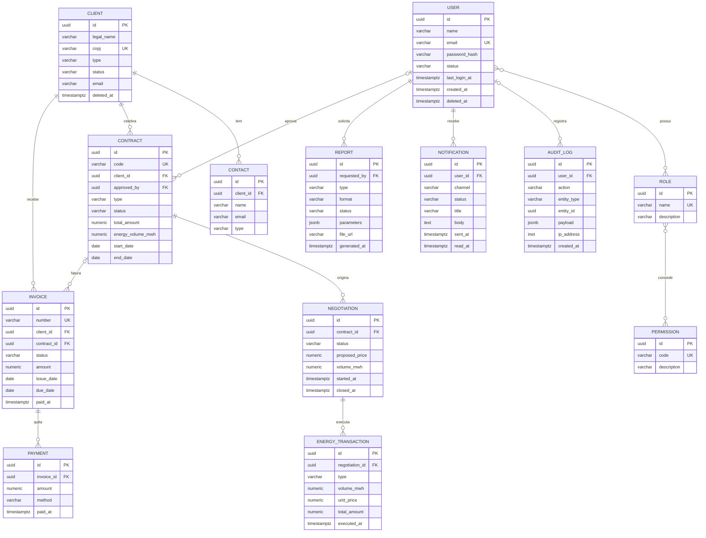

# 04 — Modelo de Dados (DER / Modelo Entidade-Relacionamento)

> **Fase 0 — Planejamento e Design do Sistema.** Este documento define o modelo de dados do
> EnergyHub como um **DER (Modelo Entidade-Relacionamento)** projetado para **PostgreSQL 16** e
> **normalizado até a 3ª Forma Normal (3FN)**. Ele é a base para o schema físico e as migrações
> Alembic entregues na **Fase 4**. Todos os nomes de entidades, atributos, tipos e restrições
> seguem o **modelo canônico** da Fase 0 (fonte de verdade compartilhada).

---

## A. Introdução e convenções

O banco-alvo é o **PostgreSQL 16**. O modelo cobre as **11 entidades de núcleo** (`User`, `Role`,
`Permission`, `Client`, `Contract`, `Negotiation`, `EnergyTransaction`, `Invoice`, `AuditLog`,
`Notification`, `Report`), as **entidades de apoio** (`Contact`, `Payment`) e as **tabelas de
junção** que resolvem os relacionamentos N:N (`user_roles`, `role_permissions`).

A modelagem prioriza **integridade financeira e transacional**: dados fortemente tipados,
chaves estrangeiras explícitas e valores monetários/energéticos em precisão exata (nunca
ponto flutuante).

| Convenção | Regra adotada |
| :-------- | :------------ |
| **Chave primária** | `id UUID PRIMARY KEY DEFAULT gen_random_uuid()` em todas as tabelas |
| **Nomes de colunas** | `snake_case`; tabelas no plural (`users`, `contracts`, `energy_transactions`) |
| **Auditoria de tempo** | `created_at TIMESTAMPTZ NOT NULL DEFAULT now()` e `updated_at TIMESTAMPTZ NOT NULL DEFAULT now()` |
| **Soft-delete** | `deleted_at TIMESTAMPTZ NULL` nas entidades que exigem exclusão lógica (registro nulo = ativo) |
| **Valores monetários** | `NUMERIC(18,2)` para o montante + coluna `*_currency CHAR(3)` (ISO-4217) — materializa o VO `Money` |
| **Volume de energia** | `NUMERIC(18,4)` em MWh (precisão exata, sem `float`) |
| **Fusos** | Todos os instantes em `TIMESTAMPTZ` (UTC); datas de negócio puras em `DATE` |
| **Enumerações** | Persistidas como `VARCHAR(n)` com `CHECK`/enum de aplicação (ex.: `UserStatus`, `ContractStatus`) |
| **Semiestruturado** | `JSONB` para cargas flexíveis (`audit_logs.payload`, `reports.parameters`) |
| **Endereços/IP** | `INET` para `ip_address`; colunas `address_*` materializam o VO `Address` |

> **Value Objects (VOs)** do módulo `shared` — `CNPJ`, `Email`, `Money`, `PhoneNumber`,
> `Address`, `Percentage` — não viram tabelas próprias: são **desmembrados em colunas** da
> entidade dona, preservando a 3FN e a validação no domínio.

---

## B. Entidades e atributos

### B.1. `User` — módulo `auth`

Tabela `users`. Identidade e credenciais de acesso ao sistema (atores Administrador e Operador).

| Campo | Tipo (PostgreSQL) | Constraints | Descrição |
| :---- | :---------------- | :---------- | :-------- |
| `id` | `UUID` | PK, `DEFAULT gen_random_uuid()` | Identificador único |
| `name` | `VARCHAR(120)` | NOT NULL | Nome do usuário |
| `email` | `VARCHAR(180)` | NOT NULL, UNIQUE | E-mail de login (VO `Email`) |
| `password_hash` | `VARCHAR(255)` | NOT NULL | Hash da senha (BCrypt) |
| `status` | `VARCHAR(20)` | NOT NULL, DEFAULT `ACTIVE` | Enum `UserStatus`: `ACTIVE` / `INACTIVE` / `BLOCKED` |
| `last_login_at` | `TIMESTAMPTZ` | NULL | Último login bem-sucedido |
| `created_at` | `TIMESTAMPTZ` | NOT NULL, DEFAULT `now()` | Criação |
| `updated_at` | `TIMESTAMPTZ` | NOT NULL, DEFAULT `now()` | Última atualização |
| `deleted_at` | `TIMESTAMPTZ` | NULL | Soft-delete (nulo = ativo) |

### B.2. `Role` — módulo `auth`

Tabela `roles`. Papéis do RBAC (ex.: `admin`, `operator`).

| Campo | Tipo (PostgreSQL) | Constraints | Descrição |
| :---- | :---------------- | :---------- | :-------- |
| `id` | `UUID` | PK, `DEFAULT gen_random_uuid()` | Identificador único |
| `name` | `VARCHAR(60)` | NOT NULL, UNIQUE | Nome do papel |
| `description` | `VARCHAR(255)` | NULL | Descrição do papel |
| `created_at` | `TIMESTAMPTZ` | NOT NULL, DEFAULT `now()` | Criação |
| `updated_at` | `TIMESTAMPTZ` | NOT NULL, DEFAULT `now()` | Última atualização |

### B.3. `Permission` — módulo `auth`

Tabela `permissions`. Permissões granulares atribuídas a papéis.

| Campo | Tipo (PostgreSQL) | Constraints | Descrição |
| :---- | :---------------- | :---------- | :-------- |
| `id` | `UUID` | PK, `DEFAULT gen_random_uuid()` | Identificador único |
| `code` | `VARCHAR(80)` | NOT NULL, UNIQUE | Código da permissão (ex.: `contracts:create`) |
| `description` | `VARCHAR(255)` | NULL | Descrição da permissão |
| `created_at` | `TIMESTAMPTZ` | NOT NULL, DEFAULT `now()` | Criação |
| `updated_at` | `TIMESTAMPTZ` | NOT NULL, DEFAULT `now()` | Última atualização |

### B.4. `Client` — módulo `clients`

Tabela `clients`. Clientes (consumidores) e fornecedores (geradores), distinguidos por `type`.
As colunas `address_*` materializam o VO `Address`.

| Campo | Tipo (PostgreSQL) | Constraints | Descrição |
| :---- | :---------------- | :---------- | :-------- |
| `id` | `UUID` | PK, `DEFAULT gen_random_uuid()` | Identificador único |
| `legal_name` | `VARCHAR(180)` | NOT NULL | Razão social |
| `trade_name` | `VARCHAR(180)` | NULL | Nome fantasia |
| `cnpj` | `VARCHAR(14)` | NOT NULL, UNIQUE | CNPJ, só dígitos (VO `CNPJ`) |
| `type` | `VARCHAR(20)` | NOT NULL | Enum `ClientType`: `CONSUMER` / `SUPPLIER` |
| `status` | `VARCHAR(20)` | NOT NULL, DEFAULT `ACTIVE` | Enum `ClientStatus`: `ACTIVE` / `INACTIVE` |
| `email` | `VARCHAR(180)` | NULL | E-mail de contato (VO `Email`) |
| `phone` | `VARCHAR(20)` | NULL | Telefone (VO `PhoneNumber`, E.164) |
| `address_street` | `VARCHAR(180)` | NULL | Logradouro (VO `Address`) |
| `address_number` | `VARCHAR(20)` | NULL | Número (VO `Address`) |
| `address_complement` | `VARCHAR(80)` | NULL | Complemento (VO `Address`) |
| `address_city` | `VARCHAR(120)` | NULL | Cidade (VO `Address`) |
| `address_state` | `VARCHAR(2)` | NULL | UF (VO `Address`) |
| `address_zip_code` | `VARCHAR(9)` | NULL | CEP (VO `Address`) |
| `address_country` | `VARCHAR(2)` | NULL, DEFAULT `BR` | País ISO-3166 alfa-2 (VO `Address`) |
| `created_at` | `TIMESTAMPTZ` | NOT NULL, DEFAULT `now()` | Criação |
| `updated_at` | `TIMESTAMPTZ` | NOT NULL, DEFAULT `now()` | Última atualização |
| `deleted_at` | `TIMESTAMPTZ` | NULL | Soft-delete (nulo = ativo) |

### B.5. `Contact` — módulo `clients` (apoio)

Tabela `contacts`. Contatos de um cliente (dentro do `ClientAggregate`).

| Campo | Tipo (PostgreSQL) | Constraints | Descrição |
| :---- | :---------------- | :---------- | :-------- |
| `id` | `UUID` | PK, `DEFAULT gen_random_uuid()` | Identificador único |
| `client_id` | `UUID` | FK → `clients(id)`, NOT NULL | Cliente dono do contato |
| `name` | `VARCHAR(120)` | NOT NULL | Nome do contato |
| `email` | `VARCHAR(180)` | NULL | E-mail (VO `Email`) |
| `phone` | `VARCHAR(20)` | NULL | Telefone (VO `PhoneNumber`) |
| `type` | `VARCHAR(20)` | NOT NULL | Enum `ContactType`: `COMMERCIAL` / `FINANCIAL` / `TECHNICAL` |
| `created_at` | `TIMESTAMPTZ` | NOT NULL, DEFAULT `now()` | Criação |
| `updated_at` | `TIMESTAMPTZ` | NOT NULL, DEFAULT `now()` | Última atualização |

### B.6. `Contract` — módulo `contracts`

Tabela `contracts`. Contratos de compra/venda de energia celebrados com um cliente.

| Campo | Tipo (PostgreSQL) | Constraints | Descrição |
| :---- | :---------------- | :---------- | :-------- |
| `id` | `UUID` | PK, `DEFAULT gen_random_uuid()` | Identificador único |
| `code` | `VARCHAR(30)` | NOT NULL, UNIQUE | Número do contrato |
| `client_id` | `UUID` | FK → `clients(id)`, NOT NULL | Cliente contratante |
| `type` | `VARCHAR(20)` | NOT NULL | Enum `ContractType`: `PURCHASE` / `SALE` |
| `status` | `VARCHAR(20)` | NOT NULL, DEFAULT `DRAFT` | Enum `ContractStatus`: `DRAFT` / `PENDING_APPROVAL` / `APPROVED` / `ACTIVE` / `REJECTED` / `EXPIRED` / `CANCELLED` |
| `total_amount` | `NUMERIC(18,2)` | NOT NULL | Valor total (VO `Money`) |
| `total_amount_currency` | `CHAR(3)` | NOT NULL, DEFAULT `BRL` | Moeda ISO-4217 (VO `Money`) |
| `energy_volume_mwh` | `NUMERIC(18,4)` | NOT NULL | Volume contratado em MWh |
| `start_date` | `DATE` | NOT NULL | Início da vigência |
| `end_date` | `DATE` | NOT NULL, `CHECK (end_date >= start_date)` | Fim da vigência |
| `approved_by` | `UUID` | FK → `users(id)`, NULL | Usuário aprovador |
| `approved_at` | `TIMESTAMPTZ` | NULL | Instante da aprovação |
| `created_at` | `TIMESTAMPTZ` | NOT NULL, DEFAULT `now()` | Criação |
| `updated_at` | `TIMESTAMPTZ` | NOT NULL, DEFAULT `now()` | Última atualização |
| `deleted_at` | `TIMESTAMPTZ` | NULL | Soft-delete (nulo = ativo) |

### B.7. `Negotiation` — módulo `negotiations`

Tabela `negotiations`. Negociações vinculadas a um contrato.

| Campo | Tipo (PostgreSQL) | Constraints | Descrição |
| :---- | :---------------- | :---------- | :-------- |
| `id` | `UUID` | PK, `DEFAULT gen_random_uuid()` | Identificador único |
| `contract_id` | `UUID` | FK → `contracts(id)`, NOT NULL | Contrato de origem |
| `status` | `VARCHAR(20)` | NOT NULL, DEFAULT `INITIATED` | Enum `NegotiationStatus`: `INITIATED` / `IN_PROGRESS` / `COMPLETED` / `CANCELLED` |
| `proposed_price` | `NUMERIC(18,2)` | NOT NULL | Preço proposto por MWh (VO `Money`) |
| `proposed_price_currency` | `CHAR(3)` | NOT NULL, DEFAULT `BRL` | Moeda ISO-4217 (VO `Money`) |
| `volume_mwh` | `NUMERIC(18,4)` | NOT NULL | Volume negociado em MWh |
| `started_at` | `TIMESTAMPTZ` | NOT NULL, DEFAULT `now()` | Início da negociação |
| `closed_at` | `TIMESTAMPTZ` | NULL | Encerramento da negociação |
| `created_at` | `TIMESTAMPTZ` | NOT NULL, DEFAULT `now()` | Criação |
| `updated_at` | `TIMESTAMPTZ` | NOT NULL, DEFAULT `now()` | Última atualização |

### B.8. `EnergyTransaction` — módulo `negotiations`

Tabela `energy_transactions`. Transações de energia executadas a partir de uma negociação
(registro imutável, apenas `created_at`).

| Campo | Tipo (PostgreSQL) | Constraints | Descrição |
| :---- | :---------------- | :---------- | :-------- |
| `id` | `UUID` | PK, `DEFAULT gen_random_uuid()` | Identificador único |
| `negotiation_id` | `UUID` | FK → `negotiations(id)`, NOT NULL | Negociação de origem |
| `type` | `VARCHAR(10)` | NOT NULL | Enum `TransactionType`: `BUY` / `SELL` |
| `volume_mwh` | `NUMERIC(18,4)` | NOT NULL | Volume transacionado em MWh |
| `unit_price` | `NUMERIC(18,2)` | NOT NULL | Preço unitário (VO `Money`) |
| `unit_price_currency` | `CHAR(3)` | NOT NULL, DEFAULT `BRL` | Moeda ISO-4217 (VO `Money`) |
| `total_amount` | `NUMERIC(18,2)` | NOT NULL | Total (= `volume_mwh` × `unit_price`) |
| `executed_at` | `TIMESTAMPTZ` | NOT NULL, DEFAULT `now()` | Instante da execução |
| `created_at` | `TIMESTAMPTZ` | NOT NULL, DEFAULT `now()` | Criação (append-only) |

### B.9. `Invoice` — módulo `financial`

Tabela `invoices`. Faturas emitidas para um cliente, opcionalmente vinculadas a um contrato.

| Campo | Tipo (PostgreSQL) | Constraints | Descrição |
| :---- | :---------------- | :---------- | :-------- |
| `id` | `UUID` | PK, `DEFAULT gen_random_uuid()` | Identificador único |
| `number` | `VARCHAR(30)` | NOT NULL, UNIQUE | Número da fatura |
| `client_id` | `UUID` | FK → `clients(id)`, NOT NULL | Cliente faturado |
| `contract_id` | `UUID` | FK → `contracts(id)`, NULL | Contrato de origem (opcional) |
| `status` | `VARCHAR(20)` | NOT NULL, DEFAULT `ISSUED` | Enum `InvoiceStatus`: `ISSUED` / `PAID` / `OVERDUE` / `CANCELLED` |
| `amount` | `NUMERIC(18,2)` | NOT NULL | Valor da fatura (VO `Money`) |
| `amount_currency` | `CHAR(3)` | NOT NULL, DEFAULT `BRL` | Moeda ISO-4217 (VO `Money`) |
| `issue_date` | `DATE` | NOT NULL | Data de emissão |
| `due_date` | `DATE` | NOT NULL | Data de vencimento |
| `paid_at` | `TIMESTAMPTZ` | NULL | Instante da quitação |
| `created_at` | `TIMESTAMPTZ` | NOT NULL, DEFAULT `now()` | Criação |
| `updated_at` | `TIMESTAMPTZ` | NOT NULL, DEFAULT `now()` | Última atualização |

### B.10. `Payment` — módulo `financial` (apoio)

Tabela `payments`. Pagamentos que quitam uma fatura (dentro do `FinancialAggregate`).

| Campo | Tipo (PostgreSQL) | Constraints | Descrição |
| :---- | :---------------- | :---------- | :-------- |
| `id` | `UUID` | PK, `DEFAULT gen_random_uuid()` | Identificador único |
| `invoice_id` | `UUID` | FK → `invoices(id)`, NOT NULL | Fatura quitada |
| `amount` | `NUMERIC(18,2)` | NOT NULL | Valor pago (VO `Money`) |
| `method` | `VARCHAR(20)` | NOT NULL | Enum `PaymentMethod`: `BANK_SLIP` / `PIX` / `TRANSFER` |
| `paid_at` | `TIMESTAMPTZ` | NOT NULL | Instante do pagamento |
| `created_at` | `TIMESTAMPTZ` | NOT NULL, DEFAULT `now()` | Criação |

### B.11. `AuditLog` — módulo `audit`

Tabela `audit_logs`. Trilha de auditoria imutável (append-only). `user_id` nulo indica ação do
próprio sistema.

| Campo | Tipo (PostgreSQL) | Constraints | Descrição |
| :---- | :---------------- | :---------- | :-------- |
| `id` | `UUID` | PK, `DEFAULT gen_random_uuid()` | Identificador único |
| `user_id` | `UUID` | FK → `users(id)`, NULL | Autor da ação (nulo = sistema) |
| `action` | `VARCHAR(30)` | NOT NULL | Enum `AuditAction`: `CREATE` / `UPDATE` / `DELETE` / `LOGIN` / `APPROVE` / `REJECT` / … |
| `entity_type` | `VARCHAR(60)` | NOT NULL | Tipo da entidade afetada (ex.: `Contract`) |
| `entity_id` | `UUID` | NULL | Identificador da entidade afetada |
| `payload` | `JSONB` | NULL | Diff/estado da operação |
| `ip_address` | `INET` | NULL | Endereço IP de origem |
| `created_at` | `TIMESTAMPTZ` | NOT NULL, DEFAULT `now()` | Registro (imutável, append-only) |

### B.12. `Notification` — módulo `notifications`

Tabela `notifications`. Notificações destinadas a um usuário.

| Campo | Tipo (PostgreSQL) | Constraints | Descrição |
| :---- | :---------------- | :---------- | :-------- |
| `id` | `UUID` | PK, `DEFAULT gen_random_uuid()` | Identificador único |
| `user_id` | `UUID` | FK → `users(id)`, NOT NULL | Destinatário |
| `channel` | `VARCHAR(20)` | NOT NULL | Enum `NotificationChannel`: `EMAIL` / `SMS` / `IN_APP` |
| `status` | `VARCHAR(20)` | NOT NULL, DEFAULT `PENDING` | Enum `NotificationStatus`: `PENDING` / `SENT` / `FAILED` / `READ` |
| `title` | `VARCHAR(160)` | NOT NULL | Título da notificação |
| `body` | `TEXT` | NOT NULL | Corpo da notificação |
| `sent_at` | `TIMESTAMPTZ` | NULL | Instante do envio |
| `read_at` | `TIMESTAMPTZ` | NULL | Instante da leitura |
| `created_at` | `TIMESTAMPTZ` | NOT NULL, DEFAULT `now()` | Criação |

### B.13. `Report` — módulo `reports`

Tabela `reports`. Relatórios solicitados por um usuário.

| Campo | Tipo (PostgreSQL) | Constraints | Descrição |
| :---- | :---------------- | :---------- | :-------- |
| `id` | `UUID` | PK, `DEFAULT gen_random_uuid()` | Identificador único |
| `type` | `VARCHAR(40)` | NOT NULL | Enum `ReportType`: `SALES` / `PURCHASES` / `FINANCIAL` / `AUDIT` / `CONTRACTS` |
| `format` | `VARCHAR(10)` | NOT NULL, DEFAULT `PDF` | Enum `ReportFormat`: `PDF` / `CSV` / `XLSX` |
| `status` | `VARCHAR(20)` | NOT NULL, DEFAULT `PENDING` | Enum `ReportStatus`: `PENDING` / `GENERATING` / `READY` / `FAILED` |
| `parameters` | `JSONB` | NULL | Filtros (período, cliente etc.) |
| `file_url` | `VARCHAR(500)` | NULL | URL do arquivo gerado |
| `requested_by` | `UUID` | FK → `users(id)`, NOT NULL | Usuário solicitante |
| `generated_at` | `TIMESTAMPTZ` | NULL | Instante da geração |
| `created_at` | `TIMESTAMPTZ` | NOT NULL, DEFAULT `now()` | Criação |

### B.14. `user_roles` — tabela de junção (N:N `User` ↔ `Role`)

Tabela associativa que resolve a relação N:N entre usuários e papéis.

| Campo | Tipo (PostgreSQL) | Constraints | Descrição |
| :---- | :---------------- | :---------- | :-------- |
| `user_id` | `UUID` | PK (composta), FK → `users(id)`, NOT NULL | Usuário |
| `role_id` | `UUID` | PK (composta), FK → `roles(id)`, NOT NULL | Papel atribuído |
| `created_at` | `TIMESTAMPTZ` | NOT NULL, DEFAULT `now()` | Instante da atribuição |

> **PK composta:** `PRIMARY KEY (user_id, role_id)` — impede atribuição duplicada.

### B.15. `role_permissions` — tabela de junção (N:N `Role` ↔ `Permission`)

Tabela associativa que resolve a relação N:N entre papéis e permissões.

| Campo | Tipo (PostgreSQL) | Constraints | Descrição |
| :---- | :---------------- | :---------- | :-------- |
| `role_id` | `UUID` | PK (composta), FK → `roles(id)`, NOT NULL | Papel |
| `permission_id` | `UUID` | PK (composta), FK → `permissions(id)`, NOT NULL | Permissão concedida |
| `created_at` | `TIMESTAMPTZ` | NOT NULL, DEFAULT `now()` | Instante da concessão |

> **PK composta:** `PRIMARY KEY (role_id, permission_id)` — impede concessão duplicada.

---

## C. Relacionamentos

Relacionamentos N:N são materializados por **tabelas de junção**; relacionamentos 1:N por
**chave estrangeira** na tabela do lado "muitos". As FKs opcionais (`contract_id` em `invoices`,
`approved_by` em `contracts`, `user_id` em `audit_logs`) admitem valor nulo.

| Relação | Cardinalidade | Implementação (FK / tabela de junção) |
| :------ | :-----------: | :------------------------------------ |
| `User` ↔ `Role` | N:N | Tabela de junção `user_roles (user_id, role_id)` |
| `Role` ↔ `Permission` | N:N | Tabela de junção `role_permissions (role_id, permission_id)` |
| `Client` → `Contract` | 1:N | FK `contracts.client_id` → `clients(id)` |
| `Contract` → `Negotiation` | 1:N | FK `negotiations.contract_id` → `contracts(id)` |
| `Negotiation` → `EnergyTransaction` | 1:N | FK `energy_transactions.negotiation_id` → `negotiations(id)` |
| `Client` → `Invoice` | 1:N | FK `invoices.client_id` → `clients(id)` |
| `User` → `AuditLog` | 1:N | FK `audit_logs.user_id` → `users(id)` (nulo = sistema) |
| `User` → `Notification` | 1:N | FK `notifications.user_id` → `users(id)` |
| `Client` → `Contact` | 1:N | FK `contacts.client_id` → `clients(id)` (apoio) |
| `Invoice` → `Payment` | 1:N | FK `payments.invoice_id` → `invoices(id)` (apoio) |
| `User` → `Report` | 1:N | FK `reports.requested_by` → `users(id)` (apoio) |
| `Contract` → `Invoice` | 1:N (opcional) | FK `invoices.contract_id` → `contracts(id)` (nulo permitido) |
| `User` → `Contract` (aprovação) | 1:N (opcional) | FK `contracts.approved_by` → `users(id)` (nulo permitido) |

---

## D. Diagrama Entidade-Relacionamento (DER)

DER completo em notação **crow's-foot**. As relações N:N `User` ↔ `Role` e `Role` ↔ `Permission`
aparecem com cardinalidade muitos-para-muitos e são fisicamente resolvidas pelas tabelas de
junção `user_roles` e `role_permissions` (detalhadas na seção B). Para legibilidade, cada bloco
lista as colunas-chave (PK, FKs) e os principais atributos de negócio.

> **Leitura das cardinalidades:** `||` = exatamente um · `|o` = zero ou um · `}o`/`o{` = zero ou
> muitos. Ex.: `CLIENT ||--o{ CONTRACT` = um cliente celebra zero ou muitos contratos; cada
> contrato pertence a exatamente um cliente. As arestas `|o--o{` refletem as FKs opcionais
> (`contract_id`, `approved_by`, `user_id` em auditoria).

---

## Referências

- [05 — Diagramas UML](./05-diagramas-uml.md) — diagramas de classes, casos de uso e sequência.
- [06 — Eventos de Negócio](./06-eventos-de-negocio.md) — catálogo dos 18 eventos de domínio.
- [07 — Arquitetura](./07-arquitetura.md) — Clean Architecture, módulos e camadas.
