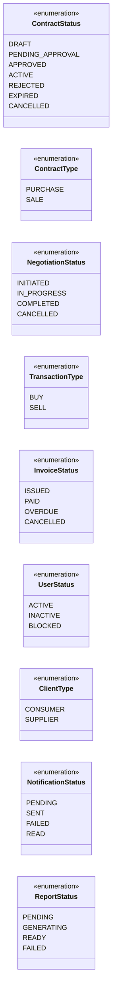
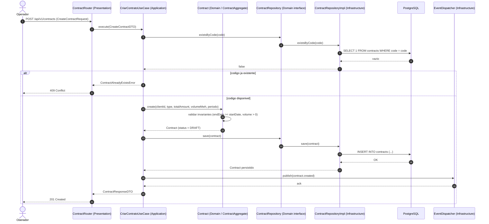
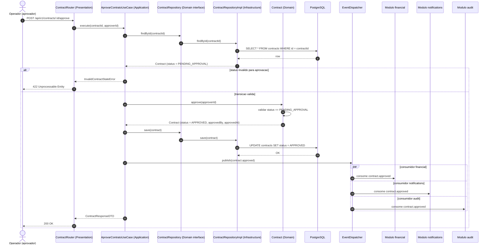
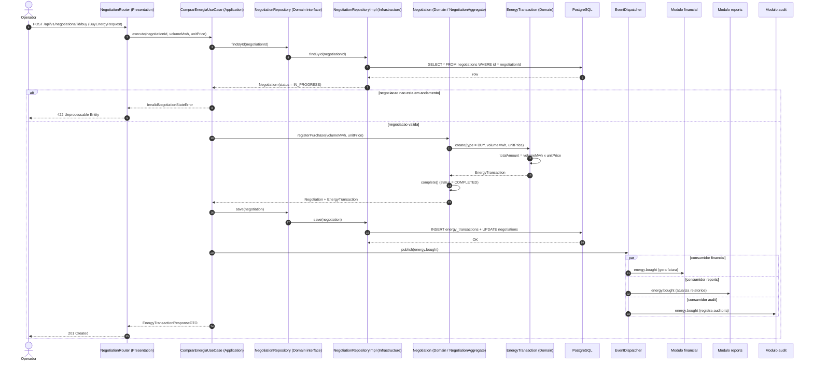
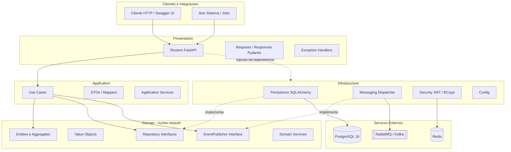
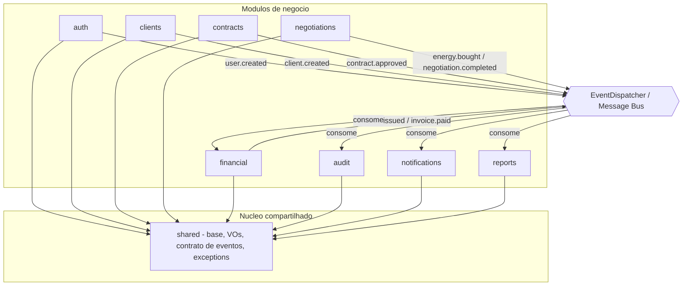

# Fase 0 — Modelagem UML

> Documento de planejamento da **Fase 0** do EnergyHub. Consolida a **modelagem UML** do
> sistema em três vistas complementares: **diagrama de classes** (estrutura do domínio),
> **diagramas de sequência** (comportamento dos principais casos de uso) e **diagrama de
> componentes** (arquitetura em camadas e os 9 módulos). Todos os diagramas seguem o
> **modelo canônico** da Fase 0 (mesmas entidades, VOs, enums, agregados e eventos) e são
> escritos em **Mermaid** — texto versionável, renderizado nativamente pelo GitHub e pela IDE.

Convenções desta modelagem:

- A vista de classes representa o **modelo de domínio** (camada `domain`), portanto usa
  atributos em `camelCase` — diferente do `snake_case` das colunas físicas do banco
  (ver [04-modelo-de-dados.md](./04-modelo-de-dados.md)).
- Estereótipos DDD são aplicados por anotação: `<<AggregateRoot>>` (raiz de agregado),
  `<<Entity>>` (entidade), `<<ValueObject>>` (objeto de valor) e `<<enumeration>>` (enum).
- As **11 entidades de núcleo** são o foco; `Contact` e `Payment` aparecem como entidades de
  apoio dentro de `ClientAggregate` e `FinancialAggregate`.

---

## A. Diagrama de Classes (tarefa 5.1)

O diagrama a seguir descreve as entidades de domínio, seus atributos e **métodos
representativos** (comportamento que expressa as regras de negócio), os **Value Objects**
compartilhados e os relacionamentos com cardinalidade. Os **5 agregados** organizam as
entidades sob uma raiz responsável por manter os invariantes:

| Agregado | Raiz | Membros | Módulo |
| :------- | :--- | :------ | :----- |
| `AuthAggregate` | `User` | `Role`, `Permission` (via `user_roles` / `role_permissions`) | `auth` |
| `ClientAggregate` | `Client` | `Contact` | `clients` |
| `ContractAggregate` | `Contract` | — | `contracts` |
| `NegotiationAggregate` | `Negotiation` | `EnergyTransaction` | `negotiations` |
| `FinancialAggregate` | `Invoice` | `Payment` | `financial` |

As entidades `AuditLog`, `Notification` e `Report` são raízes independentes (fora dos 5
agregados nomeados), cada uma no seu módulo (`audit`, `notifications`, `reports`).

```mermaid
classDiagram
    direction LR

    %% ===================== AuthAggregate =====================
    class User {
        <<AggregateRoot>>
        +UUID id
        +String name
        +Email email
        +String passwordHash
        +UserStatus status
        +DateTime lastLoginAt
        +authenticate(rawPassword) bool
        +assignRole(role) void
        +revokeRole(role) void
        +block() void
        +activate() void
    }
    class Role {
        <<Entity>>
        +UUID id
        +String name
        +String description
        +addPermission(permission) void
        +removePermission(permission) void
        +hasPermission(code) bool
    }
    class Permission {
        <<Entity>>
        +UUID id
        +String code
        +String description
    }

    %% ===================== ClientAggregate =====================
    class Client {
        <<AggregateRoot>>
        +UUID id
        +String legalName
        +String tradeName
        +CNPJ cnpj
        +ClientType type
        +ClientStatus status
        +Email email
        +PhoneNumber phone
        +Address address
        +activate() void
        +deactivate() void
        +addContact(contact) void
        +isSupplier() bool
    }
    class Contact {
        <<Entity>>
        +UUID id
        +UUID clientId
        +String name
        +Email email
        +PhoneNumber phone
        +ContactType type
    }

    %% ===================== ContractAggregate =====================
    class Contract {
        <<AggregateRoot>>
        +UUID id
        +String code
        +UUID clientId
        +ContractType type
        +ContractStatus status
        +Money totalAmount
        +Decimal energyVolumeMwh
        +Date startDate
        +Date endDate
        +UUID approvedBy
        +DateTime approvedAt
        +submitForApproval() void
        +approve(approverId) void
        +reject(approverId, reason) void
        +activate() void
        +expire() void
        +cancel() void
    }

    %% ===================== NegotiationAggregate =====================
    class Negotiation {
        <<AggregateRoot>>
        +UUID id
        +UUID contractId
        +NegotiationStatus status
        +Money proposedPrice
        +Decimal volumeMwh
        +DateTime startedAt
        +DateTime closedAt
        +initiate() void
        +updateProposal(price) void
        +registerPurchase(volume, unitPrice) EnergyTransaction
        +registerSale(volume, unitPrice) EnergyTransaction
        +complete() void
        +cancel() void
    }
    class EnergyTransaction {
        <<Entity>>
        +UUID id
        +UUID negotiationId
        +TransactionType type
        +Decimal volumeMwh
        +Money unitPrice
        +Money totalAmount
        +DateTime executedAt
        +execute() void
        +calculateTotal() Money
    }

    %% ===================== FinancialAggregate =====================
    class Invoice {
        <<AggregateRoot>>
        +UUID id
        +String number
        +UUID clientId
        +UUID contractId
        +InvoiceStatus status
        +Money amount
        +Date issueDate
        +Date dueDate
        +DateTime paidAt
        +issue() void
        +pay(payment) void
        +cancel() void
        +markOverdue() void
        +isOverdue() bool
    }
    class Payment {
        <<Entity>>
        +UUID id
        +UUID invoiceId
        +Money amount
        +PaymentMethod method
        +DateTime paidAt
    }

    %% ===================== Entidades independentes =====================
    class AuditLog {
        <<Entity>>
        +UUID id
        +UUID userId
        +AuditAction action
        +String entityType
        +UUID entityId
        +JSON payload
        +IPAddress ipAddress
        +DateTime createdAt
        +record(userId, action, entityType, entityId) AuditLog
    }
    class Notification {
        <<Entity>>
        +UUID id
        +UUID userId
        +NotificationChannel channel
        +NotificationStatus status
        +String title
        +String body
        +DateTime sentAt
        +DateTime readAt
        +send() void
        +markSent() void
        +markRead() void
        +markFailed() void
    }
    class Report {
        <<Entity>>
        +UUID id
        +ReportType type
        +ReportFormat format
        +ReportStatus status
        +JSON parameters
        +String fileUrl
        +UUID requestedBy
        +DateTime generatedAt
        +generate() void
        +markReady(fileUrl) void
        +markFailed() void
    }

    %% ===================== Value Objects (shared) =====================
    class CNPJ {
        <<ValueObject>>
        +String value
        +isValid() bool
        +formatted() String
    }
    class Email {
        <<ValueObject>>
        +String value
        +isValid() bool
        +domain() String
    }
    class Money {
        <<ValueObject>>
        +Decimal amount
        +String currency
        +add(other) Money
        +multiply(factor) Money
        +isPositive() bool
    }
    class PhoneNumber {
        <<ValueObject>>
        +String value
        +isValid() bool
    }
    class Address {
        <<ValueObject>>
        +String street
        +String number
        +String complement
        +String city
        +String state
        +String zipCode
        +String country
    }
    class Percentage {
        <<ValueObject>>
        +Decimal value
        +apply(amount) Money
    }

    %% ===================== Relacionamentos: agregados / entidades =====================
    User "0..*" -- "0..*" Role : user_roles
    Role "0..*" -- "0..*" Permission : role_permissions
    Client "1" o-- "0..*" Contact : contatos
    Client "1" --> "0..*" Contract : possui
    Contract "0..*" --> "1" User : approvedBy
    Contract "1" --> "0..*" Negotiation : gera
    Negotiation "1" *-- "0..*" EnergyTransaction : transacoes
    Client "1" --> "0..*" Invoice : recebe
    Contract "1" --> "0..*" Invoice : origina
    Invoice "1" o-- "0..*" Payment : pagamentos
    User "1" --> "0..*" AuditLog : registra
    User "1" --> "0..*" Notification : recebe
    User "1" --> "0..*" Report : solicita

    %% ===================== Relacionamentos: Value Objects =====================
    User "1" *-- "1" Email : email
    Client "1" *-- "1" CNPJ : cnpj
    Client "1" *-- "0..1" Email : email
    Client "1" *-- "0..1" PhoneNumber : phone
    Client "1" *-- "0..1" Address : address
    Contract "1" *-- "1" Money : totalAmount
    Negotiation "1" *-- "1" Money : proposedPrice
    EnergyTransaction "1" *-- "1" Money : unitPrice
    Invoice "1" *-- "1" Money : amount
```



> **Sobre `Percentage`:** é um Value Object do módulo `shared` usado nas **regras de
> precificação/reajuste** (ex.: descontos e índices aplicados a `Money`). Não possui
> associação estrutural fixa a uma entidade, por isso aparece como classe independente.
>
> **Enums:** os campos `status`/`type`/`channel`/etc. referenciam as **16 enumerações** do
> modelo canônico. As principais estão detalhadas no diagrama abaixo; a lista completa
> (`UserStatus`, `ClientType`, `ClientStatus`, `ContactType`, `ContractStatus`,
> `ContractType`, `NegotiationStatus`, `TransactionType`, `InvoiceStatus`, `PaymentMethod`,
> `AuditAction`, `NotificationChannel`, `NotificationStatus`, `ReportType`, `ReportFormat`,
> `ReportStatus`) está em [04-modelo-de-dados.md](./04-modelo-de-dados.md).

### A.1 Enumerações principais



---

## B. Diagramas de Sequência (tarefa 5.2)

Cada diagrama mostra a **interação entre objetos** e o **fluxo de mensagens atravessando as
camadas** — `Router` (Presentation) → `UseCase` (Application) → `Aggregate/Entity` /
`DomainService` (Domain) → `Repository` (interface no domínio, implementação na
infraestrutura) → `PostgreSQL` — além da **emissão de eventos de negócio** pelo
`EventDispatcher`. Os blocos `alt/else` representam os **fluxos alternativos** dos casos de uso.

### B.1 UC-04 — Criar contrato → emite `contract.created`



### B.2 Aprovar contrato → emite `contract.approved`

Demonstra uma **transição de estado no domínio** (`PENDING_APPROVAL` → `APPROVED`) e a
**distribuição paralela** do evento para os consumidores `financial`, `notifications` e `audit`.



### B.3 UC-06 — Comprar energia → cria `EnergyTransaction` → emite `energy.bought`

O caso de compra registra uma `EnergyTransaction` (`type = BUY`) sob a raiz `Negotiation`,
conclui a negociação e publica `energy.bought` para `financial` (gera fatura), `reports`
(atualiza indicadores) e `audit`.



---

## C. Diagrama de Componentes (tarefa 5.3)

### C.1 Vista em camadas (Clean Architecture)

Componentes principais e **interfaces** entre eles. A **regra de dependência** é explícita:
`Presentation → Application → Domain` e `Infrastructure ┄▶ Domain` (a infraestrutura
**implementa** as interfaces do domínio). O **domínio não aponta para nenhuma outra camada**
— ele é o núcleo estável. A apresentação recebe as implementações de infraestrutura por
**injeção de dependência**.



### C.2 Vista de módulos (9 módulos + `shared` + barramento de eventos)

Todos os módulos de negócio dependem de `shared` (base classes, VOs, contrato de eventos e
exceptions). O acoplamento **entre módulos** é feito por **eventos** através do
`EventDispatcher` — nunca por dependência direta de código, preservando as fronteiras dos
_bounded contexts_.



**Interfaces entre componentes (contratos):**

| Interface (Domain) | Implementação (Infrastructure) | Consumidor (Application) |
| :----------------- | :----------------------------- | :----------------------- |
| `XxxRepository` (ex.: `ContractRepository`) | `XxxRepositoryImpl` (SQLAlchemy) | Use Cases |
| `EventPublisher` | `EventDispatcher` / adaptador de mensageria | Use Cases |
| `PasswordHasher` | `BCryptHasher` (passlib) | `auth` use cases |
| `TokenProvider` | `JwtTokenProvider` (python-jose) | `auth` use cases |

---

## D. Ferramentas e versionamento dos diagramas (tarefa 5.4)

Todos os diagramas UML desta modelagem — **classes**, **sequência** e **componentes** — são
escritos em **Mermaid**, em blocos ` ```mermaid ` embutidos nesta própria documentação. Essa
escolha traz vantagens de engenharia:

- **Versionáveis em Git:** os diagramas são texto, portanto entram em _diff_, _code review_
  e histórico como qualquer outro artefato do repositório.
- **Renderização nativa:** GitHub, GitLab e as principais IDEs (VS Code, PyCharm) renderizam
  Mermaid sem plugins externos ou binários.
- **Baixo custo de manutenção:** evoluem junto com o código e o modelo canônico, sem
  arquivos binários (`.drawio`, imagens) que desatualizam silenciosamente.

Alternativas como Draw.io permanecem válidas conforme a especificação, mas o padrão do
projeto é **Mermaid como fonte única** dos diagramas na documentação.

---

## Referências

- [03-casos-de-uso.md](./03-casos-de-uso.md) — casos de uso (UC-01 a UC-11) e diagrama de casos de uso.
- [04-modelo-de-dados.md](./04-modelo-de-dados.md) — DER, entidades, atributos, tipos e enums.
- [07-arquitetura.md](./07-arquitetura.md) — Clean Architecture, camadas, módulos e regra de dependência.
