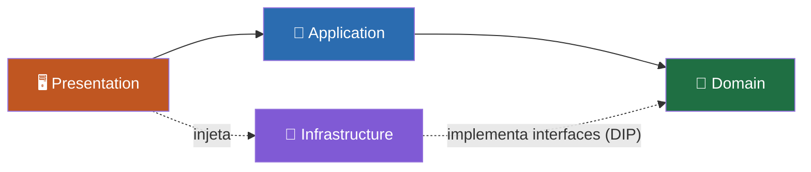
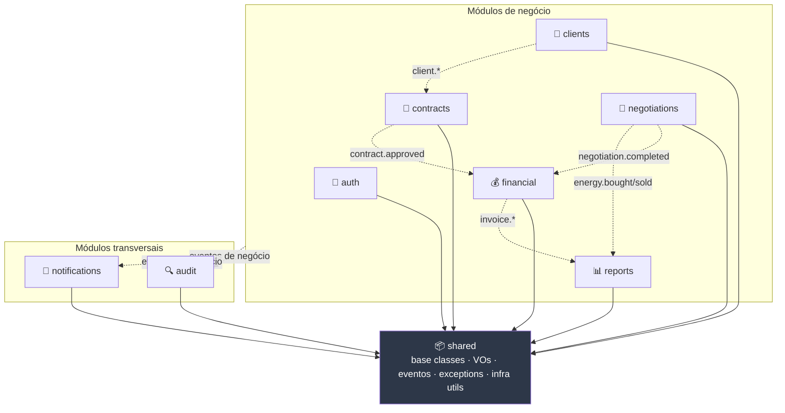
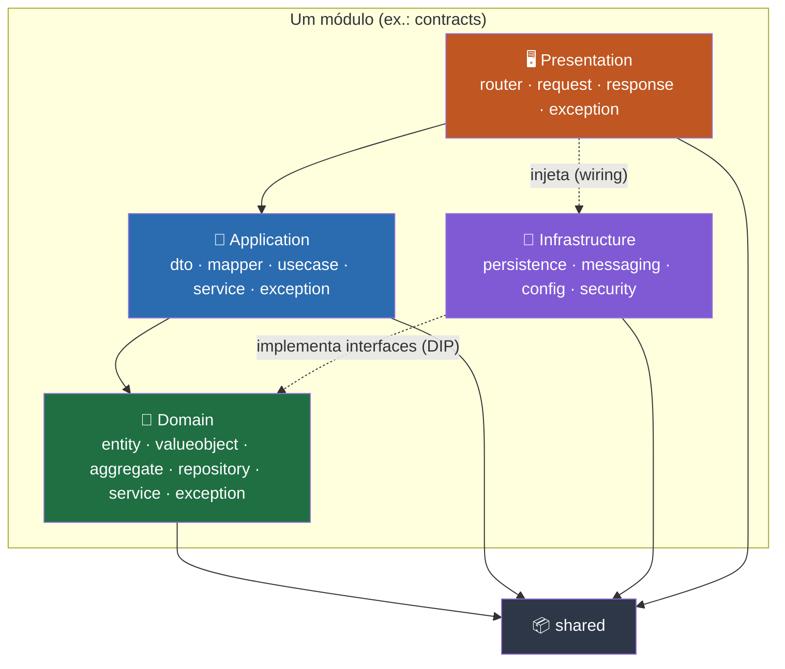

# ⚡ EnergyHub — Arquitetura do Sistema (Fase 0)

Este documento define a **arquitetura de software** do EnergyHub, o _backend_ de uma plataforma de
**negociação de energia** construída com **Python 3.12 · FastAPI · SQLAlchemy 2.0 async** sobre
**PostgreSQL 16**, seguindo **Clean Architecture** e **Domain-Driven Design (DDD)**. Enquanto o
escopo (01) define _o que_ a plataforma faz e o modelo de dados (04) define _como os dados se
estruturam_, este artefato estabelece _como o código se organiza_: os **9 módulos** de negócio,
as **4 camadas** internas de cada módulo, os **sub-pacotes** de cada camada, as **regras de
dependência** que preservam a Clean Architecture e a **estrutura de diretórios** completa que
guiará a implementação a partir da Fase 2.

> 📌 Este documento é derivado do **modelo canônico da Fase 0** e usa exatamente os mesmos nomes
> de módulos, camadas, sub-pacotes, entidades e eventos. Em caso de divergência, o modelo canônico
> prevalece.

---

## 🏛️ A. Visão geral

A Clean Architecture organiza o sistema em **camadas concêntricas** cujo objetivo é isolar as
**regras de negócio** dos **detalhes técnicos** (banco de dados, framework web, mensageria). O
princípio que sustenta tudo é a **Regra de Dependência**: o código-fonte só pode apontar **para
dentro**, em direção às políticas de mais alto nível. Nada no domínio conhece o mundo externo — é
o mundo externo que se adapta ao domínio.

### A.1 Princípios adotados

| Princípio | Aplicação no EnergyHub |
| :-------- | :--------------------- |
| **Independência de framework** | O domínio não importa FastAPI, SQLAlchemy nem Pydantic. O framework é um detalhe da camada de infraestrutura/apresentação. |
| **Testabilidade** | Regras de negócio testáveis sem banco, sem HTTP e sem rede — colaboradores externos são substituídos por _fakes_/_mocks_ via interfaces. |
| **Independência de UI** | A API REST é apenas um _driver_ da aplicação; trocar REST por CLI ou fila não afeta o núcleo. |
| **Independência de banco** | Regra de negócio não sabe se persiste em PostgreSQL, memória ou outro store; conhece apenas interfaces de repositório. |
| **Inversão de dependência (DIP)** | O domínio declara **portas** (interfaces); a infraestrutura fornece **adaptadores** (implementações). O fluxo de controle vai de fora para dentro; o de dependência de código, de dentro para fora. |

### A.2 As 4 camadas

Cada um dos 9 módulos é subdividido nas mesmas **4 camadas**, da mais interna (regras puras) para
a mais externa (I/O):

| Camada | Papel | Depende de | Exemplos de conteúdo |
| :----- | :---- | :--------- | :------------------- |
| 💎 **Domain** | Regras de negócio puras e invariantes | **Nada** (nem outros módulos) | `Contract`, VO `Money`, `ContractRepository` (interface), `ContractStatus` |
| 🧠 **Application** | Orquestração dos casos de uso | Domain | `CreateContractUseCase`, `ContractDTO`, `ContractMapper` |
| 🔌 **Infrastructure** | Detalhes técnicos e I/O | Domain (implementa suas interfaces) | Modelos ORM SQLAlchemy, publicador de eventos, config, segurança |
| 🖥️ **Presentation** | Interface HTTP (REST) | Application (injeta Infrastructure) | Routers FastAPI, _schemas_ de request/response |

### A.3 A Regra de Dependência



> 🧭 **Leitura da regra:** as setas de _dependência de código_ apontam sempre para o **Domain**.
> A `Infrastructure` não é dependência do domínio — ela **depende do domínio** ao implementar suas
> interfaces (inversão de dependência). A `Presentation` conhece a `Application` e, na composição
> da aplicação (_wiring_), injeta as implementações concretas de `Infrastructure`.

---

## 🧩 B. Módulos (9)

A plataforma é organizada em **9 módulos** de negócio. Oito deles modelam capacidades de negócio;
o `shared` é transversal e fornece os blocos reutilizáveis. Cada módulo é dono de suas entidades e
não invade o domínio dos demais — a colaboração entre módulos acontece na **camada de aplicação**
(orquestração) e por **eventos de negócio** (comunicação desacoplada).

| # | Módulo | Entidades (donas) | Agregado(s) | Responsabilidade |
| :-: | :----- | :---------------- | :---------- | :--------------- |
| 7.1 | `shared` | — (base classes, VOs, eventos, exceptions) | — | Blocos reutilizáveis por **todos** os módulos (ver B.1). |
| 7.2 | `auth` | `User`, `Role`, `Permission` | `AuthAggregate` | Autenticação (login/JWT/BCrypt) e autorização **RBAC**. |
| 7.3 | `clients` | `Client`, `Contact` | `ClientAggregate` | Cadastro de clientes/fornecedores e contatos, com validação de **CNPJ**. |
| 7.4 | `contracts` | `Contract` | `ContractAggregate` | Ciclo de vida de contratos (rascunho → aprovação → ativação → expiração). |
| 7.5 | `negotiations` | `Negotiation`, `EnergyTransaction` | `NegotiationAggregate` | Negociações comerciais e transações de compra/venda de energia. |
| 7.6 | `financial` | `Invoice`, `Payment` | `FinancialAggregate` | Faturamento, vencimentos e registro de pagamentos. |
| 7.7 | `audit` | `AuditLog` | — | Trilha de auditoria _append-only_ de operações relevantes. |
| 7.8 | `notifications` | `Notification` | — | Envio e acompanhamento de notificações multicanal (e-mail/SMS/in-app). |
| 7.9 | `reports` | `Report` | — | Geração assíncrona de relatórios (SALES/PURCHASES/FINANCIAL/AUDIT/CONTRACTS). |

> As **11 entidades de núcleo** da Fase 0 são `User`, `Role`, `Permission`, `Client`, `Contract`,
> `Negotiation`, `EnergyTransaction`, `Invoice`, `AuditLog`, `Notification` e `Report`. `Contact` e
> `Payment` são entidades de **apoio**, internas aos agregados `ClientAggregate` e
> `FinancialAggregate` respectivamente.

### B.1 🎯 Tratamento especial do módulo `shared`

O `shared` **não modela nenhuma entidade de negócio**. Ele existe para que os demais módulos não
reinventem — nem dupliquem — os blocos fundamentais do domínio e da infraestrutura. Todos os
módulos de negócio dependem de `shared`; **`shared` não depende de nenhum módulo de negócio**.

| Bloco de `shared` | O que fornece | Consumidores |
| :---------------- | :------------ | :----------- |
| **Classes-base de domínio** | `Entity` (identidade por `id UUID` + `created_at`/`updated_at`), `AggregateRoot` (raiz de agregado + coleção de eventos de domínio), `ValueObject` (base imutável), `DomainService` (contrato de serviço de domínio) | Todas as camadas `domain` |
| **Value Objects comuns** | `CNPJ`, `Email`, `Money` (`Decimal` + moeda ISO-4217), `PhoneNumber` (E.164), `Address`, `Percentage` — _frozen dataclasses_ com validação no construtor | `clients`, `auth`, `contracts`, `negotiations`, `financial` |
| **Eventos-base** | `DomainEvent` (envelope: `event_id`, `event_name`, `occurred_at`, `version`, `producer`, `data`) e o contrato do _dispatcher_/_event bus_ | Todos os módulos que publicam eventos |
| **Exceções-base** | `DomainException`, `ValidationError`, `NotFoundError`, `ConflictError`, `BusinessRuleViolation` — hierarquia comum mapeada para respostas HTTP | Todas as camadas |
| **Utilitários de infraestrutura** | _Base_ declarativa do SQLAlchemy, `UnitOfWork`, sessão/engine async, `BaseRepository`, _mixins_ de auditoria/soft-delete, _settings_ base | Todas as camadas `infrastructure` |

> ℹ️ Como regra prática: **tudo que apareceria idêntico em 2+ módulos** (um VO, uma exceção, uma
> classe-base) mora em `shared`; **tudo que é específico de um domínio** mora no módulo dono.

---

## 🧱 C. Estrutura interna de um módulo — as 4 camadas

Cada módulo repete a mesma anatomia de **4 camadas**, e cada camada tem **sub-pacotes** com
responsabilidade única. Os nomes abaixo são **normativos** (idênticos ao modelo canônico) e devem
ser usados exatamente assim na implementação.

### C.1 💎 Camada `domain` (7.10)

O coração do módulo: regras de negócio puras, sem qualquer dependência técnica externa.

| Sub-pacote | Responsabilidade |
| :--------- | :--------------- |
| `entity/` | **Entidades** com identidade e ciclo de vida (ex.: `Contract`, `User`). Encapsulam invariantes e comportamento. |
| `valueobject/` | **Value Objects** imutáveis específicos do módulo (os comuns ficam em `shared`). Igualdade por valor, validação no construtor. |
| `aggregate/` | **Agregados** — fronteiras de consistência com uma **raiz** (ex.: `ContractAggregate`). Controlam invariantes transacionais e emitem eventos de domínio. |
| `repository/` | **Interfaces** (portas) de persistência (ex.: `ContractRepository`). Definem _o que_ persistir, nunca _como_. Implementadas na infraestrutura. |
| `service/` | **Serviços de domínio** para regras que não pertencem naturalmente a uma única entidade (ex.: cálculo/validação envolvendo múltiplos objetos). |
| `exception/` | **Exceções de domínio** específicas do módulo, derivadas das bases em `shared` (ex.: `ContractNotApprovable`). |

### C.2 🧠 Camada `application` (7.11)

Orquestra os casos de uso: coordena entidades, serviços de domínio e repositórios para cumprir uma
intenção do usuário. Não contém regra de negócio — apenas **fluxo**.

| Sub-pacote | Responsabilidade |
| :--------- | :--------------- |
| `dto/` | **Data Transfer Objects** de entrada/saída dos casos de uso — desacoplam o domínio dos _schemas_ HTTP. |
| `mapper/` | **Mapeadores** entre entidades de domínio e DTOs (e vice-versa). |
| `usecase/` | **Casos de uso** (um por intenção, ex.: `CreateContractUseCase`, `ApproveContractUseCase`). Definem o fluxo transacional e publicam eventos. |
| `service/` | **Serviços de aplicação** para orquestração reutilizável entre casos de uso (ex.: coordenação com `shared`, transações, _UnitOfWork_). |
| `exception/` | **Exceções de aplicação** (ex.: `UseCaseError`, autorização negada), mapeáveis para respostas HTTP. |

### C.3 🔌 Camada `infrastructure` (7.12)

Fornece os **adaptadores** concretos para o mundo externo. É a única camada que conhece SQLAlchemy,
brokers de mensageria e segredos de configuração.

| Sub-pacote | Responsabilidade |
| :--------- | :--------------- |
| `persistence/` | **Modelos ORM** (SQLAlchemy 2.0 async), mapeamentos e **implementações** das interfaces de `repository/` do domínio. |
| `messaging/` | **Publicadores/consumidores** de eventos de negócio (dispatcher em processo na Fase 0; RabbitMQ/Kafka a partir da Fase 10). |
| `config/` | **Configuração** do módulo: _settings_ (Pydantic), _factories_ de sessão/engine, injeção de dependências. |
| `security/` | **Segurança**: hashing de senha (BCrypt), emissão/validação de **JWT**, _guards_ de RBAC (concentrado sobretudo em `auth`). |

### C.4 🖥️ Camada `presentation` (7.13)

A borda HTTP do módulo. Traduz requisições REST em chamadas de casos de uso e respostas de volta.

| Sub-pacote | Responsabilidade |
| :--------- | :--------------- |
| `router/` | **Routers** FastAPI: definição de rotas, verbos, dependências (auth) e delegação aos casos de uso. |
| `request/` | **Schemas de entrada** (Pydantic) — validação e _parsing_ do corpo/parâmetros da requisição. |
| `response/` | **Schemas de saída** (Pydantic) — serialização da resposta, ocultando detalhes internos do domínio. |
| `exception/` | **Handlers de exceção** que traduzem exceções de domínio/aplicação em respostas HTTP padronizadas (catálogo de erros). |

---

## 🔗 D. Regras de dependência (7.14)

A integridade da Clean Architecture depende de **quem pode importar quem**. As regras abaixo são
verificáveis (podem ser impostas por _linters_ de arquitetura na Fase 2+):

1. **Domínio não depende de nada.** A camada `domain` não importa `application`, `infrastructure`,
   `presentation`, frameworks (FastAPI, SQLAlchemy, Pydantic) **nem outros módulos de negócio**.
   Só pode depender de `shared` (classes-base, VOs, eventos-base, exceções-base).
2. **Aplicação depende do domínio.** A camada `application` importa `domain` (do próprio módulo e,
   quando orquestra um caso de uso transversal, de outros módulos), mas **nunca** importa
   `infrastructure` nem `presentation` concretos — depende de **interfaces**.
3. **Infraestrutura implementa interfaces do domínio (DIP).** A camada `infrastructure` importa
   `domain` para **implementar** suas portas (`repository/`, publicadores de evento). O domínio
   nunca importa a infraestrutura — a dependência é **invertida**.
4. **Apresentação depende da aplicação e injeta a infraestrutura.** A camada `presentation` importa
   `application` (casos de uso e DTOs) e, no _wiring_ da aplicação, **injeta** as implementações de
   `infrastructure` que satisfazem as interfaces do domínio.
5. **Todos os módulos de negócio dependem de `shared`;** `shared` não depende de nenhum módulo de
   negócio (evita ciclos).
6. **Módulos de domínio não dependem entre si.** O acoplamento entre módulos ocorre **na camada de
   aplicação** (orquestração explícita) e por **eventos de negócio** (comunicação assíncrona
   desacoplada) — nunca de `domain` para `domain` de outro módulo.

### D.1 Permitido × Proibido

| Origem → Destino | Permitido? | Observação |
| :--------------- | :--------: | :--------- |
| `domain` → `shared` | ✅ | Classes-base, VOs e eventos-base comuns. |
| `domain` → `application` / `infrastructure` / `presentation` | ❌ | Violaria a Regra de Dependência (aponta para fora). |
| `domain` (módulo A) → `domain` (módulo B) | ❌ | Módulos de domínio são isolados; use eventos/orquestração. |
| `application` → `domain` (próprio módulo) | ✅ | Base da orquestração. |
| `application` → `domain` (outro módulo) | ✅ | Permitido para casos de uso transversais (orquestração). |
| `application` → `infrastructure` (concreto) | ❌ | Depender de interfaces do domínio; injetar implementação. |
| `infrastructure` → `domain` | ✅ | Para **implementar** interfaces (`repository`, eventos) — DIP. |
| `infrastructure` → `presentation` | ❌ | I/O de baixo nível não conhece a borda HTTP. |
| `presentation` → `application` | ✅ | Delega aos casos de uso. |
| `presentation` → `infrastructure` (injeção/wiring) | ✅ | Apenas para compor a aplicação (injeção de dependência). |
| `presentation` → `domain` (uso direto de regra) | ⚠️ | Evitar; passe sempre pela `application`. |
| qualquer camada → `shared` | ✅ | `shared` é a fundação comum. |
| `shared` → qualquer módulo de negócio | ❌ | Manteria o grafo acíclico; `shared` é folha de dependência. |

---

## 🗺️ E. Diagrama de componentes da arquitetura (7.15)

### E.1 Componentes (módulos) e suas relações

Todos os módulos de negócio dependem de `shared` (setas sólidas, dependência em tempo de
compilação). A colaboração entre domínios de negócio acontece por **eventos** (setas tracejadas,
runtime desacoplado) e por **orquestração na camada de aplicação**; `audit` e `notifications` são
consumidores transversais de quase todos os eventos.



### E.2 Camadas dentro de um módulo (dependência)

Dentro de qualquer módulo, as camadas obedecem à Regra de Dependência: `Presentation` → `Application`
→ `Domain`, com `Infrastructure` implementando as portas do `Domain` (inversão de dependência).



---

## 📂 F. Estrutura de diretórios completa (7.16)

O projeto Python usa _layout src_ e vive na subpasta `energyhub/` do repositório. Cada módulo de
negócio reproduz a mesma anatomia de 4 camadas. Abaixo, o módulo `contracts` está **totalmente
expandido**; os demais módulos de negócio seguem **exatamente a mesma estrutura interna**.

```text
energyhub/
└── src/
    └── energyhub/
        ├── main.py                     # app FastAPI (composição/wiring, inclusão de routers)
        │
        ├── shared/                     # 📦 blocos reutilizáveis (sem entidades de negócio)
        │   ├── domain/
        │   │   ├── entity/             # Entity, AggregateRoot (classes-base)
        │   │   ├── valueobject/        # CNPJ, Email, Money, PhoneNumber, Address, Percentage
        │   │   ├── event/              # DomainEvent (envelope), contrato do event bus
        │   │   └── exception/          # DomainException, ValidationError, NotFoundError, ...
        │   ├── application/            # UnitOfWork, serviços/base de aplicação
        │   └── infrastructure/
        │       ├── persistence/        # Base declarativa, sessão/engine async, BaseRepository
        │       ├── messaging/          # dispatcher em processo (event bus)
        │       ├── config/             # settings base (Pydantic)
        │       └── security/           # utilitários de hashing/JWT compartilhados
        │
        ├── contracts/                  # 📄 MÓDULO TOTALMENTE EXPANDIDO
        │   ├── domain/
        │   │   ├── entity/             # contract.py (Contract)
        │   │   ├── valueobject/        # VOs específicos de contratos
        │   │   ├── aggregate/          # contract_aggregate.py (ContractAggregate)
        │   │   ├── repository/         # contract_repository.py (interface/porta)
        │   │   ├── service/            # regras de domínio multi-entidade
        │   │   └── exception/          # ContractNotApprovable, ...
        │   ├── application/
        │   │   ├── dto/                # ContractDTO, CreateContractInput/Output
        │   │   ├── mapper/             # ContractMapper (entidade ⇄ DTO)
        │   │   ├── usecase/            # CreateContractUseCase, ApproveContractUseCase, ...
        │   │   ├── service/            # serviços de orquestração da aplicação
        │   │   └── exception/          # exceções de casos de uso
        │   ├── infrastructure/
        │   │   ├── persistence/        # ORM SQLAlchemy + ContractRepositoryImpl
        │   │   ├── messaging/          # publicação de contract.created/approved/rejected
        │   │   ├── config/             # DI/settings do módulo
        │   │   └── security/           # (quando aplicável)
        │   └── presentation/
        │       ├── router/             # contracts_router.py (rotas /api/v1/contracts)
        │       ├── request/            # schemas de entrada (Pydantic)
        │       ├── response/           # schemas de saída (Pydantic)
        │       └── exception/          # handlers HTTP do módulo
        │
        ├── auth/                       # 🔐 mesma estrutura de 4 camadas (User, Role, Permission)
        ├── clients/                    # 🏢 mesma estrutura (Client, Contact)
        ├── negotiations/               # 🤝 mesma estrutura (Negotiation, EnergyTransaction)
        ├── financial/                  # 💰 mesma estrutura (Invoice, Payment)
        ├── audit/                      # 🔍 mesma estrutura (AuditLog)
        ├── notifications/              # 🔔 mesma estrutura (Notification)
        └── reports/                    # 📊 mesma estrutura (Report)
```

> 🧭 Cada módulo em `auth/`, `clients/`, `negotiations/`, `financial/`, `audit/`, `notifications/`
> e `reports/` contém as mesmas 4 camadas (`domain/`, `application/`, `infrastructure/`,
> `presentation/`) e os mesmos sub-pacotes normativos apresentados na seção **C** e detalhados no
> módulo `contracts` acima. Módulos sem agregado próprio (`audit`, `notifications`, `reports`)
> podem omitir o sub-pacote `domain/aggregate/`.

---

## 📚 Referências

Documentos irmãos da Fase 0 (planejamento e design do sistema):

- [04 — Modelo de Dados](04-modelo-de-dados.md)
- [05 — Diagramas UML](05-diagramas-uml.md)
- [06 — Eventos de Negócio](06-eventos-de-negocio.md)
